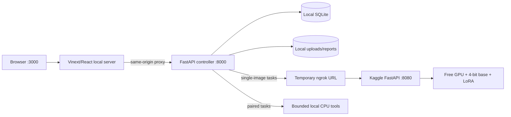

# SatQuery AI

SatQuery is a local-first, auditable remote-sensing assistant for satellite-image questions,
captions, visual grounding, bi-temporal change analysis, and optical/SAR paired analysis. The
released neural path uses the public
[SatQuery Qwen3-VL LoRA](https://huggingface.co/aanandmodi/satquery-qwen3vl-bigearthnet-txt-lora)
on the immutable `Qwen/Qwen3-VL-2B-Instruct` base revision.

**Nothing in the current workflow deploys the website.** The frontend, controller, database,
uploads, reports, and overlay artifacts run locally. Model inference can run either on the laptop's
NVIDIA GPU in 4-bit mode or, preferably, in an attended temporary Kaggle session while the website
and backend remain local. The ngrok demo has a 60-minute maximum window and no automatic renewal.
Managed Colab reverse-proxy serving is not supported; normal provider rules and quotas apply.

## What is real today

<<<<<<< HEAD
**Critical-gap correction, 2026-09-04:** [Audit and honest release gates](docs/CRITICAL_GAPS.md),
[exact Kaggle steps](docs/PAIRED_EXPERT_RUNBOOK.md). Compound target comparisons now use a bounded
dependency plan and measured candidate loss/gain. The optional learned planner runs through the
existing Kaggle service; apply the [one-cell notebook](notebooks/SatQuery_Live_Planning_Upgrade.ipynb)
to an existing session. Cartosat/RISAT product metadata is recognized without guessing band identity.
ChangeVQA/TerraMind training exports now match strict serving architectures. Their trained artifacts
and accuracy evaluation **remain required**; no analytical baseline is renamed as a learned model.
The current live service reported quality-v3; its planner route was not installed at the latest check.

=======
>>>>>>> 2f620623f8897788bd2df2ce4f5700cb183d84f8
**Studio update, 2026-09-04:** [New workflow guide](docs/STUDIO_GUIDE.md) and
[model evaluation plan](docs/MODEL_EVALUATION_PLAN.md). Exploration supports optical JPG/PNG/WebP
alongside TIFF while SIH strict remains separate. Investigation, Casebook, case detail, Archive
and Methods are real local routes. Real JPEG → Kaggle Qwen/SAM → text/mask and the Nepal temporal
TIFF pair were verified. Optical/SAR has synthetic integration coverage, not regional accuracy
evidence. Live Sentinel discovery and NASA weather context work; historical crop/import/registration
remains manual. No website was deployed or paid service provisioned.

This dated update supersedes older live-inference gates below. Scientific accuracy and learned-pair
<<<<<<< HEAD
gates remain open. Earlier v2 observations below are historical; quality-v3 is now available on
the running service. This does not establish regional segmentation accuracy.
=======
gates remain open. The active remote service was v2; updated notebook section 6b contains v3 prompts
which still need to be run and smoke-tested on Kaggle.
>>>>>>> 2f620623f8897788bd2df2ce4f5700cb183d84f8

**Report/mask quality upgrade:** see [Analysis quality](docs/ANALYSIS_QUALITY.md).
The local UI now supports binary masks, transparent overlays and detailed raster/mask reports.
The updated Kaggle notebook includes **section 6b** for a longer base-instruction narrative and
SAM 2 candidate masks. Existing Kaggle sessions must run that cell; this is not a remotely applied
model change or evidence of validated segmentation accuracy.

| Capability | State | Implementation |
|---|---:|---|
| GeoTIFF + location metadata | Ready | Raster validation plus bounded latitude, longitude, altitude and metadata |
| Single-image VQA | Implemented; live inference gate required | Qwen3-VL 2B + released LoRA |
| Scene caption | Implemented; live inference gate required | Same released specialist with a constrained prompt |
| Grounding and marked image | Live JPEG + GPU mask verified; accuracy unvalidated | Qwen proposals + SAM 2; water-only NDWI with named green/NIR |
| Text answer, warnings, provenance, trace | Ready | Schema-validated integration and SQLite job record |
| RGB preview, informative JPEG overlay, PDF report | Ready | Overlay always labels metadata/answer; boxes appear only when valid |
| Bi-temporal change analysis | Runnable CPU baseline | Quantified spectral-change proxy + evidence; learned CDVQA notebook remains release-gated |
| Optical/SAR paired analysis | Runnable CPU baseline | Optical-context/backscatter proxies + evidence; learned TerraMind notebook remains release-gated |
| Automatic agentic routing | Ready | Query + input configuration select one of five registered workflows |
| Website deployment | Deliberately not performed | Hosting will be selected only after local acceptance |

The current code/notebook checks do not establish a live Kaggle connection or semantic benchmark
quality. Require the notebook smoke tests and real-image acceptance procedure below before a demo.

## Local topology



The browser never receives model or Hugging Face credentials. It calls the local frontend route,
which calls the controller, which is the only process allowed to call a model service.

## Fastest complete start: Kaggle GPU + local application

Requirements: a free Kaggle account, free ngrok account, Python 3.12 and Node.js 22+ locally.

1. Run `scripts/setup-local.ps1` once. It creates a separate `satquery-cloud` virtualenv without
   installing local model/CUDA dependencies. Install Python 3.12 and Node.js first if missing.
2. Upload [`SatQuery_Qwen3VL_Free_GPU_Server.ipynb`](notebooks/SatQuery_Qwen3VL_Free_GPU_Server.ipynb)
   to Kaggle, enable GPU + Internet, and add `NGROK_AUTHTOKEN` plus
   `SATQUERY_MODEL_SERVICE_TOKEN` as Kaggle Secrets.
3. Run the inference notebook in order; require sections 5, 7 and 9 to print `PASS`. No retraining
   or training-dataset import is needed. Synthetic smoke output proves transport, not task accuracy.
4. Create root `.env` and `.env.local` from their examples only if absent. Set the printed ngrok
   URL and identical service token in `.env`; keep `.env.local` pointed at the local backend.
5. Start the local app:

```powershell
Set-Location D:\Projects\Sih-2026
& "$env:USERPROFILE\.venvs\satquery-cloud\Scripts\python.exe" .\scripts\run-local.py --mode remote
```

Open `http://localhost:3000`. Keep notebook section 10 running while actively testing. Press
`Ctrl+C` locally, interrupt section 10, then stop the Kaggle session to release GPU quota.
After interruption, restart sections **6–10**, not only the tunnel cell. Exact setup, separate
backend/frontend commands and troubleshooting: [NGROK_KAGGLE_RUNBOOK.md](docs/NGROK_KAGGLE_RUNBOOK.md).

## Why the website previously had no model answer

| Layer | Previous state | Correction |
|---|---|---|
| Hugging Face model Space | ZeroGPU creation returned `402` because of the account-age gate | No longer a default dependency |
| Local model service | Defaulted to the wrong 4B base and required a local adapter directory | Now uses the exact pinned 2B base and public adapter |
| Frontend fallback | Automatically tried the unavailable Space | Removed; all inference passes through the controller |
| Laptop memory | BF16 weights could not fit safely in 4 GB VRAM | NF4 4-bit, 448px input, short generation, concurrency one |

## Repository map

| Path | Responsibility |
|---|---|
| `app/` | Local Vinext/React evidence workspace and server-side API proxy |
| `backend/` | FastAPI validation, routing, orchestration, persistence, report/overlay API |
| `model_service/` | Long-lived local Qwen/change/fusion specialist service |
| `ml/` | Model loading, preprocessing, training, evaluation, and artifact utilities |
| `notebooks/` | Cloud training/evaluation notebooks and Kaggle-only temporary ngrok inference demo |
| `scripts/` | Local setup, startup, smoke, and runtime verification |
| `docs/` | Requirements, system design, pipeline, API, security, testing, UI, and status |

## Verification

```powershell
Set-Location D:\Projects\Sih-2026
& "$env:USERPROFILE\.venvs\satquery-cloud\Scripts\python.exe" -m pytest backend\tests ml\tests -q
& "$env:USERPROFILE\.venvs\satquery-cloud\Scripts\python.exe" -m ruff check backend ml model_service scripts
node --test tests/proxy.test.mjs
npm run lint
npm run build
```

The complete five-workflow check is documented in [SIH_DEMO_RUNBOOK.md](docs/SIH_DEMO_RUNBOOK.md)
and automated by `scripts/sih-acceptance.py`. It rejects simulator responses by default. Add
`--auto-route` to exercise query-driven selection for single VQA, caption, grounding, change and
optical/SAR analysis, with provenance, trace, overlays and reports. `--allow-simulated` is for
explicit plumbing tests only, never model acceptance. Neither mode measures benchmark accuracy.

## Documentation index

| Document | Purpose |
|---|---|
| [PRD](docs/PRD.md) | Users, scope, requirements, acceptance criteria |
| [Architecture](docs/ARCHITECTURE.md) | Components, boundaries, deployment-neutral design |
| [System design](docs/SYSTEM_DESIGN.md) | Runtime, data, failure, concurrency, and security design |
| [Pipeline](docs/PIPELINE.md) | Training, release, and inference flows |
| [Local development](docs/LOCAL_DEVELOPMENT.md) | Exact laptop and free-GPU commands |
| [Kaggle + ngrok runbook](docs/NGROK_KAGGLE_RUNBOOK.md) | Secrets, notebook cells, tunnel, wiring and shutdown |
| [Data model](docs/DATA_MODEL.md) | Image, location context, result, evidence and provenance schemas |
| [API](docs/API.md) | Endpoints, schemas, lifecycle, error semantics |
| [Testing](docs/TESTING.md) | Unit, integration, build, and real-model gates |
| [SIH compliance matrix](docs/SIH_COMPLIANCE_MATRIX.md) | Requirement-by-requirement status and evaluation gaps |
| [SIH demonstration runbook](docs/SIH_DEMO_RUNBOOK.md) | Exact five-workflow acceptance procedure |
| [Security](docs/SECURITY.md) | Threat model, secrets, uploads, and retention |
| [UI design](docs/DESIGN_UI.md) | Visual system and interaction rules |
| [Progress](docs/PROGRESS.md) | Evidence-backed completion and remaining work |
| [Hosted-resource status](docs/UNDEPLOYMENT_STATUS.md) | What is private, preserved, temporary, or removed |

## Secret warning

A Hugging Face token was pasted into chat earlier. Treat it as compromised: revoke it in Hugging
Face settings and create a new least-privilege token only when a future hosting action actually
requires one. Local inference against the public adapter requires no Hugging Face token.
