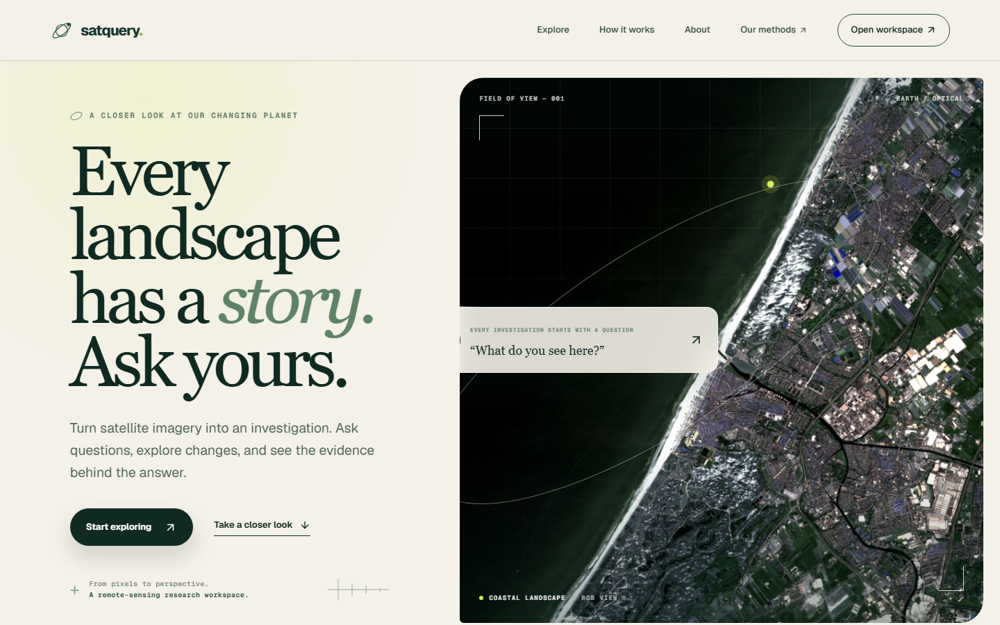
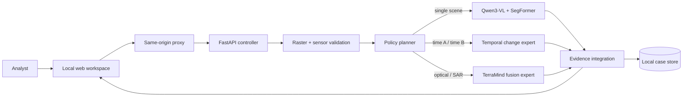
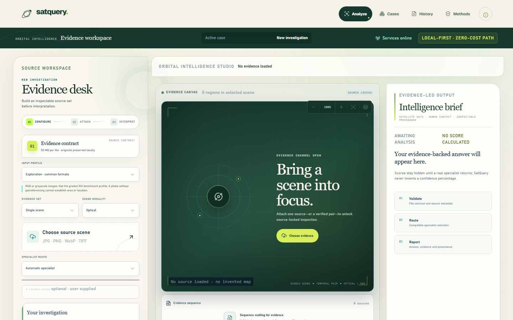
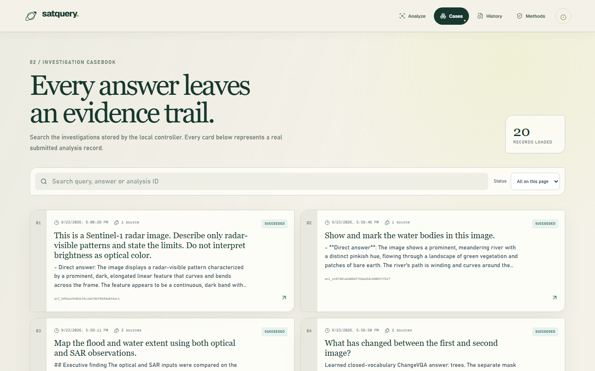
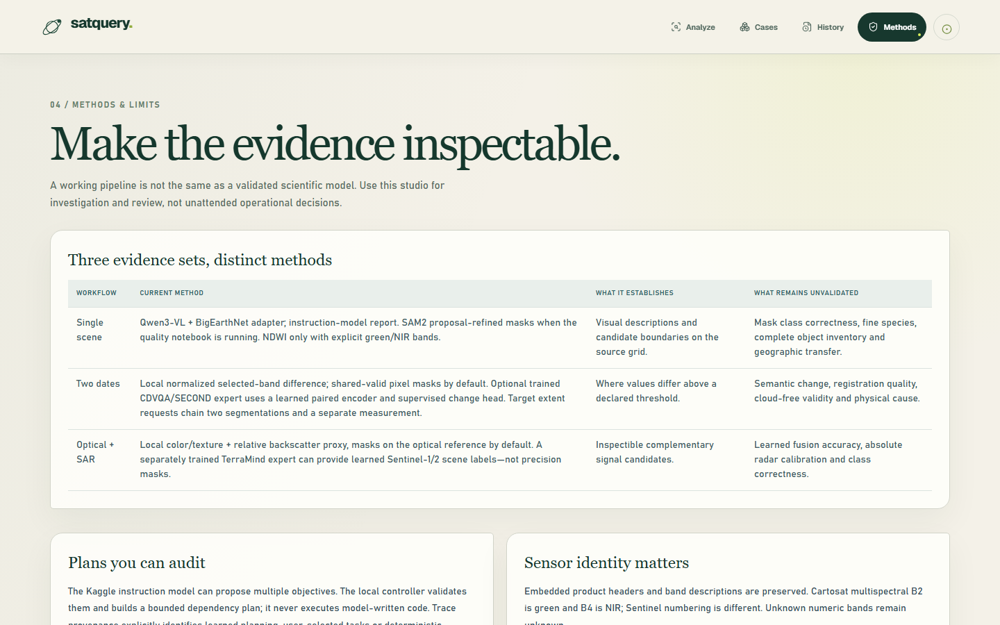

# SatQuery AI

<p align="center">
  <strong>Ask the landscape. Follow the evidence.</strong><br />
  An agentic vision-language workspace for single-scene, temporal-change and optical/SAR Earth-observation analysis.
</p>

<p align="center">
  <a href="docs/PROJECT_BOOK.md">Project book</a> ·
  <a href="docs/RUNBOOK.md">Run locally</a> ·
  <a href="docs/EVALUATION.md">Evaluation</a> ·
  <a href="notebooks/kaggle-run-all/START_HERE.md">Kaggle notebooks</a>
</p>

> SIH 26167 research prototype. SatQuery supports investigation; it is not a certified disaster-response, cadastral, navigation or safety system. Scores and model outputs preserve their documented dataset scope.



## What it does

SatQuery turns a natural-language question and an evidence set into an inspectable analysis:

- **Single scene:** visual question answering, description, grounding and class masks.
- **Bi-temporal pair:** learned question answering plus a semantic-change mask.
- **Optical + SAR pair:** learned Sentinel-1/Sentinel-2 flood/water fusion.
- **Evidence-first output:** answer, overlay, facts, warnings, model version, observable execution trace and downloadable PDF.
- **Compound questions:** a bounded planner decomposes supported requests into explicit specialist steps; it does not expose or invent hidden chain-of-thought.

The browser never receives the Kaggle/ngrok bearer token. The local FastAPI controller validates files and sensor contracts, plans bounded tasks, calls the authenticated model service, integrates evidence and stores cases locally.



## Product

| Home | Investigation workspace |
|---|---|
|  |  |

| Casebook | Methods and provenance |
|---|---|
|  |  |

## Recorded evaluation

These are separate held-out evaluations with different datasets and denominators. They must **not** be averaged into one “accuracy”. Full provenance and limitations are in [EVALUATION.md](docs/EVALUATION.md).

| Specialist | Recorded held-out result | Release interpretation |
|---|---:|---|
| Qwen3-VL 2B + BigEarthNet.txt LoRA | VQA exact match **0.61**; grounding mean IoU **0.4227** | Domain-adapted sampled test evidence |
| SegFormer-B0 + LoveDA | mean IoU **0.4206**; water IoU **0.5852** | Experimental: strict mean/forest gate did not pass |
| Temporal ResNet18/GRU change expert | answer accuracy **0.7275**; mask IoU **0.4961** | Project test gate evidence retained |
| TerraMind S1/S2 flood expert | flood IoU **0.7103**; Dice **0.8306** | Sentinel flood scope; not universal land-cover fusion |

Confidence is not fabricated: uncalibrated model scores remain labelled as such and are capped/withheld where appropriate. The saved Qwen frozen-temperature diagnostic reduced ECE from **0.5516** to **0.1304**, but automatic probability release remains disabled.

## Quick start

### 1. Prerequisites

- Windows/Linux/macOS, Python 3.11–3.12, Node.js 22+
- For the real-model path: a free Kaggle GPU session, ngrok account, and the three private secrets described in the runbook
- No local GPU is required for the normal remote-demo path

### 2. Install

```powershell
git clone https://github.com/aanandmodi/StatqueryAI.git
Set-Location StatqueryAI
Copy-Item .env.example .env
Copy-Item .env.local.example .env.local
./scripts/setup-local.ps1
npm install
```

### 3. Start the model service

Import [06_Demo_Current_Models_Ngrok.ipynb](notebooks/kaggle-run-all/06_Demo_Current_Models_Ngrok.ipynb) into Kaggle, attach the model artifacts when requested, enable a GPU and run all cells. Copy the generated connection values into the root `.env`. Keep that attended Kaggle session running.

### 4. Start the local application

```powershell
./.venv/Scripts/python.exe scripts/run-local.py --mode remote
```

Open `http://localhost:3000`. `Ctrl+C` stops the local services; stop the Kaggle session separately. Nothing is deployed by this command.

For exact setup, secrets, notebook order, Linux commands and troubleshooting, use [docs/RUNBOOK.md](docs/RUNBOOK.md).

## Demo evidence

Ready-to-use GeoTIFF scenes and prompts are in [`input/`](input/README.md):

- a single RGB/multispectral scene,
- a Nepal before/after visual pair,
- co-registered Sentinel-2 optical + Sentinel-1 SAR pairs for India, Ghana and Mekong,
- reference labels isolated in a clearly marked folder and never used as inference input.

JPG, PNG and WebP are accepted for visual exploration. GeoTIFF is required when CRS, transform, verified bands, metric area or sensor-specific spectral analysis matters.

## Repository structure

```text
app/                 React/Vinext routes and same-origin API proxy
backend/             FastAPI controller, validation, planning, reports, persistence
components/          Shared product UI and evidence rendering
input/               Named presentation scenes, checksums and provenance
lib/                 Browser/server API client utilities
ml/                  Reusable preprocessing, model and evaluation library
model_service/       GPU inference contracts and adapters
notebooks/
  kaggle-run-all/    Canonical upload-ready training/evaluation/server notebooks
  patches/           Source patches embedded by the notebook build pipeline
scripts/             Setup, notebook generation, evaluation and smoke checks
upgrade/             Selected trained weights plus immutable manifests/metrics
docs/                Project book, runbook, evaluation evidence and screenshots
```

## Verification

```powershell
./.venv/Scripts/python.exe -m pytest backend/tests ml/tests -q
npm run test:proxy
npm run lint
npm run build
```

These checks establish software integrity, not live-provider availability or hidden-sensor accuracy.

## Documentation

- [Project book](docs/PROJECT_BOOK.md): problem statement, solution, agents, datasets, training, architecture, communication, methodology and judge Q&A.
- [Runbook](docs/RUNBOOK.md): Kaggle, ngrok, secrets, local startup, evidence modes and troubleshooting.
- [Evaluation](docs/EVALUATION.md): exact metrics, denominators, model-selection state and known gaps.
- [API](docs/API.md): controller endpoints and contracts.
- [Security](docs/SECURITY.md): trust boundaries, secrets, uploads and production hardening.

## License and attribution

Code and weights do not override upstream terms. BigEarthNet, LoveDA, SECOND/CDVQA, Sen1Floods11, Qwen, SegFormer and TerraMind retain their own licenses and usage constraints. In particular, LoveDA’s academic/non-commercial and source-imagery conditions must be reviewed before reuse. See the attribution table in [PROJECT_BOOK.md](docs/PROJECT_BOOK.md).
