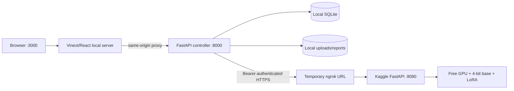

# SatQuery AI

SatQuery is a local-first, auditable remote-sensing assistant for satellite-image questions,
captions, visual grounding, future bi-temporal change analysis, and future optical/SAR fusion. The
current released neural path uses the public
[SatQuery Qwen3-VL LoRA](https://huggingface.co/aanandmodi/satquery-qwen3vl-bigearthnet-txt-lora)
on the immutable `Qwen/Qwen3-VL-2B-Instruct` base revision.

**Nothing in the current workflow deploys the website.** The frontend, controller, database,
uploads, reports, and overlay artifacts run locally. Model inference can run either on the laptop's
NVIDIA GPU in 4-bit mode or in a temporary free Kaggle/Colab session while the website and backend
remain local.

## What is real today

| Capability | State | Implementation |
|---|---:|---|
| GeoTIFF + location metadata | Ready | Raster validation plus bounded latitude, longitude, altitude and metadata |
| Single-image VQA | Ready | Qwen3-VL 2B + released LoRA |
| Scene caption | Ready | Same released specialist with a constrained prompt |
| Grounding and marked image | Ready with model caveat | Parses model boxes; never invents a box when parsing fails |
| Text answer, warnings, provenance, trace | Ready | Schema-validated integration and SQLite job record |
| RGB preview, informative JPEG overlay, PDF report | Ready | Overlay always labels metadata/answer; boxes appear only when valid |
| Change-VQA | Training notebook ready | Not exposed as released until its independent gate passes |
| Optical/SAR fusion | Training notebook ready | Not exposed as released until its independent gate passes |
| Website deployment | Deliberately not performed | Hosting will be selected only after local acceptance |

## Local topology



The browser never receives model or Hugging Face credentials. It calls the local frontend route,
which calls the controller, which is the only process allowed to call a model service.

## Fastest complete start: Kaggle GPU + local application

Requirements: a free Kaggle account, free ngrok account, Python 3.12 and Node.js 22+ locally.

1. Upload [`SatQuery_Qwen3VL_Free_GPU_Server.ipynb`](notebooks/SatQuery_Qwen3VL_Free_GPU_Server.ipynb)
   to Kaggle, enable GPU + Internet, and add `NGROK_AUTHTOKEN` plus
   `SATQUERY_MODEL_SERVICE_TOKEN` as Kaggle Secrets.
2. Run all and wait for the model, local HTTP and public tunnel smoke tests to print `PASS`.
3. Copy `.env.example` to `.env`; set the printed ngrok URL and the same service token.
4. Copy `.env.local.example` to `.env.local`, then start the local app:

```powershell
Set-Location D:\Projects\Sih-2026
& "$env:USERPROFILE\.venvs\satquery\Scripts\python.exe" .\scripts\run-local.py
```

Open `http://localhost:3000`. Keep notebook cell 10 running. Press `Ctrl+C` locally, then interrupt
cell 10 to stop the tunnel. See [NGROK_KAGGLE_RUNBOOK.md](docs/NGROK_KAGGLE_RUNBOOK.md).

## Why the website previously had no model answer

| Layer | Previous state | Correction |
|---|---|---|
| Hugging Face model Space | ZeroGPU creation returned `402` because of the account-age gate | No longer a default dependency |
| Local model service | Defaulted to the wrong 4B base and required a local adapter directory | Now uses the exact pinned 2B base and public adapter |
| Frontend fallback | Automatically tried the unavailable Space | Removed; all inference passes through the controller |
| Laptop memory | BF16 weights could not fit safely in 4 GB VRAM | NF4 4-bit, 448px input, short generation, concurrency one |

## Repository map

| Path | Responsibility |
|---|---|
| `app/` | Local Vinext/React evidence workspace and server-side API proxy |
| `backend/` | FastAPI validation, routing, orchestration, persistence, report/overlay API |
| `model_service/` | Long-lived local Qwen/change/fusion specialist service |
| `ml/` | Model loading, preprocessing, training, evaluation, and artifact utilities |
| `notebooks/` | Kaggle/Colab training, evaluation, and temporary free inference server |
| `scripts/` | Local setup, startup, smoke, and runtime verification |
| `docs/` | Requirements, system design, pipeline, API, security, testing, UI, and status |

## Verification

```powershell
& "$env:USERPROFILE\.venvs\satquery\Scripts\python.exe" -m pytest backend\tests ml\tests -q
& "$env:USERPROFILE\.venvs\satquery\Scripts\python.exe" -m ruff check backend ml model_service scripts
npm run lint
npm run build
```

The real end-to-end check is documented in [TESTING.md](docs/TESTING.md): it uploads a raster,
runs a model query through the controller, waits for completion, verifies non-empty text, and
downloads the overlay/report.

## Documentation index

| Document | Purpose |
|---|---|
| [PRD](docs/PRD.md) | Users, scope, requirements, acceptance criteria |
| [Architecture](docs/ARCHITECTURE.md) | Components, boundaries, deployment-neutral design |
| [System design](docs/SYSTEM_DESIGN.md) | Runtime, data, failure, concurrency, and security design |
| [Pipeline](docs/PIPELINE.md) | Training, release, and inference flows |
| [Local development](docs/LOCAL_DEVELOPMENT.md) | Exact laptop and free-GPU commands |
| [Kaggle + ngrok runbook](docs/NGROK_KAGGLE_RUNBOOK.md) | Secrets, notebook cells, tunnel, wiring and shutdown |
| [Data model](docs/DATA_MODEL.md) | Image, location context, result, evidence and provenance schemas |
| [API](docs/API.md) | Endpoints, schemas, lifecycle, error semantics |
| [Testing](docs/TESTING.md) | Unit, integration, build, and real-model gates |
| [Security](docs/SECURITY.md) | Threat model, secrets, uploads, and retention |
| [UI design](docs/DESIGN_UI.md) | Visual system and interaction rules |
| [Progress](docs/PROGRESS.md) | Evidence-backed completion and remaining work |
| [Hosted-resource status](docs/UNDEPLOYMENT_STATUS.md) | What is private, preserved, temporary, or removed |

## Secret warning

A Hugging Face token was pasted into chat earlier. Treat it as compromised: revoke it in Hugging
Face settings and create a new least-privilege token only when a future hosting action actually
requires one. Local inference against the public adapter requires no Hugging Face token.
