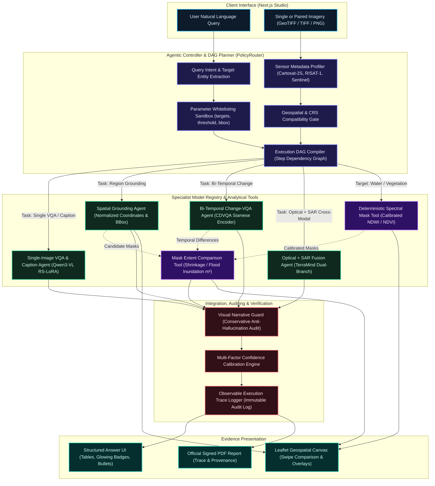

# SatQuery AI — Agentic Communication & Execution Flow

This document outlines the multi-agent coordination architecture, message sequence, and execution lifecycle of **SatQuery AI**, detailing how user natural language queries and remote-sensing satellite assets are planned, executed, audited, and presented.

---

## 1. End-to-End Agentic Architecture & Communication Flow

---

## 2. Inter-Agent Communication Sequence (Bi-Temporal Change / Flood Scenario)

This sequence diagram illustrates component interactions during a bi-temporal flood or reservoir shrinkage inquiry (e.g., *"Highlight water bodies, detect changes between Time A and Time B, and calculate area lost or gained"*):

```mermaid
sequenceDiagram
    autonumber
    actor User as Analyst / User
    participant Web as Next.js Web Studio
    participant Router as PolicyRouter (Planner)
    participant Specialist as Change-VQA & Grounding Agent
    participant Spatial as Raster Mask Engine
    participant Guard as Narrative Guard
    participant PDF as ReportLab PDF Engine

    User->>Web: Submits query & uploads Image A (Before) + Image B (After)
    Web->>Router: POST /v1/analyse {query, asset_ids}
    
    rect rgb(30, 27, 75)
        note over Router: 1. Compatibility & Planning Phase
        Router->>Router: Inspect embedded tags (Cartosat-2S / RISAT / S2)
        Router->>Router: Verify identical CRS projection & resolution grid
        Router->>Router: Whitelist parameters: target='water', threshold=0.0
        Router->>Router: Compile DAG: [Ground A, Ground B] -> [Measure Extent] -> [Change VQA]
    end

    rect rgb(15, 41, 30)
        note over Specialist,Spatial: 2. Specialized Execution Phase
        Router->>Spatial: Execute NDWI on Time A (Green & NIR bands)
        Spatial-->>Router: Returns candidate Water Mask A (pixels: 82,000)
        
        Router->>Spatial: Execute NDWI on Time B (Green & NIR bands)
        Spatial-->>Router: Returns candidate Water Mask B (pixels: 41,000)

        Router->>Specialist: Run CDVQA Siamese Model on co-registered pair
        Specialist-->>Router: Returns directional classification ("water area decreased")

        Router->>Spatial: Run compare_mask_extent(Mask A, Mask B)
        Spatial->>Spatial: Compute (Mask A & ~Mask B) = Lost water
        Spatial->>Spatial: Compute (Mask B & ~Mask A) = Gained water
        Spatial-->>Router: Returns Net Area Change: -369,000.0 m² (Shrinkage)
    end

    rect rgb(49, 16, 24)
        note over Guard: 3. Audit & Anti-Hallucination Phase
        Router->>Guard: Submit raw VLM text + measured mask metrics
        Guard->>Guard: Strip uncorroborated generative numerical claims
        Guard->>Guard: Inject verified metric facts: -369,000.0 m² gross shrinkage
        Guard->>Guard: Compute calibrated confidence score (Coverage + Agreement)
    end

    rect rgb(4, 47, 46)
        note over Web,PDF: 4. Evidence Presentation Phase
        Router-->>Web: JSON payload (Structured text, masks, trace, confidence)
        Web->>Web: Render Markdown tables, glowing bullet badges, status tags
        Web->>Web: Overlay GeoTIFF raster with shrinkage masks & swipe comparison
        User->>Web: Clicks "Download Official PDF Report"
        Web->>PDF: Request compiled analysis export
        PDF-->>User: Delivers signed PDF with execution trace & evidence table
    end
```

---

## 3. Core Architectural Stages & Responsibilities

### Stage 1: Ingestion & Sensor Metadata Profiling
- **Input Scope Validation**: Accepts single GeoTIFF/TIFF or pairs (Optical+SAR or Bi-temporal). PNG/JPEG are strictly limited to evaluation benchmarks.
- **Sensor Metadata Extraction** ([`backend/app/sensors.py`](../backend/app/sensors.py)): Automatically identifies platform signatures (`Cartosat-2S`, `RISAT-1 / EOS-04`, `Sentinel-1`, `Sentinel-2`) and binds spectral channels (B1=Blue, B2=Green, B3=Red, B4=NIR) and radar polarizations (`HH`, `HV`, `VH`, `VV`).
- **Georeference Integrity**: Checks Coordinate Reference Systems (EPSG codes), pixel resolution, affine transforms, and flags non-overlapping or unprojected scenes.

### Stage 2: Agentic Planning & Parameter Sandboxing
- **Policy Router** ([`backend/app/core/router.py`](../backend/app/core/router.py)): Classifies user query intent into closed-set tasks (`SINGLE_VQA`, `CAPTION`, `GROUNDING`, `CHANGE_VQA`, `OPTICAL_SAR_FUSION`).
- **Parameter Whitelisting**: Sandboxes query inputs to safe, validated parameters (`targets`, `threshold`, `water_index_threshold`, `bbox`). Arbitrary tool injection or parameter tampering is rejected.
- **Execution DAG Generation**: Compiles an explicit dependency plan where upstream specialist outputs (e.g., individual date segmentations) feed downstream analytical steps (e.g., temporal mask comparison).

### Stage 3: Specialist Agents & Analytical Tools
- **Remote-Sensing Adapted VLM**: Qwen3-VL 4-bit domain adapter for VQA and captioning.
- **Spatial Grounding Specialist**: Generates normalized bounding coordinates `[ymin, xmin, ymax, xmax]` for target features.
- **Bi-Temporal Change Agent**: Siamese dual-branch encoder trained on CDVQA for directional change inference.
- **Cross-Modal Optical + SAR Fusion**: TerraMind dual-branch cross-attention encoder combining optical color signatures with all-weather radar backscatter.
- **Deterministic Spectral Tools** ([`backend/app/models/masks.py`](../backend/app/models/masks.py)): Calibrated NDWI and NDVI raster computation directly on source satellite bands.
- **Mask Extent Measurement** ([`backend/app/models/mask_comparison.py`](../backend/app/models/mask_comparison.py)): Performs pixel-accurate boolean operations (`left & ~right` for loss, `right & ~left` for gain) and multiplies by ground pixel resolution to yield metric area changes ($m^2$ / hectares).

### Stage 4: Verification, Auditing & Confidence Estimation
- **Visual Narrative Guard** ([`backend/app/core/narrative.py`](../backend/app/core/narrative.py)): Intercepts VLM text to remove unmeasured numerical assertions (e.g., hallucinated acreage) unless corroborated by deterministic raster masks.
- **Multi-Factor Confidence**: Calculates calibrated probability based on four independent metrics: specialist raw score, input image quality, evidence coverage, and cross-branch agreement.
- **Observable Execution Trace**: Produces an immutable event log recording `step_id`, `task`, `tool`, `model_version`, `status`, `duration_ms`, and `policy_reason`.

### Stage 5: Multi-Modal Evidence Delivery
- **Structured Answer UI** ([`components/structured-answer.tsx`](../components/structured-answer.tsx)): Renders responsive markdown tables, glowing hierarchy headings, custom status badges (`[Verified]`, `[Detected]`, `[High]`), and styled bullet items.
- **Geospatial Canvas**: Leaflet-powered raster viewer with band switching, candidate mask overlays, and swipe comparison.
- **Auditable PDF Report** ([`backend/app/reporting.py`](../backend/app/reporting.py)): Compiles analysis metadata, structured findings, confidence meters, evidence tables, and the complete execution trace into an exportable PDF document.
