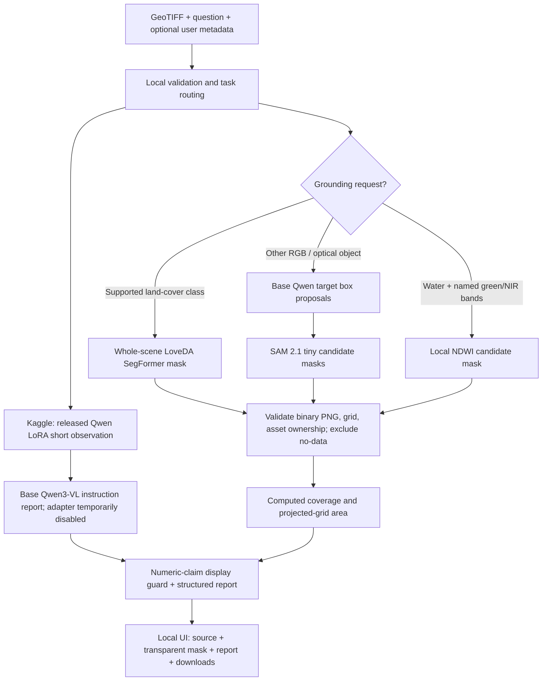

# Analysis quality v4: class-aware reports and candidate pixel masks

Updated 2026-09-08: the maintained 6b cell now requests six evidence categories and uses a
whole-scene LoveDA SegFormer transfer baseline for supported land-cover classes. This addresses the
failure where SAM precisely traced a semantically wrong Qwen proposal. Qwen + SAM remains a
fallback for unsupported targets. The display guard is not a general verifier, and v4 is prepared
but not yet GPU-tested on the user's running Kaggle session.
See [Studio guide](STUDIO_GUIDE.md) for common formats and new pages.

This is a local-first, zero-paid-infrastructure upgrade. It is **not a claim of perfect accuracy**.
The browser and backend stay local; Qwen and SAM run on the existing attended Kaggle GPU session.
No endpoint, Space, cloud website, or paid account resource is created by this upgrade.

## What was wrong

| Observed limitation | Change | Remaining limit |
|---|---|---|
| Short-answer adapter, 128-token cap | Separate 768-token instruction report pass | Longer prose is not proof of correctness |
| Model invented conflicting coverage percentages | Conservative numeric-claim display guard; retain original as unverified audit data | Not a full hallucination detector |
| Rectangles only | Binary masks, transparent cyan overlay, unfilled holes, original-image toggle, PNG download | A precise-looking contour can still identify the wrong feature |
| No per-scene report context | Raster extent, grid size, CRS, spacing, footprint, mask coverage/area, limitations | Grid area is not surveyed surface area |
| RGB used without spectral qualification | NDWI only on explicitly described green/NIR bands | RGB cannot supply a missing NIR band |

## Model and measurement pipeline

### Models

- Adapter: `aanandmodi/satquery-qwen3vl-bigearthnet-txt-lora` at `ed12e59e0def9468bdf4a226789fc1b77c7900e7`.
- Narrative and target proposals: `Qwen/Qwen3-VL-2B-Instruct` at `89644892e4d85e24eaac8bacfd4f463576704203`, using the already loaded base with PEFT's adapter disabled temporarily. This is **not presented as improved performance of the fine-tuned adapter**.
- Boundary refinement: `facebook/sam2.1-hiera-tiny` at `de431c4043854a71d8101e17995dfe596bf101a5`. Additional GPU weights, on Kaggle only. No API key besides the existing notebook secrets is added.
- Whole-scene semantic transfer baseline: `wu-pr-gw/segformer-b2-finetuned-with-LoveDA` at
  `5c74556c08bebb5f45f50b6f78f61a62c5d220c7`. It supplies background, building, road, water,
  barren, forest and agriculture classes. The publisher provides no model card or declared license,
  so this checkpoint is experimental and must be replaced by the user-owned evaluated artifact.
- SAM is promptable segmentation, **not a water classifier**. Wrong Qwen proposals can produce wrong water masks. No proposal means no invented fallback mask. At most 3 target classes and 4 proposals per class are processed.
- SAR is excluded from the RGB SAM path. SAR segmentation requires a validated specialist.

### Water index

NDWI is `(green - NIR) / (green + NIR)`, default threshold `> 0`.
The backend requires unique band descriptions `green`/`B03`/`B3` and `nir`/`near infrared`/`B08`/`B8`.
It uses stored scale and offset metadata, not stretched RGB preview values. Band naming does not
itself establish correct atmospheric/radiometric calibration: verify product metadata first.
For a multilayer TIFF set these descriptions in your GIS/export workflow only when the actual band
identities are known. Do **not** rename an RGB blue or red band to NIR.

The API accepts `parameters.water_index_threshold` between -1 and 1. This is an index threshold,
not confidence. Cloud/shadow filtering, threshold validation and local conditions matter.
The supplied `sample.tif` has 3 unnamed bands, so NDWI correctly remains unavailable for it.

### Grid and measurement semantics

- SAM input/output grid: source aspect ratio, at most 1024 pixels on the long edge; Qwen image tokens
  are bounded separately to 768 × 768 pixels. Large rasters are **not** processed at native detail.
- Local NDWI: at most 2048 pixels on the long edge; nearest-neighbour sampling. This is not a full-resolution tiled water inventory.
- Masks are binary PNGs. Transparent display uses nearest-neighbour resampling and never fills islands/holes as rectangles.
- Statistics are recomputed by the local backend; model-supplied area/coverage fields are not trusted.
- Coverage denominator: valid pixels on the analysis grid, not the padded display canvas.
- NDWI support additionally excludes nonfinite/negative calibrated values and zero denominators.
  NDWI replacement applies to water-only requests; mixed-target evidence is preserved.
- Area: selected grid pixels × projected affine pixel area, adjusted for analysis-grid size and CRS linear units. Geographic-degree rasters get **no fabricated m² estimate**.
- The PNG is not a GeoTIFF. Original CRS/affine, source dimensions and analysis-grid dimensions remain in the analysis JSON. Do not assign native pixel spacing to a downsampled mask.
- Binary masks are scoped to an analysis and its asset. The backend never fetches a model-provided artifact URL.

## Apply to your currently running Kaggle session

1. Keep the model loaded. Do not rerun training or section 3.
2. If section 10 is occupying the kernel, interrupt that waiting cell. It shuts down the attended
   tunnel/API by design; this does not remove the loaded model. Run section 6 again to start the API.
3. Insert one code cell **immediately after section 6** in the same currently running notebook and
   paste the complete contents of `notebooks/patches/quality_upgrade.py`. Do not open the separate
   live-patch notebook as a new Kaggle session: notebooks do not share loaded Python objects. Run
   the pasted cell once. It loads SegFormer and SAM on the existing GPU and updates the current
   inference/ready routes without exposing credentials.
4. Run section 7. It must return HTTP 200 with `quality_pipeline` = `satquery-quality-v4` in the
   structured facts. The synthetic test is only a transport test, not segmentation accuracy.
5. Run sections 8 and 9 to reopen and verify the free tunnel. If the ngrok URL changes, update
   `SATQUERY_MODEL_SERVICE_URL` in the local `.env` and restart the backend.
6. Run section 10 for the attended demo. The independent 60-minute shutdown remains in place;
   this upgrade does not circumvent notebook quotas or make Kaggle a 24/7 host.
7. Refresh the local website, choose **Locate a feature**, upload the TIFF and ask:

   > Outline the visible water bodies and give a detailed report of their spatial pattern and limitations.

8. Inspect the cyan candidate patches; toggle the overlay off to compare with the original. A
   rectangular box still appearing means the old handler returned boxes, not a SAM mask. Check
   the facts for `satquery-quality-v4`. Inspect `mask_diagnostics` to distinguish the whole-scene
   semantic path from Qwen/SAM fallback. No mask may mean the selected class was absent.

For a new session, upload the updated `notebooks/SatQuery_Qwen3VL_Free_GPU_Server.ipynb`; the
quality cell is already included as **section 6b**. Execute in order. Rerunning section 6 resets the
routes, so always rerun 6b after it. No fine-tuning notebook or full dataset download is needed.

If Kaggle reports out-of-memory, stop requests and release other models/notebooks. Do not upgrade
to paid hardware. Restart the kernel and use the fully updated server notebook rather than leaving
a partially applied handler. A failed segmentation returns text with an explicit warning, not fake shapes.
The live GPU path must be tested after installing this cell; local unit tests cannot verify it.

## Validation before claiming precision

1. Use independently labelled imagery with the same sensor, resolution and region as the SIH demo.
   Include small ponds, rivers, islands, shadows, urban dark surfaces, cloud and no-water scenes.
2. Hold out entire geographic scenes from training; do not split neighbouring patches across sets.
3. Manually inspect/annotate binary references on the **exact analysis grid**. Preserve no-data masks.
4. Run `python scripts/evaluate-water-mask.py prediction.png reference.png` on binary PNGs.
   The tool never resizes either file and reports precision, recall, IoU and Dice; undefined
   empty-class metrics are `null`, not a misleading perfect score.
5. Aggregate a sufficiently varied held-out set, report errors by scene type, and assess boundaries
   separately. Do not quote metrics from the synthetic pipeline tests as model accuracy.
6. If precision is inadequate, train a dedicated water segmentation model on labelled remote-sensing
   masks and replace the candidate specialist. BigEarthNet short-answer VQA tuning alone does not
   train pixel-level segmentation or detailed geospatial reporting.

## Primary references

- [SAM 2 documentation for the pinned Transformers version](https://huggingface.co/docs/transformers/v4.57.1/model_doc/sam2): box prompts and mask post-processing.
- [Meta SAM 2.1 tiny model card](https://huggingface.co/facebook/sam2.1-hiera-tiny): checkpoint and model scope.
- [PEFT model API](https://huggingface.co/docs/peft/en/package_reference/peft_model): temporary adapter disabling.
- [USGS water-index threshold study](https://pubs.usgs.gov/publication/70035636): thresholds and mixed water/non-water pixels.
- [USGS Sentinel-2 water-index product](https://www.usgs.gov/data/sentinel-2-acolite-dsf-aquatic-reflectance-conterminous-united-states): green/NIR water-index formulation.
