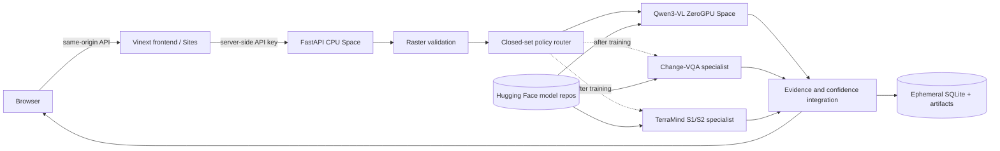

# SatQuery architecture

## Objective

Provide an observable, fail-closed controller around specialist remote-sensing models. The system
must never pretend one RGB VLM can perform bi-temporal change detection or raw optical/SAR fusion.

## Deployment profile: zero cost

| Layer | Service | Cost guardrail |
|---|---|---|
| Web UI | Sites | Static/server frontend free deployment |
| Controller | Hugging Face Docker Space, CPU Basic | Never requests upgraded hardware |
| VLM | Public Gradio ZeroGPU Space | `@spaces.GPU`, one queued job, cached responses |
| Model registry | Public Hugging Face model repositories | Adapter-only SafeTensors |
| Training | Kaggle/Colab free GPU sessions | Separate bounded notebooks and explicit stop gates |
| State | SQLite and local Space filesystem | Ephemeral; no paid persistent volume |

Free infrastructure has quotas, cold starts, and no uptime SLA. “Zero cost” therefore means a
bounded judging/demo service, not unlimited production capacity. If the quota is exhausted the API
returns a clear `503 model_unavailable`; it never falls back to invented neural output.

## Request lifecycle

1. Upload is streamed to an immutable random filename and size-limited.
2. Rasterio validates driver, dimensions, bands, CRS, transform and pair compatibility.
3. The policy router maps the query to a closed `TaskType`; user text cannot select arbitrary code,
   URLs, model IDs, or file paths.
4. For VLM tasks the API creates a bounded RGB preview, hashes the request, and checks the TTL/LRU
   cache before consuming ZeroGPU quota.
5. The gateway submits to Gradio's queue API, polls the event ID, retries only transient failures,
   and validates the structured response with Pydantic.
6. The integrator caps uncalibrated confidence, attaches evidence to the source asset, records the
   observable trace, and generates a report.

## Specialist boundaries

| Task | Inputs | Model | Released? |
|---|---|---|---|
| `single_vqa` | One RGB/optical scene | Qwen3-VL 2B + BigEarthNet.txt LoRA | Yes |
| `caption` | One RGB/optical scene | Same adapter | Yes |
| `grounding` | One RGB/optical scene | Same adapter; 0..1000 box parsing | Yes |
| `change_vqa` | Two co-registered temporal RGB scenes | Shared ResNet, diff/product fusion, GRU, answer and mask heads | Notebook ready |
| `optical_sar_fusion` | Co-registered 12-band S2 + VV/VH S1 | TerraMind dual-modality backbone and evidence head | Notebook ready |

With a personal free-account limit of two ZeroGPU Spaces, the intended final layout is one Qwen
Space and one combined change/fusion specialist Space after both artifacts pass release gates.

## Data and reproducibility

- Qwen adapter: immutable adapter and base revisions are hard-pinned in deployment code.
- Text/grounding: `BIFOLD-BigEarthNetv2-0/BigEarthNet.txt` at a pinned dataset revision.
- Matching imagery: bounded Lithuania summer S1/S2 LMDB mirror at a pinned revision.
- Change: CDVQA annotations plus externally attached SECOND image/label folders.
- Artifacts: SafeTensors, configuration, metrics, runtime/training manifest and SHA-256 manifest.
- Splits: image/patch IDs are disjoint; test is not used for model selection.

## Failure and trust model

- Missing/misaligned imagery: `422 validation_failed` or `routing_failed`.
- Unsupported undeployed specialist: `503 model_unavailable` with the missing task named.
- ZeroGPU sleep, queue or quota: bounded retries then `503`, retaining the job trace.
- Unparseable grounding geometry: text is returned with a warning and no fabricated box.
- Confidence: token likelihood and raw sigmoid scores are not described as calibrated probability.
- Free Space restart: jobs/uploads may disappear; the browser must retain originals.

## Scale-up path without changing contracts

The `SpecialistGateway` interface isolates hosting. A future funded deployment can replace the
Space gateway with the existing long-lived HTTP model service, object storage, PostgreSQL and a
distributed queue while preserving frontend/API schemas.

