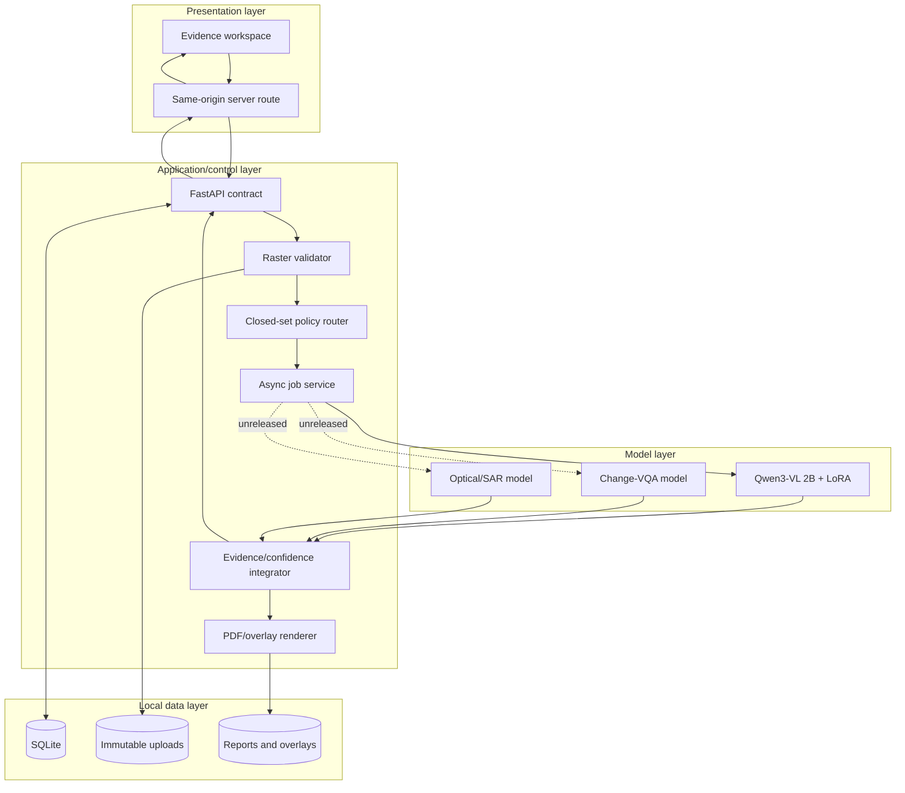
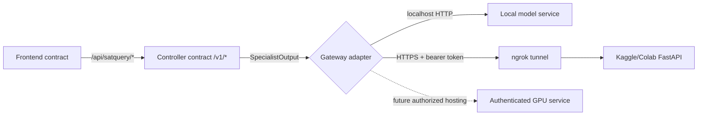
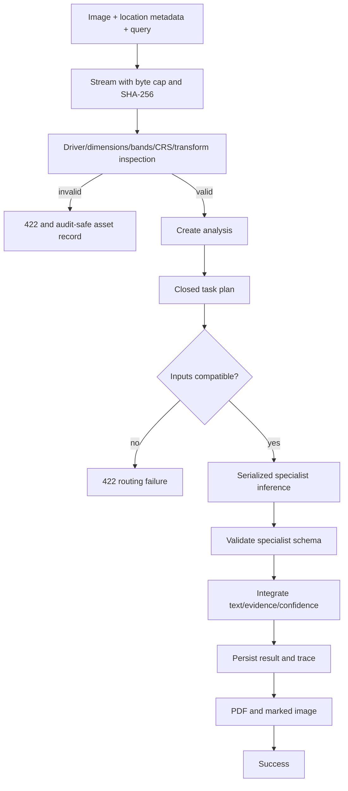

# Architecture

## Architectural decision

SatQuery is a modular monolith plus isolated specialist processes. The controller owns validation,
policy, job state, integration, and artifacts. Models own only bounded inference. The frontend owns
interaction and visualization, never model credentials or orchestration policy.

## Layer responsibilities

| Layer | Owns | Must not own |
|---|---|---|
| Frontend | Upload UX, task selection, polling, evidence canvas, downloads | Secrets, model loading, task-policy decisions |
| Frontend proxy | Same-origin transport, narrow allowlist, optional server-only API key | File persistence or result invention |
| Controller | Validation, routing, jobs, persistence, integration, reports | GPU model implementation details |
| Specialist gateway | Authenticated HTTP transport and response validation | User-facing state or arbitrary routing |
| Model service | Preprocessing, pinned model load, serialized inference | Public upload API, database, hidden fallbacks |
| Stores | Immutable source bytes, job records, generated artifacts | Model execution |

## Deployment-neutral ports and contracts

Changing the model location requires environment configuration, not a UI rewrite. The free-GPU
profile uses `SATQUERY_MODEL_BACKEND=http` and the temporary ngrok HTTPS URL printed by the
notebook. The same contract also works at `127.0.0.1:8080`.

## Specialist matrix

| Task | Required input | Specialist | Release state | Output |
|---|---|---|---|---|
| `single_vqa` | One optical/multispectral raster | Qwen3-VL 2B + LoRA | Released | Text, facts, warnings |
| `caption` | One optical/multispectral raster | Qwen3-VL 2B + LoRA | Released | Factual scene description |
| `grounding` | One optical/multispectral raster | Qwen3-VL 2B + LoRA | Released with localization caveat | Text + optional normalized box |
| `change_vqa` | Two co-registered temporal rasters | Change specialist | Not released | Answer + change evidence |
| `optical_sar_fusion` | Co-registered optical and SAR rasters | TerraMind fusion specialist | Not released | Multilabel facts + dense evidence |

Unreleased tasks remain visible in system architecture but are disabled in capabilities. The
single-image VLM is not allowed to impersonate temporal or sensor-fusion models.

## Request lifecycle

## Technology choices

| Concern | Choice | Rationale |
|---|---|---|
| Frontend | Vinext/React/TypeScript | Existing local app, server routes, responsive evidence UI |
| API | FastAPI/Pydantic | Explicit contracts, async jobs, typed error handling |
| Raster processing | Rasterio + NumPy + Pillow | Geospatial inspection and bounded previews |
| Local state | SQLite + filesystem | Zero cost, inspectable, adequate for single-machine demo |
| VLM runtime | PyTorch + Transformers + PEFT + bitsandbytes | Loads the released adapter without merging; 4-bit hardware fit |
| Reports | ReportLab + Pillow | Local deterministic PDF/JPEG artifacts |
| Tests | Pytest + Ruff + frontend lint/build | Layered verification |

## Non-negotiable invariants

1. A demo/simulator answer cannot run when `environment=production`.
2. A model and adapter revision must be immutable commit SHAs.
3. Invalid rasters never reach a specialist.
4. The browser never receives HF/model/API secrets.
5. The system never fabricates evidence geometry or calibrated probability.
6. Uploaded source bytes are not modified when previews or overlays are created.
7. No website or backend deployment occurs without a future explicit hosting decision.
8. User coordinates remain labelled as metadata and are never presented as pixel inference.

Detailed runtime behavior is in [SYSTEM_DESIGN.md](SYSTEM_DESIGN.md); model/data flows are in
[PIPELINE.md](PIPELINE.md).
