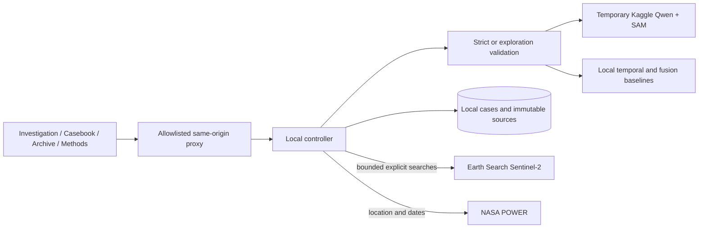
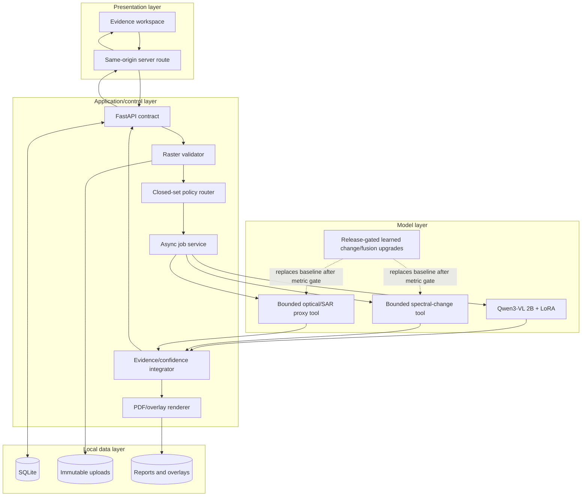
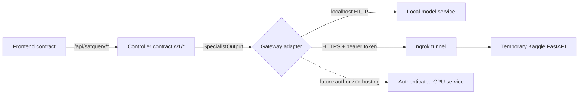
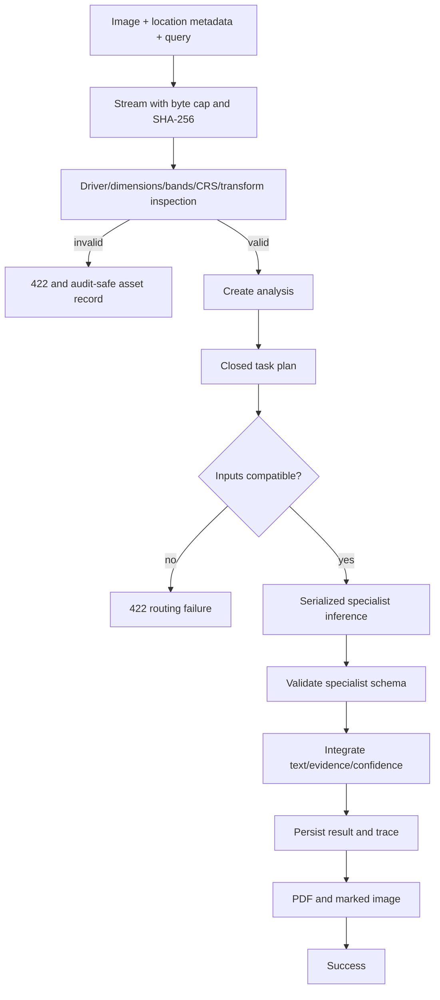

# Architecture

<<<<<<< HEAD
## Bounded learned-proposal extension — 2026-09-04

The controller now owns a dependency DAG rather than a task-only flat list. An optional authenticated
Qwen `/v1/plan` proposes closed-set objectives; schema/asset checks determine the executable plan.
Missing/invalid proposals are explicitly labelled fallback. `query`, `depends_on` and `operation`
are controller-only fields stripped from legacy remote inference payloads. Sensor profiles and
band descriptions likewise remain compatible with the already-running strict v1 server.

Target pair requests can invoke two independent grounding steps, one pair comparison and a
dependent mask-extent measurement. See [current flow diagram and gates](CRITICAL_GAPS.md).
Learned paired runtime artifacts use exactly the cloud-notebook class definitions, verified hashes,
explicit spectral inputs and uncalibrated scores. Local analytical baselines remain the default
until the separate checkpoints are trained and verified. They are not a trained change/fusion model.

=======
>>>>>>> 2f620623f8897788bd2df2ce4f5700cb183d84f8
## Studio extension — 2026-09-04

Exploration and strict validation are separate profiles stored with each asset. WebP is repackaged
as PNG only for remote transport; original bytes/hash remain local. Controller-only profile fields
are omitted from remote-v1 payloads for compatibility with already-running GPU notebooks.

Context clients use fixed providers and bounded sizes/timeouts/concurrency/caches, not arbitrary
URLs. Pair masks recompute shared validity and derive grouping from grid/mask bytes rather than
model identifiers. [Studio guide](STUDIO_GUIDE.md) documents preparation and scientific limits.

The [quality-v2 extension](ANALYSIS_QUALITY.md) adds separate adapter observations, base-instruction
reporting and SAM 2 candidate-mask refinement in Kaggle. The local controller owns binary-mask
validation, optional declared-band NDWI, area calculations, numeric-claim filtering and report
assembly. The old single-image handler remains compatible but cannot generate SAM masks.

## Architectural decision

SatQuery is a modular monolith plus isolated specialist processes. The controller owns validation,
policy, job state, integration, and artifacts. Models own only bounded inference. The frontend owns
interaction and visualization, never model credentials or orchestration policy.

## Layer responsibilities

| Layer | Owns | Must not own |
|---|---|---|
| Frontend | Upload UX, task selection, polling, evidence canvas, downloads | Secrets, model loading, task-policy decisions |
| Frontend proxy | Same-origin transport, narrow allowlist, optional server-only API key | File persistence or result invention |
| Controller | Validation, routing, jobs, persistence, integration, reports | GPU model implementation details |
| Specialist gateway | Authenticated HTTP transport and response validation | User-facing state or arbitrary routing |
| Model service | Preprocessing, pinned model load, serialized inference | Public upload API, database, hidden fallbacks |
| Stores | Immutable source bytes, job records, generated artifacts | Model execution |

## Deployment-neutral ports and contracts

Changing the model location requires environment configuration, not a UI rewrite. The free-GPU
profile uses `SATQUERY_MODEL_BACKEND=http` and the temporary ngrok HTTPS URL printed by the
notebook, plus `SATQUERY_PAIR_BACKEND=local`. After learned pair experts pass their metric gates,
`SATQUERY_PAIR_BACKEND=http` and task-specific service URLs replace the local baselines without a
UI or controller-contract change. The same contract also works at `127.0.0.1:8080`.

## Specialist matrix

| Task | Required input | Specialist | Release state | Output |
|---|---|---|---|---|
| `single_vqa` | One optical/multispectral/SAR raster | Qwen3-VL 2B + LoRA | Released | Text, facts, warnings |
| `caption` | One optical/multispectral/SAR raster | Qwen3-VL 2B + LoRA | Released | Factual scene description |
| `grounding` | One optical/multispectral/SAR raster | Qwen3-VL 2B + LoRA | Released with localization caveat | Text + optional normalized box |
| `change_vqa` | Two co-registered temporal rasters | Spectral-change CPU tool | Runnable baseline | Fraction, direction, candidate box, caveats |
| `optical_sar_fusion` | Co-registered optical and SAR rasters | Optical/backscatter CPU tool | Runnable baseline | Candidate water/built-up facts and boxes |

All five tasks are exposed by the hybrid gateway. Pair tools report uncalibrated evidence quality
and never impersonate the learned CDVQA or TerraMind experts; those artifacts can replace the
baseline behind the same contract after their independent metric gates pass.

Change boxes use the time-A grid; fusion boxes use the optical grid. The UI and download route
select the source asset explicitly and filter evidence by its asset ID. Neither rendering path
crops the preview or transfers boxes onto another input. Pair baselines abstain on missing/shared
nodata or insufficient signal; their candidate boxes are not semantic segmentation masks.

## Request lifecycle

## Technology choices

| Concern | Choice | Rationale |
|---|---|---|
| Frontend | Vinext/React/TypeScript | Existing local app, server routes, responsive evidence UI |
| API | FastAPI/Pydantic | Explicit contracts, async jobs, typed error handling |
| Raster processing | Rasterio + NumPy + Pillow | Geospatial inspection and bounded previews |
| Local state | SQLite + filesystem | Zero cost, inspectable, adequate for single-machine demo |
| VLM runtime | PyTorch + Transformers + PEFT + bitsandbytes | Loads the released adapter without merging; 4-bit hardware fit |
| Reports | ReportLab + Pillow | Local deterministic PDF/JPEG artifacts |
| Tests | Pytest + Ruff + frontend lint/build | Layered verification |

## Non-negotiable invariants

1. A demo/simulator answer cannot run when `environment=production`.
2. A model and adapter revision must be immutable commit SHAs.
3. Invalid rasters never reach a specialist.
4. The browser never receives HF/model/API secrets.
5. The system never fabricates evidence geometry or calibrated probability.
6. Uploaded source bytes are not modified when previews or overlays are created.
7. No website or backend deployment occurs without a future explicit hosting decision.
8. User coordinates remain labelled as metadata and are never presented as pixel inference.

Detailed runtime behavior is in [SYSTEM_DESIGN.md](SYSTEM_DESIGN.md); model/data flows are in
[PIPELINE.md](PIPELINE.md).
