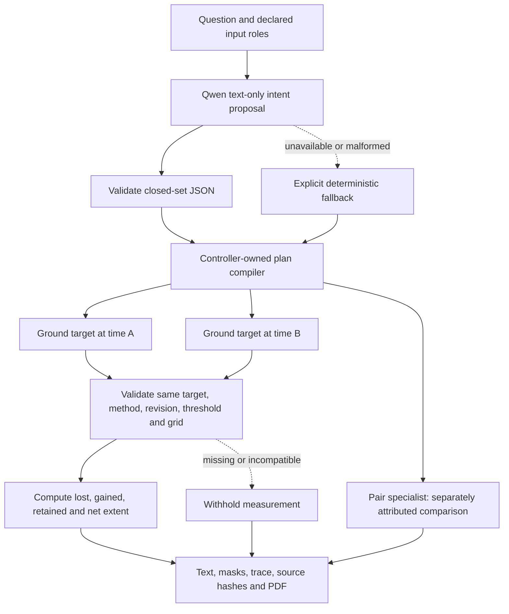

# Critical-gap audit and implementation — 2026-09-08

This is the current status, not a claim of perfect accuracy. No website deployment, paid endpoint,
new account credential or local GPU training is involved.

## Update — 2026-09-21 (supersedes the older pending-run notes below)

Actual 01/05 raw Qwen predictions and scorecards are now preserved in `upgrade/`; final test VQA
exact-match is 0.61, grounding mean IoU 0.42267, caption token F1 0.40145. These do not establish
mask quality or justify lifting the uncalibrated confidence cap. Temperature remains frozen from
validation; the test scorecard explicitly disallows automatic probability release.

02 was trained but failed mean/forest IoU targets. 03 was trained but failed validation mask IoU
(0.39661 against 0.40). 04 finished execution but saved NaN head weights and is invalid. Therefore
the learned specialist release gap remains **open**, not closed by notebook completion.

[R2 revisions](TRAINING_R2.md) address scale mismatch, coarse mask decoding, loss balance and
numerical failure without weakening acceptance thresholds. Revised code and matching serving
architectures are available; new Kaggle runs and passing evidence are still required. Previously
observed public test splits cannot now be described as newly untouched evaluation.

| Judge's challenge | Implemented correction | Remaining release gate |
|---|---|---|
| “Are you only subtracting matrices?” | Analytical baselines remain explicitly labelled. Corrected ChangeVQA/SECOND training exports and strict serving share the **exact same architecture**; the learned mask is binary PNG, not a rectangle. Training now resumes, selects by answer+mask quality, exports reversible raw predictions, and refuses upload until declared validation and untouched-test gates pass. The controller prefers a configured learned pair endpoint and labels any analytical fallback. | Run cloud training on licensed SECOND pixels + CDVQA questions, pass the held-out gates, pin the artifact, then verify real pair HTTP inference. No compatible trained change checkpoint has passed yet. |
| “Where is learned optical/SAR fusion?” | The replacement notebook trains a TerraMind S2-L1C/S1-GRD **pixel segmentation** head from Sen1Floods11 LabelHand masks. It preserves official disjoint splits and hashes, ignores invalid pixels, records reversible raw predictions, compares fused/S2-only/S1-only ablations from the same best checkpoint, and exports a strict `satquery-pair-v3` artifact. The runtime returns its learned flood mask and method provenance. | Run the notebook on Kaggle with the official data, choose a validation IoU threshold before release, pass validation plus untouched test gates, pin the artifact, and verify real paired HTTP inference. Until then the controller continues to label/use the analytical fallback. |
| “Can one question require several tools?” | Learned closed-set intent proposal, deterministic DAG compiler, focused per-step questions, dependency validation, two date-specific segmentations, comparison and dependent loss/gain tool. | Existing Kaggle sessions must apply the live upgrade cell. Until `/v1/plan` works, provenance explicitly reports deterministic fallback. |
| “What are Cartosat/RISAT inputs?” | Embedded platform/product/mode/band/polarization/RTC metadata is preserved. Numeric band aliases are sensor-qualified; conflicting tags and complex SAR fail safely. | External sidecar ingestion and ISRO-specific training/calibration are not implemented. Embed metadata using a reviewed preprocessing workflow; a filename or UI sensor label is not proof. |
| “Where did these benchmark numbers come from?” | The fabricated random-number benchmark generator and every derived benchmark report were removed. A user-supplied 200-row validation aggregate with immutable base, adapter and dataset revisions is recorded under `docs/evaluation/`; LoRA improved all four reported aggregates. | Add the raw per-example JSONL and split manifest, run the local scene-bootstrap scorer, review error slices, then run the untouched test split before presenting a final number. |
| “Why is confidence below 0.8?” | Uncalibrated values remain capped by design. Sequence likelihood is recorded only as a calibration input, never presented as correctness probability. | Fit on held-out validation scenes, freeze temperature/abstention policy, and evaluate once on an untouched test split before changing `score_kind`. |

## Bounded dynamic planning

The LLM proposes objectives, not Python, tools, URLs, file paths or numerical measurements.
The compiler selects exact uploaded asset IDs. Four steps are allowed. Explicit user task choices
remain authoritative. A one-target extent plan discloses other unprocessed targets.

Loss is `before AND NOT after`; gain is `after AND NOT before`; both exclude shared-invalid pixels.
An absent mask is **not** an empty mask. NDWI validity additionally requires finite, nonnegative,
scaled green/NIR values with positive denominator. Measurement and final artifact statistics use
the same support policy. Different masks/grids/thresholds cause abstention, not silent resizing.
Before/after dates remain unverified unless acquisition metadata is independently established.
Water extent does not determine water level/depth or explain why flooding occurred.

## Sensor contracts

| Declared product | Optical mapping / polarization | Policy |
|---|---|---|
| Cartosat-2-series MX | B1 blue, B2 green, B3 red, B4 NIR | RGB `[3,2,1]`; NDWI `[2,4]` only when the embedded product profile resolves it |
| Sentinel-2 | B02 blue, B03 green, B04 red, B08 NIR | Numeric labels without a platform declaration remain unknown |
| Unknown optical product | Explicit red/green/blue/NIR descriptions | Semantic names are accepted; first-three-band display fallback is not spectral identification |
| EOS-04 / RISAT-1A | Preserve HH/HV/VH/VV/RH/RV order | Circular/linear channels never substitute for a VV/VH-trained model |
| Complex/SLC SAR | Complex samples | Reject before any float conversion; require reviewed calibrated geocoded intensity |

Pixel spacing is not native sensor resolution. The NRSC Cartosat-2S sample specification reports
PAN 0.6 m and MX 1.6 m; do not enforce 0.65/2 m universally across products.
[NRSC sample specification](https://bhoonidhi.nrsc.gov.in/bhoonidhi_resources/help/sampleprods/Cartosat-2S/C2S-Specs.pdf).
Cartosat MX band identities are documented in [NRSC Table 4](https://bhuvan-app3.nrsc.gov.in/nhai_gci/files/NRSC_NH-GCI_FinalReport_09Dec2025.pdf).
RISAT/EOS-04 product modes, polarization headers and `RTC_Apply_Flag` are documented in the
[NRSC product-format specification](https://bhoonidhi.nrsc.gov.in/bhoonidhi_resources/help/docs/EOS_04_Data_Products_Format_Document.pdf).
Recognition is not calibration: `RTC_Apply_Flag=0` remains false. Product QA masks, sidecars and
per-pixel acquisition-date mosaics need further dedicated ingestion support.

## What to say in Q&A

“Our default paired workflow is an auditable analytical baseline, not a trained change detector.
We have separate learned ChangeVQA and TerraMind training/serving paths, with strict artifacts and
sensor contracts. We only call an expert trained when its checkpoint and held-out evaluation pass.
The planner can decompose a compound request; deterministic measurement consumes verified mask
outputs rather than trusting generated area numbers. Segmentation is candidate evidence requiring
review, not a claim of perfect boundaries or flood causality.”

## Required evidence before claiming the remaining gaps closed

1. Exact training configuration, dataset licenses/revisions, geographic split manifests, checkpoints.
2. Held-out ChangeVQA answer accuracy; per-unique-scene mask IoU/Dice, precision/recall, boundary error.
3. Optical-only / SAR-only / fused metrics on **the same saved checkpoint**, plus Indian-domain tests.
4. Probability calibration and abstention tests; never describe raw softmax/sigmoid as confidence.
5. Fresh architecture reload and real local HTTP, public tunnel, backend and UI case tests.
6. A passing pixel-labelled checkpoint for any learned fusion-mask claim. The implemented notebook
   follows the official
   [TerraMind Sen1Floods11 configuration](https://github.com/IBM/terramind/blob/main/configs/terramind_v1_base_sen1floods11.yaml)
   and [Sen1Floods11](https://github.com/cloudtostreet/Sen1Floods11) supervision contract. It is
   still a flood-domain specialist, not a universal land-cover or Cartosat/RISAT model.

See [paired expert runbook](PAIRED_EXPERT_RUNBOOK.md) for files and safe execution order.
