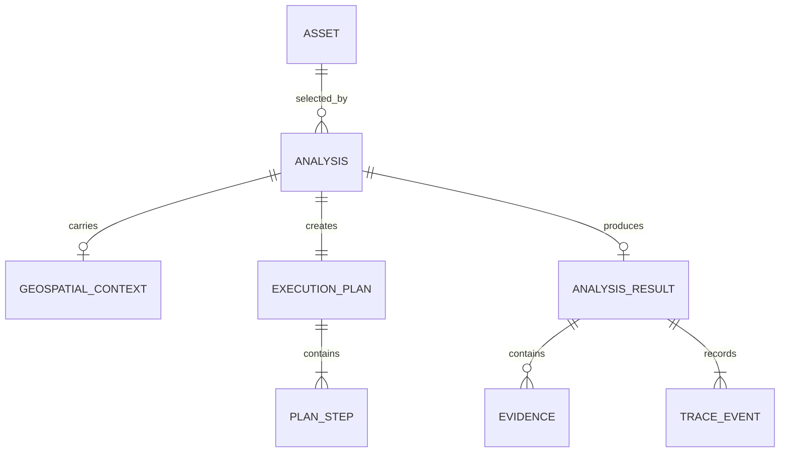
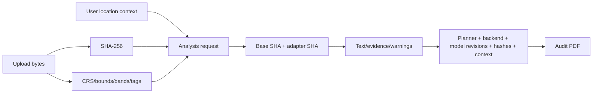

# Data model and provenance

## Core entities



| Entity | Important fields | Source of truth |
|---|---|---|
| Asset | ID, SHA-256, role, modality, raster metadata | Immutable uploaded bytes + Rasterio inspection |
| Geospatial context | latitude, longitude, altitude, capture time, sensor, metadata | User/GPS/EXIF/raster, always labelled by `source` |
| Analysis | query, asset IDs, requested tasks, context, lifecycle state | Controller request and SQLite record |
| Plan step | task enum, selected assets, permitted params, reason | Closed-set policy router |
| Specialist output | text, facts, evidence, score semantics, revision, warnings | Pydantic-validated model-service response |
| Evidence | geometry, coordinate space, label, score, asset ID | Parsed model grounding output |
| Result | answer, confidence semantics, trace, warnings, provenance | Controller integrator |

## Geospatial context contract

```json
{
  "latitude": 28.6139,
  "longitude": 77.209,
  "altitude_m": 216,
  "captured_at": "2026-09-02T10:30:00+05:30",
  "sensor": "Sentinel-2",
  "source": "user",
  "metadata": {
    "mission": "SIH demo"
  }
}
```

| Field | Rule |
|---|---|
| `latitude` | Required with context; −90…90 |
| `longitude` | Required with context; −180…180 |
| `altitude_m` | Optional; −500…100000 metres |
| `captured_at` | Optional ISO-8601 timestamp |
| `sensor` | Optional, max 120 characters |
| `source` | `user`, `gps`, `exif`, or `raster` |
| `metadata` | Up to 24 scalar entries; bounded keys/strings |

Coordinates are context, not visual evidence. The prompt explicitly tells the model not to claim
they were inferred from pixels. The controller copies context into provenance and the PDF report.

## Evidence geometry

| Type | Current state | Coordinate contract | Overlay behavior |
|---|---|---|---|
| Box | Released grounding parser | Normalized `x,y,width,height` in 0…1 | Browser and JPEG renderer draw it |
| Polygon | Schema-ready | Normalized/pixel/geographic | Renderer extension required |
| Mask/heatmap | Schema-ready | Asset-linked artifact | Renderer extension required |
| Text region | Schema-ready | Declared coordinate space | Renderer extension required |

Every downloadable image contains a clearly labelled user-metadata/model-answer strip. Only
validated geometry is rendered as spatial marking. A text answer without parseable geometry keeps
the information strip and an explicit warning; it never receives a fabricated box.

## Provenance flow


