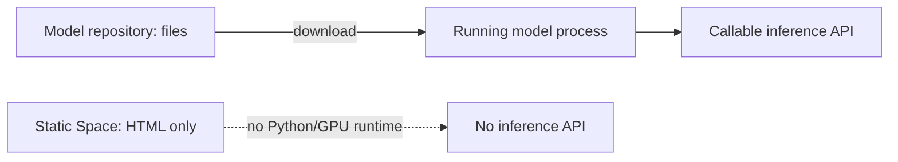

# Model serving status and future hosting decision

## Current truth

No website, backend, or persistent model-serving deployment is part of the current phase. The
ngrok bridge is an ephemeral development tunnel that ends with the notebook session.

| Hugging Face object | What it is | Current live state | Callable as model API? |
|---|---|---|---:|
| `aanandmodi/satquery-qwen3vl-bigearthnet-txt-lora` | Public PEFT model repository/files | Public at pinned SHA | No; `inferenceProviderMapping` is empty |
| `aanandmodi/satquery-qwen3vl-space` | Archived static Space | Private, no hardware | No |
| `aanandmodi/StatqueryAI` | Archived static Space | Private | No |
| Temporary Kaggle/Colab notebook | FastAPI + ngrok while session lives | User-operated and ephemeral | Yes, while cell 10 runs |
| Local model service | Running PyTorch process on port 8080 | Created by `scripts/run-local.py` | Yes, on localhost |

Uploading weights to a model repository provides storage, versioning, and downloads. It does not
allocate a GPU. A Gradio Space becomes an API only when its Gradio app is running. A static Space
can be `RUNNING` while serving only HTML; it still has no `/gradio_api/*` endpoint.

## Token semantics

| Situation | Token needed? | What a token changes |
|---|---:|---|
| Download public model/adapter | No | Optional authentication/rate attribution |
| Call public normal Gradio Space | No | Optional better rate limits/account attribution |
| Call private Space | Yes, read access | Authentication |
| ZeroGPU public Space | Optional | Uses authenticated account's daily quota instead of shared unauthenticated pool |
| Inference Providers | Yes | Authenticates provider calls; billing/free-credit terms still apply |

A token never creates GPU hardware, converts a static Space into Gradio, or guarantees that a
custom LoRA is served by an Inference Provider.

## Current execution choices

1. Test locally with NF4 on the RTX 2050 using [LOCAL_DEVELOPMENT.md](LOCAL_DEVELOPMENT.md).
2. Recommended: use the protected Kaggle/ngrok notebook. The website/controller stay local; the
   validated raster and context cross the temporary HTTPS model boundary.
3. After local acceptance, choose a model host separately from frontend and backend hosts. No
   existing script should be run until that decision is explicit.

## Future hosting acceptance checklist

| Gate | Required evidence |
|---|---|
| Cost | Provider terms and hard spend cap confirm intended budget |
| Hardware | Pinned model loads and smoke query passes |
| Contract | `/analyze` or `/v1/infer/*` schema passes integration tests |
| Security | Secrets server-side, authentication/rate limit defined |
| Privacy | Upload region, retention, and deletion policy approved |
| Reliability | Cold start, quota, timeout, and retry behavior measured |
| Observability | Revision, request ID, errors, and latency visible |

Deployment is a later, explicit phase and must not be inferred from implementation work.
