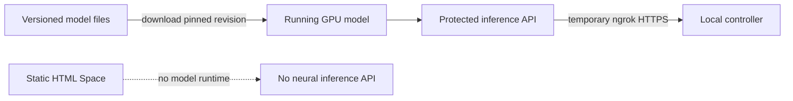

# Model serving status and future hosting decision

## Current execution design

No website, backend or persistent model endpoint is deployed by this workflow. The preferred
profile is an attended, temporary Kaggle model process reached through ngrok; the website and
controller remain local. It has a maximum 60-minute demo window and no automatic renewal or SLA.
See [NGROK_KAGGLE_RUNBOOK.md](NGROK_KAGGLE_RUNBOOK.md) for current setup and free-tier boundaries.

| Component | Meaning | Callable inference API? |
|---|---|---|
| Public `aanandmodi/satquery-qwen3vl-bigearthnet-txt-lora` repository | Pinned adapter files to download | Repository storage alone is not an inference endpoint |
| Previously archived static Spaces | Historical resource status is recorded in [UNDEPLOYMENT_STATUS.md](UNDEPLOYMENT_STATUS.md) | Static HTML cannot run the Python/GPU model |
| Temporary Kaggle notebook | User-operated FastAPI + model + ngrok | Only after live smoke checks pass and while its bounded demo window remains active |
| Opt-in local model service | CUDA process on localhost port 8080 | Only after local loading/readiness/generation checks pass |
| `--mode demo` | Deterministic single-image simulator | API plumbing works, but no neural VLM inference occurs |

This document is not a live health probe or a current remote-account inventory. Code/build checks
do not establish that a GPU is currently serving this model. Validate the actual session yourself
before recording real-model acceptance.



Uploading weights supplies storage and versioning, not GPU compute. Similarly, a Space reporting
that its static site is running does not establish a Gradio or FastAPI model endpoint.

## Required secrets for this workflow

| Secret | Where stored | Purpose |
|---|---|---|
| `NGROK_AUTHTOKEN` | Kaggle Secrets only | Authorizes the temporary tunnel |
| `SATQUERY_MODEL_SERVICE_TOKEN` | Kaggle Secrets and ignored repository-root `.env` | Authenticates local controller requests to Kaggle |
| Hugging Face token | Not required for the public pinned base/adapter | Never reuse the credential previously exposed in chat |

The frontend receives neither model secret. Root `.env.local` points it at the local controller,
not at ngrok. A Hugging Face token does not create hardware, turn a static Space into a model
server or guarantee free inference for a custom LoRA.

## Start without deployment

After one-time `scripts/setup-local.ps1` setup and Kaggle sections 1–9:

```powershell
Set-Location D:\Projects\Sih-2026
& "$env:USERPROFILE\.venvs\satquery-cloud\Scripts\python.exe" .\scripts\run-local.py --mode remote
```

Keep section 10 running only during attended testing. Interrupt it and stop the Kaggle session
when finished. Restart at section 6 if the API was shut down; a fresh runtime requires the entire
inference notebook again, not retraining. Managed Colab reverse-proxy serving is not supported.

Use `--mode demo` only for explicitly simulated UI/API checks. Use `--mode local` only after
opting into local CUDA dependencies and demonstrating hardware fit. See
[LOCAL_DEVELOPMENT.md](LOCAL_DEVELOPMENT.md) for those alternatives.

## Future hosting acceptance checklist

Deployment is a later, explicit decision. A temporary free notebook/tunnel is not a production
hosting guarantee. Do not provision paid infrastructure or enable billing fallbacks.

| Gate | Required evidence before any future hosting decision |
|---|---|
| Cost | Current provider terms and enforced zero-spend constraints |
| Hardware | Pinned model loads and a real-image query succeeds |
| Contract | Actual API matches the typed integration contract |
| Security | Server-side secrets, authentication and rate limits |
| Privacy | Approved image transfer, retention and deletion policy |
| Reliability | Measured cold starts, quotas, timeouts and failures |
| Observability | Model revision, request ID, errors, latency and trace |
| Quality | Held-out task-specific metrics, separate from transport smoke tests |

Run the strict default acceptance script with `--auto-route` before a real-model demonstration.
Do not use `--allow-simulated` as evidence that hosting or neural inference works.
