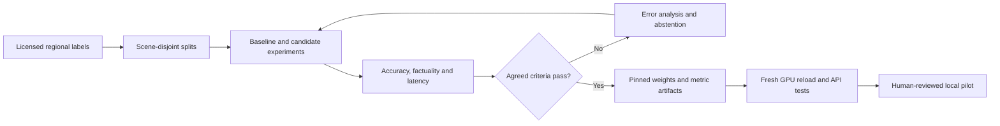

# Accuracy, confidence and efficiency release plan

This is required validation work, not a claim of ministry-grade accuracy. The released 2B
BigEarthNet LoRA, base-instruction report and SAM boundaries have distinct roles. SAM refines a
proposal; a precise contour around the wrong feature remains a wrong prediction.

Observed live failure: the Nepal JPEG water mask includes visually suspected forested hillside.
This is a useful negative/error-analysis case, not evidence of successful water classification.
Independent labels are still needed to measure the error and compare alternative pipelines.

| Claim | Required evidence | Current status |
|---|---|---|
| Water precision | Same-grid independent labels, negative scenes, shadows/snow/turbid water | Evaluation utility available; representative regional labels pending |
| Forest type/health | Expert labels and suitable multispectral/seasonal data | Broad visible vegetation only; species/health unvalidated |
| Physical change | Registered dates, cloud/shadow masks and change labels | Difference baseline works; learned CDVQA release pending |
| Optical/SAR semantics | Correct preprocessing and prescribed paired benchmarks | Proxy baseline works; learned fusion release pending |
| Weather/event timing | Verified source date and appropriate-resolution records | Regional NASA context available separately |
| Event cause | Chronology, independent records and alternative explanations | Not established by a photo or rainfall correlation |
| Confidence probability | Held-out calibration, reliability and abstention curves | Scores uncalibrated; no correctness percentage displayed |

## Experiment protocol

1. Record licenses, scene IDs, region, date, sensor, resolution and preprocessing.
2. Split by geography/event/time before cropping; never mix tiles of one scene across splits.
   Keep validation data for thresholds and untouched test data for final evaluation.
3. Obtain expert pixel labels, cloud/shadow/uncertainty masks and adjudicated disagreements.
   Model predictions are not ground truth.
4. Compare base Qwen, LoRA, Qwen+SAM and named-band NDWI on identical scenes/budgets. Compare
   pair baselines with eventual learned experts on prescribed public data.
5. Measure per-scene precision, recall, IoU, Dice, boundary error, negative-scene false positives,
   failure rate and subgroup performance. Bootstrap by scene/event, not independent pixels.
6. Review reports for supported claims, omissions, spatial grounding, attribution and abstention.
   Longer prose is not an accuracy metric.
7. Measure cold start, warm median/p95 latency, VRAM, image sizes, token budgets, quotas and failures.
8. Agree task-specific acceptance thresholds with analysts before running the test set.

For a first binary mask comparison:

```powershell
.\.venv\Scripts\python.exe scripts/evaluate-water-mask.py prediction.png reference.png
```

Inputs must be same-grid grayscale 0/1 or 0/255 masks, not colored overlays. The utility returns
confusion counts, precision/recall/IoU/Dice. Undefined metrics remain null. It does not register,
resize, exclude clouds automatically, compute boundary error or replace a benchmark harness.
Use the same independently defined observable support for both inputs.

## Efficiency and upgrades

Implemented: one auto-routed specialist call for multi-clause single-image questions, bounded
input grids, serialized GPU requests, local CPU pair tools, reusable exports and bounded cached
context lookups. One actual JPEG grounding/report call took about 36 seconds on the existing
session; this is one observation, not a performance guarantee.

Next experiments: tiled inference/stitching, calibrated multispectral water models, cloud/shadow
filtering before temporal inference, learned pair experts and regional held-out evaluations.
These are not advertised as implemented. Bigger weights alone do not solve task/data mismatch.
A 4B model cannot reuse the current 2B LoRA as a drop-in adapter: choose a compatible checkpoint,
measure memory and evaluate it separately. Do not train locally or spend on hardware silently.
Use free Kaggle quota without circumventing platform limits.


