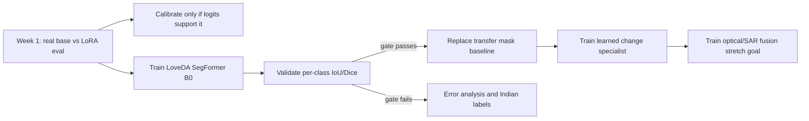

# SatQuery model-quality roadmap

## The quality problem is three different problems

| Output | Responsible component | Training evidence required |
| --- | --- | --- |
| Detailed, query-focused text | Qwen3-VL adapter and constrained report prompt | Scene-disjoint VQA evaluation, base-vs-LoRA raw predictions, task-sliced exact match/F1 |
| Single-image class mask | Semantic segmentation specialist; SAM only refines unsupported prompted objects | Per-class IoU/Dice on labelled masks, with water/forest/agriculture reported separately |
| Bi-temporal change mask | Learned change segmentation specialist, with analytical differencing retained as fallback | Scene/event-disjoint change IoU/Dice and area error |
| Optical/SAR fusion mask | Pixel-supervised fusion specialist; analytical agreement/disagreement retained as fallback | Held-out paired optical/SAR segmentation IoU/Dice |

Fine-tuning the text adapter on more question-answer rows cannot by itself repair vegetation or
water boundaries because those rows do not provide a target class for every pixel. SatQuery keeps
the VLM, semantic segmentation, change detection and fusion components separate and exposes the
method used in the audit trace.

## Current runtime upgrade

`notebooks/patches/quality_upgrade.py` installs quality-v4 into the existing Kaggle model server.
For supported land-cover targets it uses whole-scene semantic classes before falling back to Qwen
box proposals plus SAM. The temporary checkpoint is pinned to an immutable revision, but it has no
published model card or declared license and has not been validated on India/ISRO data. It is an
experimental transfer baseline, not a release-quality accuracy claim.

Run `notebooks/SatQuery_SegFormer_LoveDA_Training.ipynb` to train and evaluate a user-owned
replacement. The notebook uses 70% of the official LoveDA training split, stratified by domain,
while keeping the official validation split untouched. It exports real per-class IoU/Dice, a
training manifest, hashes and a fresh-reload smoke test.

## Why “70% of BigEarthNet.txt” is not the target

BigEarthNet.txt contains about 9.6 million image-text triplets. Running 70% of that corpus through
Qwen3-VL would be millions of multimodal examples and is not realistic within free Kaggle GPU
quota. More importantly, it contains text supervision rather than the dense pixel labels required
to fix masks. The defensible policy is:

1. Preserve geographic and temporal isolation before sampling.
2. Grow Qwen SFT in bounded, balanced stages and stop when held-out metrics plateau.
3. Use labelled segmentation/change/fusion datasets for masks.
4. Store raw predictions and immutable manifests for every reported metric.
5. Never promote an experimental checkpoint unless its task-specific release gate passes.

## Free-compute sequence

Use separate Kaggle sessions for evaluation and training. Local CPU runs should be limited to
scoring saved predictions, report generation and tests. The ngrok tunnel is an attended demo path,
not production hosting and not a source of model accuracy.

## Acceptance gates

| Gate | Minimum evidence before the claim changes |
| --- | --- |
| Semantic masks | Mean IoU ≥ 0.45 and water/forest/agriculture IoU ≥ 0.35 on untouched LoveDA validation, then an additional representative India/ISRO set |
| Detailed VQA | Base-vs-LoRA comparison on identical held-out records with raw JSONL predictions and task slices |
| Confidence | Held-out calibration curve and ECE; raw softmax/SAM scores remain labelled uncalibrated |
| Learned change | Released checkpoint plus scene-disjoint IoU/Dice and area error; otherwise keep “analytical baseline” label |
| Learned fusion | Pixel-supervised optical/SAR checkpoint plus pair-disjoint evaluation; otherwise keep “analytical proxy” label |

These are project release gates, not claimed benchmark results. No threshold is reported as passed
until the corresponding notebook produces the real artifacts.
