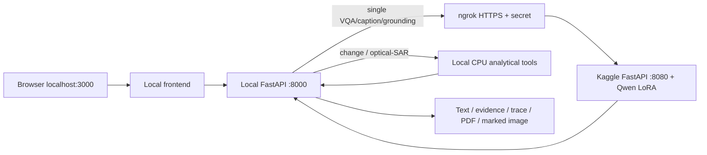

# Start here: Kaggle GPU → ngrok → local SatQuery

**Quality update:** run the new **section 6b** after starting section 6 and before 7–10. Existing
notebooks can use the one-cell patch in `notebooks/patches/quality_upgrade.py`; see
[detailed instructions and accuracy limits](ANALYSIS_QUALITY.md). Rerun 6b whenever you rerun 6.

Last checked: 2026-09-03. This workflow does **not** deploy the website. Kaggle runs the already
fine-tuned Qwen adapter; ngrok temporarily carries API requests; the frontend, controller, uploads,
SQLite database, paired-image tools, reports and overlays remain on your laptop.



## 1. One-time laptop preparation

Install **Python 3.12** and **Node.js 22 LTS or newer** if absent. Enable Python's “Add python.exe
to PATH” installer option and reopen PowerShell. `python --version` and `node --version` must work.
The previous `satquery` virtualenv may reference a missing Python installation, so the new setup
uses a separate `satquery-cloud` environment and preserves the old one.

```powershell
Set-Location D:\Projects\Sih-2026
& .\scripts\setup-local.ps1
```

Do **not** add `-WithLocalModel`: you do not need CUDA, PyTorch or model weights on the laptop for
this profile. If Python is installed outside PATH, pass
`-PythonExecutable 'C:\actual\path\to\python.exe'`. If PowerShell blocks your local script,
review it first, then use a process-only execution policy for that PowerShell window; do not
disable machine-wide security settings.

## 2. Create only two secrets

| Secret | Where to obtain it | Where it goes |
|---|---|---|
| `NGROK_AUTHTOKEN` | Free ngrok dashboard → Your Authtoken | Kaggle Secrets only |
| `SATQUERY_MODEL_SERVICE_TOKEN` | Generate a random value yourself | Kaggle Secrets **and** ignored root `.env` |
| Hugging Face token | Not needed for these public pinned models | Do not reuse the token previously exposed in chat |

Generate the model-service secret in your own PowerShell window (keep its output private):

```powershell
$tokenBytes = New-Object byte[] 32
$tokenGenerator = [Security.Cryptography.RandomNumberGenerator]::Create()
$tokenGenerator.GetBytes($tokenBytes)
[Convert]::ToBase64String($tokenBytes)
$tokenGenerator.Dispose()
```

These two tokens have different purposes. The ngrok authtoken is **not** the model-service token.
Do not put either in chat, source code, screenshots, GitHub or notebook outputs.

## 3. Start a fresh Kaggle notebook

1. Create a **new inference notebook**, separate from the fine-tuning notebook.
2. Import [`SatQuery_Qwen3VL_Free_GPU_Server.ipynb`](../notebooks/SatQuery_Qwen3VL_Free_GPU_Server.ipynb).
3. Enable **GPU** and **Internet** in notebook settings. Available accelerator/quota depends on
   your account. This notebook uses GPU 0 only; two GPUs are not required.
4. In Kaggle **Add-ons → Secrets**, add both names above and enable them for this notebook.
5. Run the cells in order. You do **not** retrain or download the training dataset.

### Exact section map

These are the notebook **section headings**, not execution counters such as `In [18]`.

| Section | What it does | Continue only when |
|---|---|---|
| Install | Installs inference packages | No fatal pip error |
| 1 | Loads secrets without printing them | `Secrets loaded safely` |
| 2 | Checks GPU | `cuda_available: true` |
| 3 | Loads the pinned 2B base and existing LoRA | Model/device printed |
| 4 | Defines bounded decoding and generation | Completes |
| 5 | Real generation on a synthetic transport fixture | Direct-generation `PASS` |
| 6 | Starts protected FastAPI on Kaggle | Listening `PASS` |
| 7 | Tests inference through Kaggle localhost | Local-contract `PASS` |
| 8 | Opens one temporary ngrok HTTPS tunnel | Prints `SATQUERY_MODEL_SERVICE_URL=...` |
| 9 | Tests actual inference through that public URL | Internet/tunnel `PASS` |
| 10 | Serves during an active, bounded demonstration window | Leave running while testing the app |

**Run All is acceptable in this inference notebook**, with the two secrets configured. It stops
at any error and then spends the demo window in section 10. No paid endpoint is created. The
synthetic smoke image proves generation/transport, not satellite benchmark accuracy.

### Recover the section 8 error on an already-running Kaggle session

If sections 3, 5 and 7 passed but section 8 says **“Remote proxy tunnels are not allowed on
managed Colab runtimes”** while you are actually on Kaggle, this was a notebook detection bug.
Kaggle's [official Dockerfile](https://github.com/Kaggle/docker-python/blob/main/Dockerfile.tmpl)
uses a Colab base image. Inherited `COLAB_*` variables or an imported `google.colab` package do not
prove the notebook is hosted by Colab. The fix requires both Kaggle's own `KAGGLE_KERNEL_RUN_TYPE`
marker and its `/kaggle/working` directory before permitting this Kaggle-only tunnel workflow.
Actual Colab and unverified runtimes remain blocked; do not spoof environment variables.

1. **Do not restart, retrain, reinstall packages, or click Run All on the already-loaded session.**
2. Open [the complete replacement section 8 cell](../notebooks/patches/section_8_ngrok.py).
   Copy the entire file into the code cell beneath **“8. Open the temporary free ngrok tunnel”**,
   replacing that cell's old code. This file is cell code, not a standalone laptop server.
3. Run **section 8 only**. Expect `Runtime verified: Kaggle. Model service is running.` and an
   HTTPS `SATQUERY_MODEL_SERVICE_URL`. Do not paste or print either secret.
4. Run **section 9**, then **section 10** and keep the notebook attended while testing.
5. Continue with local configuration below. If the API was stopped but the model remains loaded,
   rerun **6 → 7 → 8 → 9 → 10**. If the whole session was lost, import the updated full notebook
   and run it from the beginning; this still does not retrain the model.

| Screenshot output | Meaning and correction |
|---|---|
| Model on `cuda:0`, direct-generation `PASS` | Successful GPU load and generation; do not reload to fix a tunnel guard |
| Section 7 HTTP `200` and `PASS` | The Kaggle-local API returned actual model text; public connectivity is a separate gate |
| Pillow `mode` deprecation | Nonfatal; updated sections 4/5 let Pillow infer RGB from the uint8 array |
| Ignored `temperature`, `top_p`, `top_k` | Nonfatal; updated section 4 supplies neutral defaults for greedy decoding, preserving checkpoint EOS/pad configuration |
| Rasterio `NotGeoreferencedWarning` on `smoke.tif` | Nonfatal in the old synthetic fixture; section 7 now writes an explicitly synthetic, georeferenced test TIFF |
| API JSON `warnings` about calibration/domain | Intentional limitations; not exceptions and not removed by this fix |

The warning fixes are included in the updated full notebook. They are not necessary to unblock
the current session: replacing section 8 is sufficient if the earlier smoke tests passed. The
synthetic TIFF's georeference is test-only; never copy it onto real images to invent a location.

## 4. Connect the local controller

In the repository root, create `.env` and `.env.local` from their examples **only if absent**:

```powershell
Set-Location D:\Projects\Sih-2026
if (-not (Test-Path .env)) { Copy-Item .env.example .env }
if (-not (Test-Path .env.local)) { Copy-Item .env.local.example .env.local }
notepad .env
```

Set these values in `.env`. Use the exact URL printed in section 8 and the exact same service
secret you stored in Kaggle:

```dotenv
SATQUERY_ENVIRONMENT=development
SATQUERY_MODEL_BACKEND=http
SATQUERY_PAIR_BACKEND=local
SATQUERY_MODEL_SERVICE_URL=https://YOUR-ACTUAL-DEV-DOMAIN.ngrok-free.app
SATQUERY_MODEL_SERVICE_TOKEN=YOUR_SAME_RANDOM_SECRET
SATQUERY_API_KEY=
SATQUERY_ALLOWED_ORIGINS=["http://localhost:3000"]
SATQUERY_MAX_UPLOAD_BYTES=52428800
SATQUERY_MODEL_TIMEOUT_SECONDS=300
```

`.env.local` must contain:

```dotenv
SATQUERY_BACKEND_URL=http://127.0.0.1:8000
SATQUERY_BACKEND_API_KEY=
```

The frontend URL points to your **local backend**, never to ngrok. Only the backend gets the
ngrok URL and service secret.

## 5. Run backend + frontend

Recommended: one PowerShell window starts both, validates JSON readiness and cleans up its child
processes on Ctrl+C:

```powershell
Set-Location D:\Projects\Sih-2026
& "$env:USERPROFILE\.venvs\satquery-cloud\Scripts\python.exe" .\scripts\run-local.py --mode remote
```

Open **http://localhost:3000**. Keep this terminal and Kaggle section 10 running.

### Separate terminals, if you prefer

Terminal 1 — backend (run from the **repository root**):

```powershell
Set-Location D:\Projects\Sih-2026
& "$env:USERPROFILE\.venvs\satquery-cloud\Scripts\python.exe" -m uvicorn app.main:app --app-dir backend --host 127.0.0.1 --port 8000
```

Terminal 2 — frontend:

```powershell
Set-Location D:\Projects\Sih-2026
npm run dev
```

Use either the single runner or separate terminals—not both simultaneously.

## 6. Test the connected system

```powershell
Invoke-RestMethod http://127.0.0.1:8000/v1/health/ready
Invoke-RestMethod http://127.0.0.1:8000/v1/capabilities
```

Readiness must say `status: ok` and both checks must be true. In the UI:

1. Choose **one scene**, declare its modality, upload a valid georeferenced TIFF, and ask
   “Is water visible in this image?” A real answer must show the Qwen adapter revision in its trace.
2. Try caption/grounding. Download the marked image and PDF.
3. Choose **bi-temporal pair** or **optical + SAR pair** for the two CPU-baseline workflows.
   These require compatible co-registered inputs, and their output is explicitly uncalibrated.

The full five-workflow command is in [SIH_DEMO_RUNBOOK.md](SIH_DEMO_RUNBOOK.md). A website build
or synthetic PASS is not a substitute for running real satellite queries and benchmark evaluation.

## 7. Stop and restart correctly

- Stop local processes with **Ctrl+C**. In separate-terminal mode, stop both terminals.
- Interrupt **section 10**, then stop the Kaggle session to release GPU quota.
- Section 10 is bounded by default; it does not bypass provider idle/session limits.
- If section 10 stopped and model variables still exist, rerun **sections 6–10**. Section 10 shuts
  FastAPI down, so rerunning only the tunnel cell is insufficient.
- If the Kaggle session restarted, run the entire inference notebook again. No retraining needed.
- After any tunnel restart, copy its newly printed URL if different and restart the local runner.

## Troubleshooting and cost boundaries

| Symptom | Action |
|---|---|
| `python` not found / old venv cannot launch | Install Python 3.12, reopen PowerShell, run setup; use the new `satquery-cloud` env |
| Fatal pip error | Stop; resolve the first error. Setup no longer prints success after native-command failures |
| GPU unavailable / quota exhausted | Stop the session and wait for available quota; do not enable a paid fallback |
| Section 8 incorrectly says Colab while on Kaggle | Apply the replacement section 8 cell above; keep the loaded model |
| Section 9 reports no active tunnel | Section 8 must finish successfully; the demo window may also have expired |
| ngrok 401 / invalid token | Check `NGROK_AUTHTOKEN` in Kaggle—not the separate model-service secret |
| Model API 401 | Kaggle and local `SATQUERY_MODEL_SERVICE_TOKEN` differ |
| Valid TIFF fails with `Failed to fetch` / frontend logs POST 413 | The frontend must load `next.config.ts` with `serverActions.bodySizeLimit: '51mb'`; restart `npm run dev` after config changes, refresh and reselect the file. The file limit remains 50 MiB |
| ngrok 502 / offline | Rerun sections 6–10; verify section 7 before opening a tunnel |
| HTTP 200 but HTML instead of JSON | Startup now rejects this; use the exact ngrok URL, not a dashboard URL |
| Pair rejected | Check declared modalities, time roles, CRS, coverage, resolution, grid and band compatibility |
| No grounding box | Inspect warning; no fabricated box will be supplied |

Use ngrok's **Free** plan and assigned dev domain, with no paid upgrade or top-up. The currently
documented free limits include 20,000 HTTP/S requests and 1 GB outbound transfer per month; check
the dashboard because plans can change. [Official ngrok free-plan limits](https://ngrok.com/docs/pricing-limits/free-plan-limits)

Kaggle provides quota-limited remote notebook compute, not a guaranteed production hosting SLA.
Treat tunnelling as an experimental active-development path and comply with current account rules;
if the platform blocks it, do not bypass the restriction. [Kaggle notebook documentation](https://www.kaggle.com/docs/notebooks)

Do not use this reverse-proxy workflow on managed Colab runtimes: its FAQ restricts remote proxies
and some web-service use. Colab remains an option for permitted notebook-based training/testing,
not a recommended always-on model API here. [Official Colab restrictions](https://research.google.com/colaboratory/faq.html)
