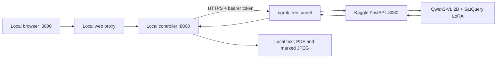
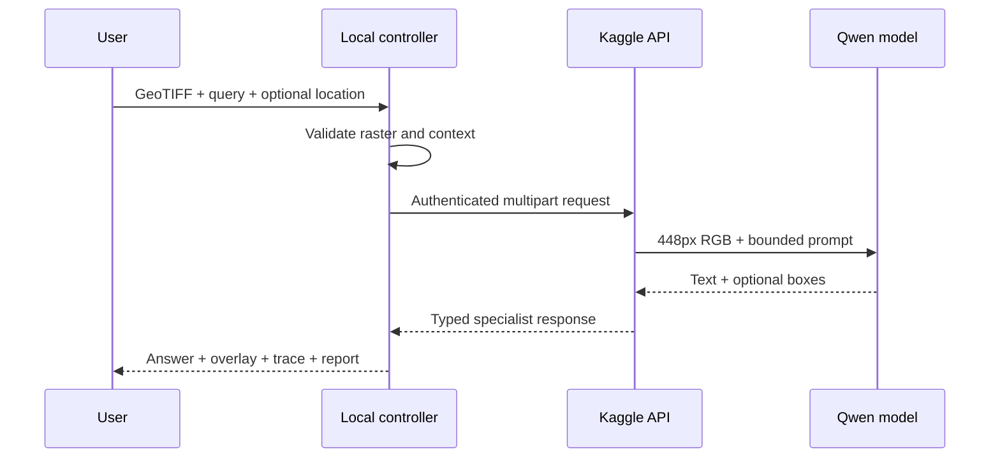

# Kaggle GPU + ngrok runbook

## Purpose

Run the pinned SatQuery Qwen3-VL adapter on a free Kaggle/Colab GPU while the website, controller,
database, uploads, reports, and overlays remain on the laptop. This is temporary development
access, not a production deployment.



## Accounts and secrets

| Name | Create at | Stored in Kaggle | Stored locally | Purpose |
|---|---|---:|---:|---|
| `NGROK_AUTHTOKEN` | ngrok dashboard | Yes | No | Lets the notebook create a free tunnel |
| `SATQUERY_MODEL_SERVICE_TOKEN` | Generate yourself, ≥32 random characters | Yes | `.env` | Authenticates controller → Kaggle inference |
| Hugging Face token | Not needed | No | No | Base and adapter are public |

Generate a service token in PowerShell:

```powershell
$bytes = New-Object byte[] 32
[Security.Cryptography.RandomNumberGenerator]::Fill($bytes)
[Convert]::ToBase64String($bytes)
```

Paste the result into Kaggle Secrets and the ignored local `.env`; never commit it. The Hugging
Face credential pasted previously must be revoked and must not be reused.

## Notebook cell map

| Cell/section | Action | Required success signal |
|---:|---|---|
| Install | Installs bounded runtime packages | No fatal pip error |
| 1 | Reads secrets without echoing them | `Secrets loaded safely` |
| 2 | Checks GPU | `cuda_available: true` |
| 3 | Loads immutable base + adapter | Printed model revision and CUDA device |
| 4 | Defines decode, prompt and box parser | Cell completes |
| 5 | Calls the real model directly | `PASS: base + adapter generated text` |
| 6 | Starts bearer-protected FastAPI | `PASS: ... listening ...` |
| 7 | Calls FastAPI on Kaggle localhost | `PASS: backend-compatible ...` |
| 8 | Opens ngrok tunnel | Printed `SATQUERY_MODEL_SERVICE_URL` |
| 9 | Calls the same API through the Internet | `PASS: internet -> ngrok -> Kaggle ...` |
| 10 | Keeps session alive | Cell remains running |

Do not proceed after any failed assertion. Fix or restart the notebook first.

## Local configuration

Create `D:\Projects\Sih-2026\.env`:

```dotenv
SATQUERY_ENVIRONMENT=development
SATQUERY_MODEL_BACKEND=http
SATQUERY_MODEL_SERVICE_URL=https://YOUR-NGROK-DEV-DOMAIN.ngrok-free.app
SATQUERY_MODEL_SERVICE_TOKEN=THE_SAME_RANDOM_SECRET
SATQUERY_API_KEY=
SATQUERY_ALLOWED_ORIGINS=http://localhost:3000
SATQUERY_MODEL_TIMEOUT_SECONDS=300
```

Create `.env.local` from `.env.local.example`, then:

```powershell
Set-Location D:\Projects\Sih-2026
& .\scripts\setup-local.ps1
& "$env:USERPROFILE\.venvs\satquery\Scripts\python.exe" .\scripts\run-local.py
```

Open `http://localhost:3000`. Upload a valid GeoTIFF, optionally supply coordinates, and run a
released task.

## End-to-end verification



Acceptance requires a non-empty real answer, model revision containing `ed12e59`, a user-location
fact when coordinates were supplied, and a successful overlay download. Grounding may legitimately
return no boxes; that must produce a warning rather than invented geometry.

## Safe stop and restart

1. Press `Ctrl+C` in the local runner.
2. Interrupt notebook **cell 10**. It disconnects ngrok and asks Uvicorn to exit.
3. Stop the Kaggle session to release GPU quota.

If Kaggle restarts, rerun all cells. If only ngrok changes, rerun cells 8–10 and update `.env`.
The free URL is not an uptime commitment and must never be treated as a production endpoint.

## Free-tier limits

ngrok's current free plan is finite (request and outbound-transfer limits apply), and Kaggle GPU
availability/session length are best-effort. The application fails with model-unavailable status;
there is no paid fallback and no code path provisions billed hardware.
