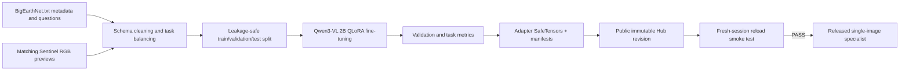
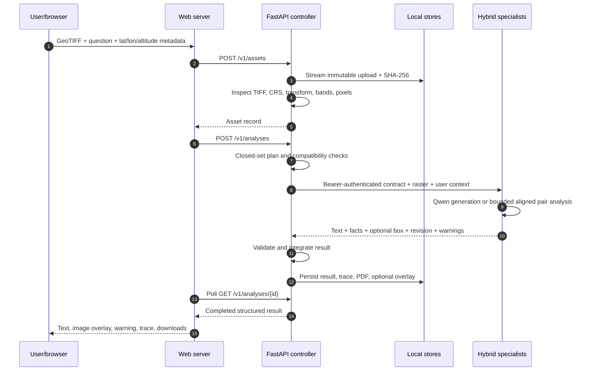
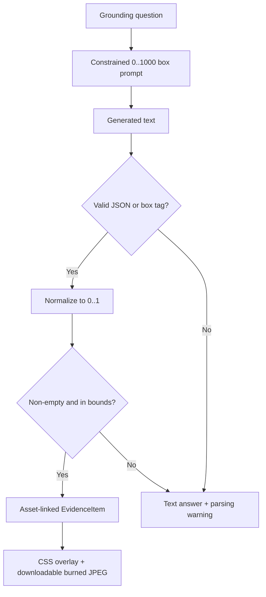
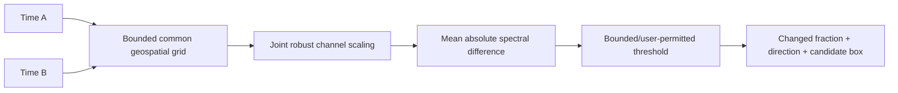
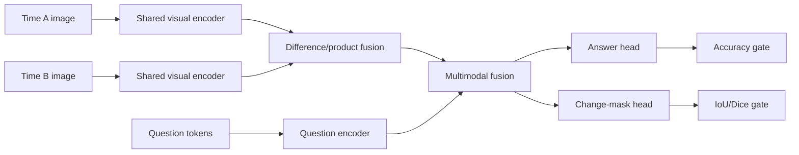
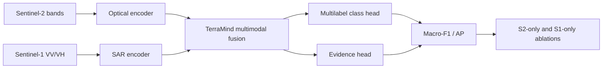

# Model and inference pipelines

## Released Qwen pipeline

| Release item | Value |
|---|---|
| Base model | `Qwen/Qwen3-VL-2B-Instruct` |
| Base revision | `89644892e4d85e24eaac8bacfd4f463576704203` |
| Adapter | `aanandmodi/satquery-qwen3vl-bigearthnet-txt-lora` |
| Adapter revision | `ed12e59e0def9468bdf4a226789fc1b77c7900e7` |
| Technique | LoRA/QLoRA, rank 16, alpha 32 |
| Target modules | Q/K/V/O and gate/up/down projections |
| Artifact | `adapter_model.safetensors` plus processor/config/manifests |
| Release gate | Immutable revisions, hashes, evaluation summary, Hub upload, fresh reload |

The training notebook remains the evidence source for exact sample counts, epochs, optimizer,
metrics, and final PASS output. The runtime never silently substitutes another base or adapter.

## Inference dataflow

## Preprocessing contract

| Step | Rule | Why |
|---|---|---|
| Decode | Rasterio for TIFF; PIL fallback only for allowed benchmark imagery | Preserve geospatial validation |
| RGB bands | Descriptions `red/green/blue` or B04/B03/B02; 4/3/2 fallback for multispectral; grayscale repeat for fewer than 3 bands | Deterministic optical and SAR preview |
| Stretch | Per-band 2nd–98th percentile | Make reflectance imagery viewable without altering source |
| Resize | Long edge ≤ 448 for laptop VLM | Bound visual tokens and VRAM |
| Prompt | Task-specific instruction + user question | Separate caption/VQA/grounding output contracts |
| Decode | Greedy (`do_sample=False`) | Reproducible demo behavior |
| Output | Pydantic specialist schema | Reject malformed model-service responses |

The generated RGB image is an inference preview. The original upload, SHA-256, CRS, transform, and
metadata remain the provenance source.

## Grounding and overlay pipeline

An absent or invalid box is never replaced with a decorative placeholder. The released adapter is
primarily trained for remote-sensing VQA; grounding quality must be judged independently.

## Confidence semantics

| Model output | API label | UI behavior |
|---|---|---|
| Qwen open-ended answer | `uncalibrated` / evidence quality | No correctness percentage; display warning |
| CPU pair analytical tools | `evidence_quality` | Candidate fractions/boxes plus explicit proxy warning |
| Future temperature-calibrated classifier | `calibrated_probability` | Percentage allowed with calibration version |
| Demo simulator | `simulated` | Visibly marked; forbidden in production mode |

Token likelihood is not treated as the probability that an answer is factually correct.

## Change pipeline: runnable baseline and learned upgrade

The runnable CPU tool is deterministic and makes no semantic-class claim. Its evidence-quality
score is capped below calibrated-confidence display. The learned upgrade path is:

The learned artifact must not replace the baseline until CDVQA/SECOND imagery and labels are
attached, leakage-safe evaluation is run, and both answer and localization gates pass.

## Optical/SAR pipeline: runnable baseline and learned upgrade

The runnable baseline aligns SAR onto the optical grid, combines relative backscatter with optical
luminance/colour/edge cues, and returns explicitly labelled water and built-up **candidate proxies**.
It supports one- or two-band SAR and never passes raw SAR through Qwen. The learned upgrade path is:

The TerraMind artifact may replace the baseline only after prescribed paired evaluation plus
fused/S2-only/S1-only ablations. Raw SAR is never passed to Qwen as if it were optical colour.

## Reproducibility and leakage controls

| Control | Enforcement |
|---|---|
| Immutable sources | Model and dataset revisions recorded before training/inference |
| Split identity | Patch/image IDs cannot cross train/validation/test |
| Test isolation | Test used once after selection; no checkpoint selection on test |
| Artifact integrity | SafeTensors and SHA-256 manifest |
| Fresh reload | Release recreated without the in-memory Trainer object |
| Runtime parity | Matching processor, chat template, base SHA, adapter SHA |
| Deterministic smoke | Fixed seeds where applicable and greedy generation |
