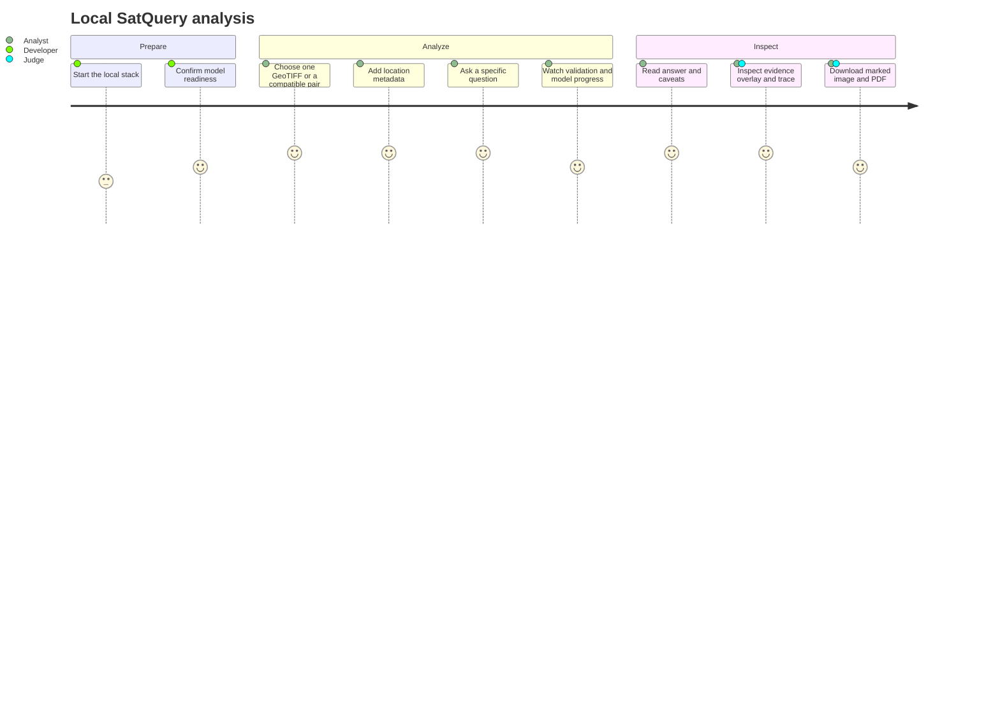
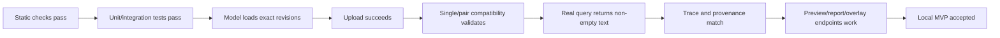

# Product requirements document

## Critical-gap acceptance addendum — 2026-09-04

| Requirement | Acceptance |
|---|---|
| Compound planning | Reservoir comparison produces separate before/after grounding plus dependent loss/gain; trace identifies learned proposal or fallback |
| Safe measurements | Missing mask, mismatched method/threshold/grid or missing dates never produces invented metric extent, water level or causal claims |
| Learned paired inference | Strict cloud artifact reload and real paired HTTP inference required; CPU baselines cannot satisfy this release gate |
| Sensor-specific inputs | Cartosat numeric bands are profile-qualified; RISAT RH/RV and HH/HV never masquerade as Sentinel VV/VH |
| Accuracy | Held-out domain/mask/answer/calibration evaluation; no perfect-confidence claim from passing software tests |

Implementation and still-open gates: [Critical-gap audit](CRITICAL_GAPS.md).

## Product statement

SatQuery helps an analyst ask a natural-language question about satellite imagery and receive a
model answer tied to visible evidence, explicit uncertainty, reproducible model provenance, and an
auditable execution trace. The initial acceptance target is a complete local SIH demonstration,
not a publicly hosted service.

## Users and jobs

| User | Primary job | Success signal |
|---|---|---|
| Disaster-response analyst | Inspect a scene and locate a visible affected region | Answer plus image-linked evidence and caveat |
| Agriculture/water/urban analyst | Ask a land-cover question or request a caption | Concise grounded response with provenance |
| SIH judge | Verify that a real released model ran | Trace shows pinned revision, timing, warnings, artifact |
| Developer | Run the stack without paid infrastructure | One documented local command or free-GPU bridge |

## Problem

General chat interfaces can hide which model ran, accept incompatible imagery, invent certainty,
and return text with no spatial evidence. Remote-sensing workflows also require geospatial input
validation and separate specialists for single-scene, temporal, and multimodal tasks.

## Scope by release

| Capability | Local MVP | Later release |
|---|---:|---:|
| Optical GeoTIFF + latitude/longitude/altitude metadata | Required | Automatic metadata import |
| Single-image VQA/caption | Required | Improve domain evaluation |
| Grounding and marked image | Required with honest parsing caveat | Dedicated grounding evaluation/model |
| Text, facts, warnings, trace, PDF | Required | Rich audit export |
| Change-VQA | Required CPU analytical baseline | Learned semantic expert after evaluation |
| Optical/SAR fusion | Required CPU analytical baseline | Learned TerraMind expert after evaluation |
| Public website/backend hosting | Out of scope | User chooses providers after local acceptance |
| Paid endpoint | Forbidden for zero-cost phase | Only with separate explicit authorization |

## Functional requirements

### Exploration studio extension

| ID | Requirement | Acceptance / boundary |
|---|---|---|
| EX-01 | Common optical images | JPG/PNG/WebP exploration; SIH strict separate |
| EX-02 | Usable temporal pairs | Declared pixel-grid pairs supported; automatic registration absent |
| EX-03 | Forestry/journalism reports | Editable presets and sourced sections; species/cause unvalidated |
| EX-04 | Persistent work | Paginated cases and source-specific exports |
| EX-05 | History from one image | Known footprint/date required; discovery works, GIS preparation manual |
| EX-06 | Weather context | NASA regional reanalysis; no exact-pixel or causal claim |
| EX-07 | Honest confidence | Candidate masks; held-out regional calibration/accuracy still required |

See [Studio guide](STUDIO_GUIDE.md) and [evaluation plan](MODEL_EVALUATION_PLAN.md).

| ID | Requirement | Acceptance |
|---|---|---|
| FR-01 | Accept TIFF/GeoTIFF using a streamed byte cap | Oversize/corrupt file fails before inference |
| FR-02 | Record SHA-256 and raster metadata | Asset response contains immutable identity and metadata |
| FR-03 | Route only to registered task enums | Prompt cannot choose code, URL, file path, or model |
| FR-04 | Enforce task/input compatibility | Single image cannot enter change/fusion; SAR is rendered as an explicit grayscale visual channel |
| FR-05 | Run the exact released Qwen base + adapter | Result provenance contains both pinned revisions |
| FR-06 | Return asynchronous status and terminal errors | UI can poll without blocking and explains failures |
| FR-07 | Return text plus structured evidence/warnings | Pydantic-valid result; no fake box on parse failure |
| FR-08 | Produce a downloadable information overlay | Always labels metadata/answer; valid grounding geometry aligns to preview |
| FR-09 | Produce an audit PDF | Report includes request, result, trace, warnings, provenance |
| FR-10 | Support complete local startup | Browser → controller → real model query passes |
| FR-11 | Validate latitude, longitude and optional altitude | Partial or out-of-range coordinates fail before inference |
| FR-12 | Preserve metadata provenance | Reports label it user-supplied, never pixel-derived |
| FR-13 | Accept a co-registered bi-temporal pair | UI and API validate two rasters and return quantified change evidence |
| FR-14 | Accept a co-registered optical/SAR pair | UI and API return complementary candidate facts/evidence |
| FR-15 | Automatically select the workflow | With no explicit task, query and input configuration produce a registered plan |

## Non-functional requirements

| Category | Requirement |
|---|---|
| Cost | No paid hosting, endpoint, storage, database, or API required for local MVP |
| Reproducibility | Pin base, adapter, processor, dependency family, and release manifests |
| Reliability | Bounded timeouts, serialized GPU inference, explicit terminal state |
| Security | Loopback defaults, narrow proxy allowlist, server-only secrets, strict upload checks |
| Privacy | Controller state stays local; free-GPU mode explicitly transmits the raster through ngrok |
| Accessibility | Keyboard access, visible focus, status not color-only, reduced motion, text equivalent for evidence |
| Honesty | No hidden simulator, fake confidence, fake evidence, or unsupported specialist claim |
| Maintainability | Frontend/controller/model contracts remain independently testable |

## Primary user flow

## UX requirements

- The first viewport exposes upload, task, question, and run action; it is not a marketing hero.
- The evidence canvas and answer are the visual anchors.
- Status copy reflects real backend phases and model availability.
- Local/offline errors say which local process is missing.
- Incompatible tasks are visibly disabled for the selected input configuration.
- Confidence language distinguishes uncalibrated evidence quality from correctness probability.
- The UI retains a calm cartographic frost/liquid-glass identity without generic AI-chat styling.

## Acceptance criteria

The MVP is not complete merely because the frontend builds or a model repository exists. It is
complete only after a real browser/backend/model round trip passes on an accepted execution
profile.

## Risks and mitigations

| Risk | Impact | Mitigation |
|---|---|---|
| 4 GB laptop VRAM OOM | Local model cannot start | Bounded NF4 profile; temporary free-GPU bridge |
| Free notebook session expires | Inference stops | Explicit readiness/error; restart and update URL |
| Adapter domain mismatch | Incorrect Indian-domain answer | Clear warning, Indian validation set before claims |
| Weak grounding behavior | Missing/incorrect box | Parse validation, no fake box, localization metric gate |
| Analytical pair baseline over-interpreted | Misleading semantic claim | Proxy wording, uncalibrated score, learned-model benchmark gate |
| Exposed credential | Account compromise | Revoke pasted token; local public-model path needs no token |

## Out of scope

- Emergency, legal, financial, or safety-critical autonomous decisions.
- Claims of Cartosat/RISAT performance without an Indian-domain evaluation set.
- Unlimited traffic, uptime SLA, multi-user isolation, or public data retention.
- Automatic deployment or paid-resource provisioning.
