# Project progress

## R2 release recovery — 2026-09-21

- Initial checkpoint published as `c9d61fd`. GitHub rejected the previous unpushed history because
  temporal prediction JSONL exceeded 100 MB. Local backup branch
  `backup/pre-large-evidence-publish-680bc5b` preserves that history; all local evidence remains intact.
- Revised 02/03/04 sources target the measured gaps; thresholds and failed original evidence are
  preserved. 02 addresses scale mismatch and balanced checkpoint selection; 03 adds a multiscale
  mask decoder and balanced training; 04 adds finite-data/loss/gradient guards and FP32 recovery.
- Updated paired runtime supports explicit legacy/R2 decoders. No new weights have been trained,
  no failed checkpoint promoted, and no new release accuracy is claimed.
- See [TRAINING_R2.md](TRAINING_R2.md) for exact notebook order, optional checked warm starts,
  output preservation, unchanged gates, and the distinction between code tests and model quality.
- Verification: 290 backend + 13 ML tests and four CPU numerical/gradient/reload tests passed;
  notebook schemas/code cells validated. Local re-scoring reproduces 05's Qwen test aggregates.

## Recorded cloud training and final Qwen test — 2026-09-21

- Qwen notebook 05 completed: 200 held-out examples, including 100 VQA, 50 grounding and 50
  caption examples. LoRA VQA exact-match 0.61, grounding mean IoU 0.42267, grounding IoU≥0.5
  accuracy 0.42 and caption token F1 0.40145. Frozen validation-temperature test ECE is 0.13041
  versus raw ECE 0.15073. This is bounded Qwen evaluation, not mask calibration or ISRO validation.
- Notebook 02 finished but failed release: mean IoU 0.35003 (<0.45), forest IoU 0.24929 (<0.35).
  Water/agricultural class gates passed. Notebook 03 finished with answer accuracy 0.71334 and
  validation mask IoU 0.39661 (<0.40); its test mask IoU was 0.41653. Do not lower the thresholds.
- Notebook 04 exported an invalid numerical run: NaN losses throughout, NaN prediction-head
  tensors and NaN scores on all labelled validation/test chips. Export hashes match; it is not a
  damaged download. Both release gates failed. Do not resume or serve that checkpoint.
- Fusion environment setup now pins the numeric and Hugging Face dependency families, retains
  cloud CUDA wheels, and requires a kernel restart after installation changes. The import errors
  are resolved in the reported cloud run; numerical training recovery is the next task.
- Notebook 06 remains blocked by model-quality gates. No new production inference, public
  deployment or calibrated probability release is claimed. Preserve completed 01/05 evidence;
  revised 02–04 experiments must not use previous test results as tuning targets.
- Raw evidence and manifests are in `upgrade/`; newly exported training binaries are excluded
  from Git by default. Locally preserved failed artifacts are not deleted.

## Orbital intelligence frontend redesign — 2026-09-20

- Rebuilt the investigation screen as the approved command-center layout: dark navigation rail,
  bounded evidence builder, large source-locked scene canvas and a persistent intelligence brief.
- Preserved the existing upload, validation, routing, analysis, trace, case persistence and artifact
  download behavior. This pass changes presentation and interaction hierarchy, not scientific output.
- Added real source switching, paired-image split view, canvas zoom/fullscreen, evidence opacity,
  dynamic returned-class legends, measured-area/coverage cards and provenance. Each element renders
  only when the uploaded asset or controller response supplies the underlying value.
- Removed the report/canvas mode switch so visual evidence and textual findings remain auditable
  side by side. Empty, degraded and unavailable states are explicit; no demo scene, metric, mask,
  confidence, status event or report text is synthesized in the browser.
- Restyled Casebook, Archive and Methods under the same navy/paper/lime visual system and added
  responsive layouts plus reduced-motion handling.
- Verification: frontend lint and TypeScript passed, all **20** proxy/API tests passed, the production
  build completed, and the desktop investigation and Casebook routes were visually checked in the
  local browser. The current model gateway was unavailable during the final visual pass, and the UI
  reported that degraded state rather than substituting sample results.
- Unified the former home rail and document-page top navigation into one reusable sidebar on all
  routes, with a responsive bottom-rail form on narrow screens.
- Reworked Casebook with search/status filtering over real controller records, and rebuilt case
  detail as a visual evidence dossier with source tabs, overlays, structured report sections, facts,
  warnings, trace and provenance.
- Added conditional Recharts views for returned mask coverage, confidence integration factors and
  recorded trace durations. No chart renders from fallback constants or invented values.
- Rechecked Investigation, Casebook, a stored optical/SAR case, Historical Evidence and Methods at
  desktop width, plus the responsive Investigation layout. Lint, TypeScript, all 20 proxy tests and
  the production build passed after the revision.
- Refined the Investigation route with a three-stage workflow ribbon, custom Base UI selectors,
  descriptive menu options, a richer investigation placeholder, interactive upload/composer states
  and layered cartographic workspace textures. Decorative layers remain outside the evidence canvas.
- Revalidated the custom dropdown in its expanded state and reviewed the settled desktop and
  390-pixel mobile layouts. Lint, TypeScript, all 20 proxy tests and the production build passed.

## Numbered Kaggle Run All pack — 2026-09-09

- Added six standalone, numbered notebooks plus an upload guide and ZIP in `notebooks/kaggle-run-all`.
  Validation/scoring, land-cover masks, learned temporal training, learned fusion training, frozen
  calibration test and final ngrok serving now have explicit output-to-input handoffs.
- The fusion pack downloads official Sen1Floods11 CSV splits and hand-labelled S1/S2/mask triplets,
  checks source object generations/checksums, and converts the layout expected by training.
- Final serving automatically discovers and verifies the three attached trained exports, loads
  the user's SegFormer safetensors, includes quality/planner/paired routes, and prints a token-free
  backend connection file before the existing attended waiting cell.
- Fixed fusion optimizer resume and repeated optimizer recreation; change mask metrics now count
  each image pair once and unknown answers count against total answer accuracy.
- Verification: 287 backend/ML tests passed, notebook pack syntax/schema checks passed, and targeted
  Python lint passed. Cloud GPU training/inference was not executed in this local validation.
- SECOND pixels/labels remain a manual licensed-data attachment. Passing dataset-specific validation
  does not complete calibration integration, representative ISRO evaluation or live paired API tests.

## Pixel-supervised paired-model implementation — 2026-09-09

- Replaced the TerraMind scene-classification notebook with a Sen1Floods11 v1.1 pixel-supervised
  S2-L1C/S1-GRD flood segmentation pipeline. It preserves official disjoint split identities and
  hashes, validates exact co-registration, ignores invalid labels, supports resume, and emits
  reversible per-chip validation/test predictions plus real IoU/Dice/precision/recall metrics.
- Added fused, optical-only and SAR-only ablations from the same best checkpoint and a fail-closed
  release gate. The notebook will not upload until an operator-declared IoU target passes on both
  validation and untouched test, with fused validation no worse than either single modality.
- Added strict `satquery-pair-v3` serving with an exact 13-band Sentinel-2 L1C + Sentinel-1 VV/VH
  contract and learned pixel-mask output. Cartosat/RISAT transfer remains explicitly unvalidated.
- This closes the **implementation** gap, not the scientific release gate: Kaggle training,
  held-out results, a pinned checkpoint and real pair HTTP verification are still required.
- Hardened the ChangeVQA/SECOND notebook to resume training, select a checkpoint using both answer
  accuracy and mask IoU, export reversible raw validation/test predictions, and refuse Hub upload
  until declared validation and untouched-test gates pass.
- Verification: **284 backend/ML tests and 20 proxy/API tests passed**; targeted Python lint,
  frontend lint, TypeScript and the complete production frontend build passed.

## Real validation aggregate and NDMI pass — 2026-09-08

- Recorded the user-supplied, immutable-revision 200-row validation aggregate. The pinned LoRA
  improved over the pinned base on VQA exact match (+0.55), grounding mean IoU (+0.3638),
  grounding accuracy at IoU ≥ 0.5 (+0.40), and caption token F1 (+0.0840).
- The aggregate is evidence of improvement, not a calibrated release artifact. Raw per-example
  predictions, scene-cluster bootstrap intervals and the untouched test run remain required; the
  uncalibrated confidence cap stays enabled.
- Added Sentinel-2-only NDMI for vegetation-moisture/drought candidate mapping. Requests on
  Cartosat or other inputs without a verified SWIR1 contract now refuse explicitly.
- Added a named five-file TIFF demonstration pack and an exploration-profile option to the
  five-workflow acceptance runner for display-only, non-georeferenced pairs.
- Added learned-pair endpoint preference with observable method labels and automatic analytical
  fallback. This is serving infrastructure only; no learned pair checkpoint is marked released.
- Verification: **282 backend/ML tests and 20 proxy/API tests passed**; Python lint, frontend lint,
  TypeScript and the production frontend build passed.
- Real TIFF pair preflight passed locally: temporal analysis
  `anl_68d261e5a2db4d27abf0f120bb317a57` returned two change masks, and optical/SAR analysis
  `anl_ff3ac04b121040198030cd72e288b3b2` returned two proxy masks plus reports/overlays.

Next actions: add `validation_predictions.jsonl`, run the local scorer, review error slices, then
freeze calibration and run the untouched test split. Learned change/fusion checkpoints remain
separate release gates.

## Semantic-mask and report-quality pass — 2026-09-08

- Quality-v4 replaces the failed Qwen-box-first path for supported land-cover classes with a
  whole-scene LoveDA SegFormer transfer baseline. Qwen + SAM remains a bounded fallback for
  unsupported prompted objects. The checkpoint is pinned, but its author provides no model card or
  declared license; it is not a release artifact and no India/ISRO accuracy is claimed.
- Added an upload-ready free-Kaggle training notebook for a user-owned SegFormer B0 checkpoint. It
  uses 70% of LoveDA's official training split, stratified by urban/rural domain, while preserving
  the complete official validation split. It computes real per-class IoU/Dice, saves manifests and
  hashes, resumes checkpoints, reloads safetensors and gates optional Hub upload.
- Replaced terse temporal and optical/SAR prose with structured, measured reports. Change reports
  separate observed differences from possible explanations; fusion reports expose cue agreement
  and disagreement instead of presenting analytical proxies as semantic truth.
- Generated and syntax-checked the updated server, live-patch and segmentation-training notebooks.
  Verification: **277 backend/ML tests and 10 proxy tests passed**; frontend lint, TypeScript and
  production build passed. Quality-v4 still requires a live Kaggle GPU run and labelled-image
  evaluation before any accuracy claim.
- After restarting the local controller, a real-model five-workflow rerun passed using actual
  JPG/PNG jury fixtures. Temporal case `anl_6a5862bbd8ac40e5a35a659dfc0b4fcc` and fusion case
  `anl_a017754008e84cda96b0a57e940e1562` contain the new structured reports. The remote service was
  still quality-v3 during this run, so single-image case `anl_df956101f0b1482aac51a23bc92512f0`
  is transport evidence only and must not be used to claim the v4 mask improvement.

Next actions: apply quality-v4 in the active Kaggle kernel, run a real single-image smoke test, then
run the segmentation-training notebook in a separate Kaggle session. See
[Model quality roadmap](MODEL_QUALITY_ROADMAP.md).

## Evidence-integrity and spectral-overlay pass — 2026-09-08

- Removed the random/hard-coded benchmark generator and all reports derived from it. No replacement
  score is claimed.
- The evaluation-only Kaggle notebook now compares the exact same loaded base and LoRA model via
  `disable_adapter()`, and exports raw per-example JSONL. A local CPU scorer calculates real task
  metrics, scene-cluster bootstrap intervals and a clearly labelled calibration diagnostic.
- Added sensor-qualified NDVI, Sentinel-2-only NDBI/NBR and temporal dNBR. Cartosat requests that
  require SWIR explicitly refuse instead of guessing a band.
- Candidate masks are bounded-vectorized into class-labelled polygons and rendered as multi-colour
  SVG overlays, with the original raster mask retained as a fallback/download.
- Demo simulator prose now says that no pixels or models were inspected; it cannot be mistaken for
  measured evidence.
- Verification: **275 backend/ML tests passed**, Python/frontend lint passed, TypeScript passed and
  the production frontend build passed. Learned ChangeVQA and pixel-supervised fusion checkpoints
  remain open release gates.

## Critical-gap implementation — 2026-09-04

- Added optional learned Qwen intent proposals plus bounded dependency planning, focused step
  prompts, mask-loss/gain measurement, exact target/method/threshold/grid checks and abstention.
- Cartosat numeric bands are sensor-qualified; RISAT/EOS-04 polarizations, product mode and RTC
  declarations are preserved. Complex/conflicting inputs reject safely; ISRO transfer remains unvalidated.
- Corrected paired training/serving architecture, normalization, mask representation and artifact
  hashes. Fixed mixed-resolution Sentinel stacking, LMDB transaction-buffer lifetime, and evaluation
  of the wrong epoch. Optional paired runtime shares the existing Kaggle/ngrok service.
- Real case `anl_8ab89f87856a487088742d9a6c43dd76` completed via localhost proxy → Kaggle quality-v3
  Qwen/SAM for both Nepal dates → local baseline comparison → dependent extent tool. Six candidate
  masks were returned. Source images lacked georeferencing, so metric area was correctly withheld.
  Candidate counts are not verified ground truth; visual/class precision is still an open gate.
- `/v1/plan` returned 404 at the latest live check; this case correctly records **deterministic
  fallback**. User must run the provided live upgrade cell for learned planning. No new paired
  checkpoint was trained or released; no learned paired GPU-forward or accuracy claim is made.
- Local backend and frontend restarted; stale frontend PID lock pointed at an unrelated NVIDIA
  process and was archived without stopping that process. Local readiness and website returned 200.
- UI refined with local font stack, balanced headings, consistent panel/control corners and subtle
  depth. Updated architecture/system/pipeline/PRD/design and [gap audit](CRITICAL_GAPS.md).
- Verification initially passed 265 Python tests, 20 Node tests, frontend lint/type check and build;
  final additional regression results are recorded in [Testing](TESTING.md).
- No deployment, paid resources, token changes, local training or GitHub push.

Next cloud actions: [paired expert runbook](PAIRED_EXPERT_RUNBOOK.md).

## Studio delivery — 2026-09-04

- Common optical formats, explicit profiles, PNG verification and WebP/remote-v1 compatibility
  fixed; rejected assets cannot bypass validation through preview.
- Temporal masks/shared-valid counts/source-locked panes fixed. NDWI uses spectral-eligible support;
  mixed-target requests no longer lose nonwater masks. SAR reports omit optical cloud diagnostics.
- New studio pages, persistent cases, opacity controls, presets and bounded history/weather APIs.
- Actual JPEG analysis `anl_1665fb17f3d74ed59c4a8ebb30ad9e50` succeeded: one ~36s Qwen/SAM request,
  water mask and no duplicated full report. Remote quality-v2 was live. V3 prompts are prepared,
  not yet GPU-applied; no retraining required.
- Visual inspection of that JPEG overlay showed suspected forested-hillside false positives.
  Mask transport/rendering passed; water recognition did not achieve a professional accuracy gate.
  No accuracy improvement is claimed from the UI/report changes alone.
- Nepal pair `anl_d14431afdf644382a94e58a28a6fba02` produced candidate difference masks. Bright
  cloud-like regions dominate strong differences; not verified flood mapping.
- Live Sentinel catalog and NASA context worked via local proxy; weather table rendered in browser.
  Automatic historical download/crop/registration and attachment to reports remain unimplemented.
- 239 backend/ML tests and 20 frontend/proxy tests passed; lint, TypeScript and production build
  passed. PDF pages visually checked; heading/source pagination improved.
- No deployment, payment, token change, retraining or GitHub push. User data and existing edits
  preserved. Scientific accuracy and learned-pair release gates remain open.

Current usage: [Studio guide](STUDIO_GUIDE.md). Quality gates:
[Model evaluation plan](MODEL_EVALUATION_PLAN.md). Older dated records below remain historical.

Last updated: 2026-09-03. Nothing was deployed during this implementation pass.

## Report and mask quality upgrade (2026-09-03)

- Follow-up routing fix: the actual request "Show me all the water bodies in this region"
  (`anl_cc91a807294b4e67a201573a0edafae0`) used `caption` despite an active quality-v2 Kaggle
  handler. Display/find requests naming supported features now route to `grounding`; report-only
  requests and explicitly selected caption tasks keep their original behavior. Regression tests
  include the exact user query. Live rerun awaits backend restart after an approval-system failure;
  no successful new water mask is claimed yet.

- Local masks: bounded binary PNG validation, asset ownership, nodata exclusion, transparent
  cyan overlays with holes preserved, original/overlay toggle, binary download, computed coverage
  and projected-grid area. RGB-only rasters cannot masquerade as green/NIR products.
- Local reports: readable narrative paragraphs, raster footprint/extent/grid, mask measurements,
  method limits and verification guidance. PDF tables now wrap long model IDs within page bounds.
- A live test on the user's `sample.tif` exposed contradictory percentages and a truncated answer
  from the old handler. A conservative display guard now excludes unmeasured numeric claims and
  retains original model text explicitly as unverified audit data.
- Kaggle: maintained `notebooks/patches/quality_upgrade.py` is embedded as section 6b. It adds
  a 768-token base-instruction narrative (adapter temporarily disabled, with explicit provenance),
  released-adapter observations and SAM 2.1 tiny box-refined candidate masks on the free GPU.
- **Not yet verified:** the user must apply section 6b to the running Kaggle session and run real
  satellite inference. No SAM GPU result, real-scene IoU/precision or complete water inventory is
  claimed from local CPU/mocked tests. See [quality runbook](ANALYSIS_QUALITY.md).
- Verification: 189 Python tests, 18 frontend/proxy tests, backend lint, frontend lint/type-check
  and production build passed. The user TIFF completed another live caption request through the
  local frontend and Kaggle (`anl_7787e77f510a466295f6a101c825111f`); unmeasured percentages were
  excluded from its main narrative. Two-page synthetic mask-report PDF rendering was inspected.

## Evidence-backed status

| Workstream | Status | Evidence / next gate |
|---|---|---|
| Released Qwen LoRA | Prior training PASS reported and pinned runtime provided | Adapter/base revisions, manifests and fresh reload recorded in training artifacts |
| Kaggle inference server | Live public-tunnel connection verified | Readiness returned pinned Qwen adapter; real inference completed through the local frontend and backend |
| Local controller and frontend | Integration path exercised | All five automatic routes completed through the real local frontend proxy and backend |
| Single-image neural inference | Live laptop-to-Kaggle single-VQA transport passed | Actual pinned Qwen response on synthetic pixels; remaining task and satellite-quality gates stay open |
| Bi-temporal workflow | Real CPU analytical baseline runs | Shared-valid-pixel spectral-change fraction and reference-grid candidate box, not semantic CDVQA |
| Optical/SAR workflow | Real CPU analytical baseline runs | Relative-backscatter/optical candidate proxies, not a trained/calibrated semantic classifier |
| Evidence and downloads | Asset-aware | Source selector, uncropped preview, correct reference-grid overlay, PDF and structured trace |
| Geospatial validation | Hardened | Nodata/masks, same temporal modality/band count, north-up pair grid and coverage checks |
| Laptop launch tooling | Repaired code path and documented setup | Root dotenv/CORS/blank secrets handled; broken old venv preserved; fresh `satquery-cloud` setup |
| Public benchmark/hidden-set quality | Not established | Prescribed datasets and held-out metrics still required; no claim of perfection |

## What changed in this pass

- The default runner starts only the local frontend/controller and checks the remote Kaggle model.
  Local GPU loading requires explicit `--mode local`; `--mode demo` is visibly simulated.
- Configuration reads the root `.env` consistently. Comma/JSON CORS lists work, and blank optional
  secrets in the example configuration mean unset. Invalid requests return safe 422 responses.
- Model readiness validates JSON, capability and dependency checks, not only HTTP 200.
- The frontend streams multipart/JSON POST requests correctly in Node, has bounded proxy timeouts,
  shows degraded/offline status, and keeps selected-source evidence consistent.
- Automatic pair routing retains both images. Raster tools preserve internal masks and reject empty
  or uninformative shared inputs; boxes enclose candidate pixels, not dense segmentations.
- The Kaggle notebook has rerun-safe listener/tunnel cleanup and a 60-minute attended-demo cap.
  Managed Colab is explicitly not a supported tunnel host. No paid fallback is provisioned.
- Added strict acceptance checking: simulator output fails unless `--allow-simulated` is explicitly
  supplied for plumbing tests. `--auto-route` verifies input/query-based orchestration.

## Verification ledger

| Gate | Result / meaning |
|---|---|
| Python tests | **165 passed** across backend and ML, including 28 notebook regression checks; remaining warnings in older Rasterio fixtures/dependencies |
| Frontend transport/client tests | **17 passed** including the actual Vinext multipart preflight, 6 MiB upload, bounded rejection, proxy transport and readable errors |
| Static checks | Ruff, frontend lint, TypeScript and production build passed |
| Notebook | Valid nbformat; 23 cells / 11 code cells compile; synchronized source; no outputs |
| Live local five-workflow integration | Passed through dev and built frontend; synthetic GeoTIFFs; single tasks simulated, pair tools actually executed |
| Real Kaggle Qwen run | **User screenshots: T4 load, direct text generation, local FastAPI HTTP 200/PASS** |
| Public ngrok/laptop-to-Kaggle run | **Passed for single VQA through frontend proxy → local controller → ngrok → pinned Qwen; image/PDF downloads completed** |
| Satellite benchmark accuracy/localization | **Pending licensed/prescribed evaluation data and metric artifacts** |

Latest local integration outputs are under ignored `outputs/smoke-20260903/acceptance-production-build/`: five JSON
records, five JPEGs, five PDFs and a summary explicitly stating simulator-allowed integration
scope. These synthetic fixtures are not evidence of remote-sensing accuracy.

## Kaggle screenshot error repair — 2026-09-03

- Corrected the false Colab detection: Kaggle's runtime marker plus working directory takes
  precedence over inherited Colab image variables. The notebook still refuses actual Colab and
  unverified hosts. No manual platform override or quota workaround was added.
- Removed deprecated Pillow `fromarray(mode=...)` arguments and explicitly neutralized the
  checkpoint's sampling-only settings for deterministic generation.
- Replaced the unreferenced synthetic TIFF with a labelled test GeoTIFF; this does not assert a
  real location or grant georeferencing to user uploads. Domain/calibration warnings remain.
- Added HTTP-before-JSON checks, clear missing-tunnel prerequisites, HTTPS validation and stale
  URL cleanup after failed reconnects. Retained the 60-minute timer and server-side secrets.
- Added a copyable section 8 patch and recovery instructions that preserve the running model.
  Regression tests use injected tunnel/timer/model doubles, not live ngrok or local GPU weights.
- Nothing deployed, no training repeated, no cloud resources provisioned, and no credentials
  changed during the repair. The subsequent live connection check is recorded below.

## Live local launch and Kaggle connection — 2026-09-03

- Started the frontend at `http://localhost:3000` and controller at `http://127.0.0.1:8000`.
  Updated only the ignored local model URL setting to the user's current ngrok HTTPS URL;
  the service secret was preserved and never printed.
- Frontend HTML returned HTTP 200. Backend readiness through the frontend proxy returned
  `status=ok`, `database=true`, `model_gateway=true`, and `model_backend=http`.
- Uploaded the existing explicitly synthetic `single.tif` through the frontend proxy and asked
  the real model to describe its colors. Analysis `anl_747d25bfeafb4ed19c61e7a6ea40d197`
  succeeded with adapter revision `ed12e59e0def` and answer
  "blue, purple, red, orange, yellow". No simulator was enabled.
- JSON, overlay JPEG and PDF artifacts were saved under ignored
  `outputs/live-kaggle-20260903/anl_747d25bfeafb4ed19c61e7a6ea40d197/`.
- This verifies one real-model transport path, not satellite accuracy or valid localization.
  The remaining tasks still need live acceptance and domain-specific quality evaluation.
  No website deployment or paid resource was created; the connection lasts only while the
  user's bounded Kaggle/ngrok session is active.

## User TIFF upload repair — 2026-09-03

- Inspected the supplied `sample.tif`: 6,018,396 bytes, 1001×1001 pixels, three uint16 bands,
  EPSG:32631 and a valid 10 m affine mapping. Direct backend upload returned HTTP 201.
- Reproduced HTTP 413 at the frontend before the proxy handler. The installed Vinext version
  runs multipart forms through a 1 MiB server-action preflight even for App Router API routes;
  early connection closure surfaced as the browser's unhelpful `Failed to fetch` message.
- Set `experimental.serverActions.bodySizeLimit` to `51mb` in `next.config.ts`: 50 MiB file
  plus 1 MiB bounded multipart overhead. UI and backend file limits remain 50 MiB. No dependency
  patch, unbounded upload, token change, CORS relaxation or paid service was introduced.
- Added client diagnostics for connection failures, plain-text HTTP 413 and invalid JSON.
  Regression checks include the real framework preflight, not just direct route invocation.
- Restarted the frontend and verified the exact file through both the development server and
  a temporary local production-build server. Production upload returned HTTP 201; that temporary
  server was stopped after the check. Frontend lint, TypeScript, build and all 17 Node tests passed.
- In the actual browser, the original question completed at 100%, displayed its preview, and
  automatically selected the caption specialist. Pinned Qwen returned
  "coastal, urban, agricultural, forest". Analysis `anl_3cdd7ab67a4b40089081f51b5ece64f5`
  has nonempty JSON, JPEG and PDF artifacts under
  `outputs/live-kaggle-upload-fix-20260903/anl_3cdd7ab67a4b40089081f51b5ece64f5/`.
- This is a successful real-model application test, not independently verified land-cover
  accuracy. Caption mode returned no boxes; localization quality remains a separate gate.

## Remaining gates

```mermaid
flowchart LR
    Secrets[Kaggle secrets + free GPU] --> Notebook[Run inference sections 1–9]
    Notebook --> Connect[Copy tunnel URL + secret into local env]
    Connect --> Query[Real satellite image query through local UI]
    Query --> Five[Five-workflow acceptance without simulator]
    Five --> Train[Train learned pair experts with valid datasets]
    Train --> Bench[Public split metrics and localization gates]
    Bench --> Hidden[Organizer hidden-set evaluation]
```

The next user-operated steps are in [NGROK_KAGGLE_RUNBOOK.md](NGROK_KAGGLE_RUNBOOK.md).
Learned change/fusion evaluation is a requirement for strong SIH semantic claims, not an optional
cosmetic upgrade. The existing analytical tools are useful baselines, not proof of that quality.

## Analyze workspace visual refinement — 2026-09-20

- Rebuilt the no-source Evidence Canvas as an honest acquisition state with orbital scan graphics,
  registration corners, supported evidence modes, and a working file-selection call to action.
- Added designed empty states for the evidence sequence and Intelligence brief, including the real
  validate → route → report workflow. No sample scene, invented region, placeholder score, or
  synthetic analysis result was added.
- Separated the home output column into rounded evidence, answer, and trace instruments over a
  subtle cartographic field, improving hierarchy without changing analysis behavior.
- Assigned a stable per-factor palette to the stored-case confidence donut and matching legend.
  Browser inspection confirmed four returned factors rendered as four distinct SVG fills.

## Limits and deployment state

- Free GPU availability, temporary tunnels and traffic quotas cannot guarantee continuous hosting.
- BigEarthNet European Sentinel training does not establish Cartosat/RISAT performance.
- A user-supplied coordinate is context; it does not georeference an ungeoreferenced image or prove
  that the scene depicts that location. TIFF uploads require a valid CRS and transform.
- Grounding can return no valid box. The app reports that limitation instead of inventing one.
- Prior records say Hugging Face Spaces are private archives and the former ChatGPT Site is
  owner-only; that external state was not re-audited this pass. Local deployment bindings/helpers
  remain removed. No public upload, hosting change, paid resource or GitHub push was performed.
