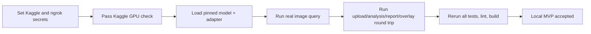

# Project progress

Last updated: 2026-09-02

## Evidence-backed status

| Workstream | Status | Evidence / next gate |
|---|---|---|
| Qwen LoRA training | Complete | Kaggle final PASS; adapter, manifests, evaluation summary, fresh reload |
| Public adapter | Complete | Public repository at immutable SHA `ed12e59...` |
| Kaggle VLM service | Notebook complete; user run pending | Exact 2B base + adapter, NF4, FastAPI + ngrok smoke gates |
| Controller | Complete for released single-image tasks | Upload, policy, jobs, SQLite, trace, report, overlay tests |
| Frontend wiring | Complete in code | Local proxy, uploads, polling, text, evidence, downloads |
| Geospatial context | Implemented | Validated lat/lon/altitude reaches prompt, provenance and report |
| Remote fallback | Removed | Browser cannot bypass the controller or call a model host directly |
| Temporary free GPU path | Complete in notebook | Protected backend-compatible FastAPI + ngrok tunnel |
| Change-VQA | Not released | Requires SECOND imagery/labels and metric gates |
| Optical/SAR fusion | Not released | Requires training and fused/S2-only/S1-only gates |
| Public deployment | Archived/removed | HF Spaces private; ChatGPT Site owner-only; deployment source removed |

## Completed implementation

- Parsed the SIH guide as product specification, not executable instructions.
- Fine-tuned Qwen3-VL 2B and published the adapter with immutable base/release metadata.
- Added local model loading from the public Hub adapter; removed the wrong 4B/local-directory
  runtime default.
- Added 4-bit Windows-compatible inference bounds for the audited RTX 2050.
- Added a one-time setup script, one-command three-process runner, and CUDA verifier.
- Added a protected Kaggle/Colab FastAPI notebook with local and public ngrok smoke tests.
- Added explicit latitude/longitude/altitude context and provenance handling end-to-end.
- Implemented fail-closed raster validation, closed-set routing, job state, typed specialist
  gateways, confidence integration, PDF reports, and marked JPEG artifacts.
- Wired the frontend only to the local controller and removed direct hosted-model fallback.
- Added detailed architecture, system, pipeline, PRD, API, security, testing, local runbook, UI,
  model, free-tier, and progress documentation with diagrams/tables.

## Verification ledger

| Gate | Latest known result |
|---|---|
| Backend tests | 21 passed, including context + protected HTTP gateway contract |
| ML utility tests | 9 passed |
| Ruff | Passed across backend, ML, model service, scripts and server notebook |
| Frontend lint/build | Passed; production server smoke returned HTTP 200 |
| Notebook structure | 23 cells, valid nbformat, all 11 code cells compile |
| Kaggle GPU/model/tunnel cells | Pending user secrets and free Kaggle session |
| Browser → API → real Kaggle model query | Pending successful notebook cell 9 |

This ledger is intentionally conservative. “Implemented” is not promoted to “verified” until the
corresponding command or real request passes.

## Remaining for local MVP acceptance

## Later work, not part of current acceptance

- Run and preserve the evaluation-only notebook's held-out results.
- Train and release Change-VQA only after SECOND answer/localization gates.
- Train and release TerraMind fusion only after multimodal and ablation gates.
- Select frontend, backend, storage, and model hosting providers with the user.
- Design public authentication, privacy, retention, observability, and rate limits before deployment.

## Known limitations

- The laptop has only 7.7 GiB RAM and 4 GiB VRAM; even the bounded 4-bit runtime may be marginal.
- The prior Hugging Face Spaces are private archives and are not model endpoints.
- The previous ChatGPT Site is owner-only. Its connector exposes no unpublish/delete primitive;
  the local Sites binding and deployment code have been removed.
- Grounding generation can return text without parseable geometry; this is surfaced honestly.
- BigEarthNet European Sentinel performance does not prove Indian Cartosat/RISAT performance.
