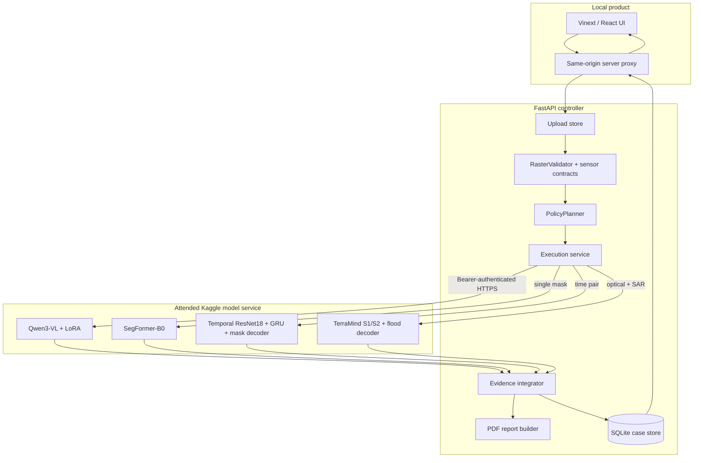
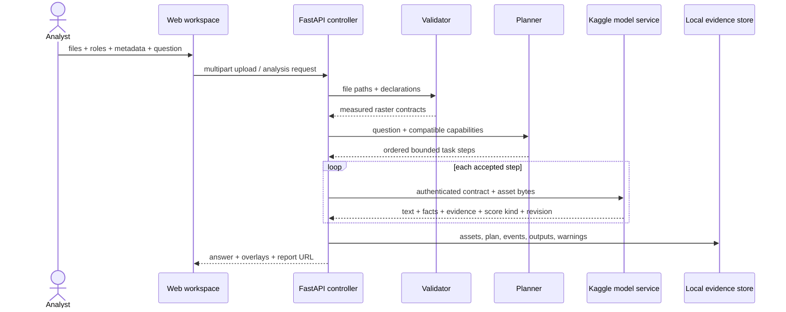

# SatQuery AI — project book for judges and contributors

## 1. Problem statement

**SIH 26167: An Interactive Vision-Language Assistant for Multimodal Remote Sensing Image Analysis through Text Queries.**

Earth-observation imagery supports forestry, agriculture, disaster response, water management, infrastructure and journalism, yet most analysis remains fragmented across specialist GIS tools and isolated task-specific models. The challenge asks for an interactive system that understands natural-language questions, validates remote-sensing inputs, selects and sequences suitable specialists, handles single images, bi-temporal change and optical/SAR fusion, and returns textual answers with confidence information, visual evidence and an observable execution summary.

The hard part is not only generating fluent text. A useful system must know which evidence configuration it has, reject incompatible requests, preserve sensor semantics, ground claims in pixels, distinguish calibrated confidence from raw scores, and record what actually ran.

## 2. Our solution

SatQuery is a local-first **agentic controller plus specialist models**. The user uploads one scene or a validated pair and asks a question. The controller validates the file contract, converts the question into a bounded plan, dispatches compatible specialists, combines structured outputs and renders a report with overlays, facts, warnings, provenance and execution events.

| Evidence set | Required input | Primary capabilities | Key refusal boundary |
|---|---|---|---|
| Single scene | 1 optical, multispectral or SAR raster | VQA, captioning, grounding, supported masks/indices | Never infer missing bands, CRS, date or sensor metadata |
| Bi-temporal | 2 comparable rasters with explicit `time_a`/`time_b` roles | learned change answer + generic semantic-change mask | No causal claim; RGB-only inputs cannot prove cloud-free or metric area |
| Optical + SAR | 1 optical/multispectral and 1 SAR raster on a shared grid | learned flood/water fusion | Sentinel flood scope, not arbitrary cross-modal reasoning |

JPG, PNG and WebP are accepted for accessible visual exploration. GeoTIFF is the scientific path when the result depends on georeferencing, band identity, spectral units, co-registration or physical area.

## 3. Why this approach

A single giant VLM can write plausible prose without respecting band order, sensor units or spatial registration, and a language model cannot create a precise segmentation boundary merely through better wording. SatQuery separates responsibilities:

1. deterministic validation for objective file/sensor constraints;
2. a transparent policy planner for task decomposition;
3. a domain-adapted VLM for language and visual grounding;
4. pixel-supervised specialists for masks and paired imagery;
5. deterministic integration, provenance and reporting.

This is feasible on a free Kaggle T4, permits each specialist to be measured independently, and makes failures visible rather than hiding them behind fluent narration. A larger external LLM is intentionally not mandatory: it would add cost, latency, privacy and availability risk without fixing pixel-level accuracy. A future planner may use one, but its plan must still pass the same policy checks.

## 4. Architecture

Only the temporary model service is exposed through ngrok. The website and controller stay on the presenter’s computer. The service token exists in Kaggle Secrets and the local backend environment; it is never sent to browser JavaScript. This is a zero-cost attended demonstration topology, not permanent production hosting.

## 5. Agents and responsibilities

“Agent” means an observable software role with a constrained contract—not an unbounded autonomous chatbot.

| Agent / component | Responsibility | Output |
|---|---|---|
| Evidence intake | Size-limit and preserve original uploads and declared roles | immutable asset records |
| Raster validator | Decode safely; inspect shape, CRS, transform, bands, dtype, nodata; check pair alignment | measured contracts or refusal |
| Sensor resolver | Recognize supported sensor/band metadata only when evidenced | verified semantic band mapping |
| Policy planner | Decompose supported compound questions and choose permitted specialists | ordered steps with route reasons |
| Single-scene specialist | VQA, description, normalized boxes and optional semantic masks | text + boxes/masks + score semantics |
| Temporal specialist | Answer CDVQA-style questions and predict generic change | answer label + change mask + warnings |
| Fusion specialist | Fuse aligned Sentinel-2 optical and Sentinel-1 VV/VH evidence | flood/water mask + scoped facts |
| Evidence integrator | Normalize results, enforce score semantics, create overlays and synthesis | intelligence brief + trace |
| Report agent | Produce an auditable PDF without adding unsupported claims | downloadable report |

The trace records validation, routing, model revision, task timing and evidence production. It deliberately does **not** expose private chain-of-thought.

## 6. Communication contracts

Every specialist response separates `text`, machine-readable `facts`, spatial `evidence`, `raw_score` plus `score_kind`, immutable `model_version`, and domain/calibration `warnings`.

## 7. Models, datasets and weights

| Capability | Model / adaptation | Data | Upstream source | Selected artifact |
|---|---|---|---|---|
| VQA, captioning, grounding | Qwen3-VL 2B Instruct + PEFT LoRA | BigEarthNet.txt paired questions/answers and images | [BigEarthNet.txt](https://huggingface.co/datasets/BIFOLD-BigEarthNetv2-0/BigEarthNet.txt), [Qwen3-VL](https://huggingface.co/Qwen/Qwen3-VL-2B-Instruct) | [SatQuery LoRA](https://huggingface.co/aanandmodi/satquery-qwen3vl-bigearthnet-txt-lora) |
| Single-scene land cover | SegFormer-B0 semantic decoder | LoveDA official train/validation | [LoveDA](https://github.com/Junjue-Wang/LoveDA) | `upgrade/02_segmentation_inference/best-model/model.safetensors` |
| Temporal change | shared ResNet18 + GRU + answer/mask heads | CDVQA annotations + SECOND imagery/labels | [CDVQA](https://github.com/YZHJessica/CDVQA), [PerASCD distribution](https://github.com/SathShen/PerASCD) | `upgrade/03_change_inference/artifacts/model.safetensors` |
| Optical/SAR flood fusion | TerraMind tiny S1/S2 + pixel decoder | Sen1Floods11 v1.1 hand-labelled chips | [Sen1Floods11](https://github.com/cloudtostreet/Sen1Floods11), [TerraTorch](https://github.com/IBM/terratorch) | `upgrade/04_fusion_inference/artifacts/model.safetensors` |

The repository contains selected inference weights with configs, hashes, splits and summaries. It excludes optimizer checkpoints, bulky per-example prediction dumps, extracted duplicate ZIPs and runtime uploads.

### Training methodology

#### Qwen domain adaptation

- pinned base, dataset and adapter revisions;
- parameter-efficient LoRA/QLoRA-style tuning for a free T4;
- leakage-aware split reconstruction;
- base-vs-LoRA inference on the same held-out rows;
- raw prediction export and separate scoring;
- frozen-temperature diagnostic, with automatic probability release disabled.

#### SegFormer masks

- `nvidia/mit-b0` initialization;
- full official LoveDA training split in R4, 384 px crops, microbatch 1 and gradient accumulation;
- all official validation scenes through a streaming confusion matrix;
- incumbent-protected selection;
- gate: mean IoU ≥ 0.45 and water/forest/agriculture IoU ≥ 0.35.

R4 did not pass mean-IoU and forest thresholds, so this capability remains visibly experimental.

#### Learned temporal change

- official CDVQA question splits with SECOND semantic-change supervision;
- shared ResNet18 encodes time A and B, GRU encodes the question;
- separate closed-vocabulary answer and semantic-change mask heads;
- mask metrics grouped on unique pairs so repeated questions do not duplicate evidence.

#### Learned optical/SAR fusion

- Sen1Floods11 co-registered Sentinel-2/Sentinel-1 triplets;
- TerraMind tiny multimodal backbone and pixel-supervised flood decoder;
- S2-only and S1-only ablations beside fused performance;
- output scoped to flood/water, not arbitrary vegetation/building fusion.

## 8. Methodology and safety rules

1. **Measure before interpreting.** File properties come from the decoder, never prose.
2. **Declare roles.** Time A/B and optical/SAR roles are explicit.
3. **Refuse unsupported indices.** NDVI needs red/NIR; NDBI/NBR require SWIR. No band guessing.
4. **Preserve coordinate space.** Every spatial item says pixel, normalized or geospatial.
5. **Do not turn logits into certainty.** Raw model statistics are labelled honestly.
6. **Separate prediction from observation.** User metadata is not pixel-derived evidence.
7. **No causal invention.** Change or flood appearance does not prove cause, damage or date.
8. **Record provenance.** Model revision, inputs, task route and warnings accompany results.

## 9. Problem-statement compliance

| Requirement | Implementation | Evidence / limitation |
|---|---|---|
| Remote-sensing adaptation | Qwen LoRA and three task specialists | pinned artifacts and notebook pack |
| Single-image VQA | Qwen3-VL route | held-out sampled scorecard |
| Captioning / grounding | description + normalized box evidence | boxes are not universal segmentation |
| Bi-temporal change | learned CDVQA/SECOND answer + mask | generic change; no cause claim |
| Optical/SAR fusion | learned TerraMind Sen1Floods11 head | flood scope only |
| Agentic orchestration | validation-aware compound planner + registry | bounded tasks and trace |
| Compatibility checks | raster, sensor and pair validation | non-georeferenced images limited to exploration |
| Confidence information | score kinds, calibrated Qwen diagnostic, caps/abstentions | most spatial scores are not calibrated probabilities |
| Visual evidence | boxes, masks, polygons and compare slider | model-estimated boundaries |
| Execution summary | persisted plan and trace | no hidden reasoning exposure |

## 10. Honest evaluation summary

| Component | Split and size | Principal result | Status |
|---|---|---|---|
| Qwen LoRA | held-out test, 200 mixed rows | VQA EM 0.61; grounding mIoU 0.4227; caption F1 0.4014 | sampled evidence, not universal accuracy |
| SegFormer | LoveDA validation, 1,669 scenes | mIoU 0.4206; water 0.5852; forest 0.3395 | strict gate failed |
| Temporal | test: 39,686 QA, 968 pairs | answer 0.7275; mask IoU 0.4961 | project test evidence retained |
| Fusion | test: 90 chips, 3,908,105 valid pixels | flood IoU 0.7103; Dice 0.8306 | Sentinel flood scope passed |

See [EVALUATION.md](EVALUATION.md) for comparisons, ablations, score semantics and sources.

## 11. Known gaps and roadmap

- No labelled organizer Cartosat-2S/RISAT set was available. Sentinel/SECOND/LoveDA results do **not** establish hidden Indian-sensor accuracy.
- Single-image segmentation is experimental because forest and mean IoU missed the project gate.
- Qwen grounding predicts boxes; pixel masks come from segmentation specialists.
- Temporal masks predict generic semantic change and can react to cloud, shadow, season and misregistration.
- Fusion is trained for flood/water. Broader cross-modal questions need labelled tasks.
- Free Kaggle + ngrok is attended and temporary; keep a recorded fallback.
- JPG/PNG cannot supply missing CRS, verified bands or metric area.
- Reports must not create weather history or causal explanations without external evidence.

Highest-value next work: acquire labelled Cartosat/RISAT pairs, calibrate each specialist on a disjoint split, improve forest/barren segmentation, add cloud/quality masks, and measure latency per route.

## 12. Judge demo narrative

1. Explain “one question, the right specialist, visible evidence” on the home page.
2. Upload `input/01_single/02_india_water_multispectral.tif`; ask for water bodies.
3. Show validation, route, mask, warnings and report.
4. Use the Nepal temporal pair; state that its date/CRS provenance is not independently verified.
5. Use the India optical/SAR pair; show the slider, learned flood mask and trace.
6. Open the saved case and methods pages; show model revision and provenance.
7. Finish with what passed, what did not, and why SatQuery refuses to overclaim.

### Judge Q&A

**Is change detection learned or subtraction?** The primary pair route loads a supervised CDVQA/SECOND answer-and-mask checkpoint. Analytical fallbacks are explicitly labelled.

**Why is confidence sometimes low or absent?** An uncalibrated softmax is not a correctness probability. SatQuery reports semantics and withholds stronger language until calibration passes.

**Can you claim Cartosat/RISAT performance?** No. Sensor contracts exist, but no labelled organizer sample was available. Sentinel metrics are not a substitute.

**Why not one large LLM?** Language planning cannot replace co-registration, sensor validation or pixel supervision. A larger LLM may improve phrasing later, but specialist evidence remains authoritative.

**Is this production-ready?** It is a production-shaped research prototype. Permanent hosting, authentication, malware scanning, monitoring, calibration and organizer-domain validation remain deployment work.
