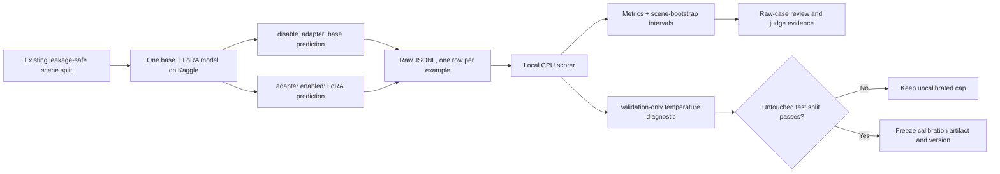

# Real base-versus-LoRA evaluation runbook

This runbook produces auditable results on free Kaggle GPU and scores them locally without using
GPU quota. It does not contain target numbers and does not certify change/fusion specialists.

## Evidence flow



## Kaggle run

1. Upload `notebooks/SatQuery_Qwen3VL_Evaluation_Only.ipynb` to a Kaggle notebook.
2. Enable one free GPU and Internet. Add `HF_TOKEN` as a private Kaggle secret if the model or
   adapter access requires authentication. Never paste or print the token in a cell.
3. Keep the pinned base/adapter revisions and the notebook's existing leakage-safe split logic.
4. Start with `rows_per_type=50` (200 rows across the four current task slices). Reduce it only for
   a smoke test; increase it only after time/quotas are measured.
5. Run in order. The model is loaded once. Each example is generated with the adapter enabled and
   with `model.disable_adapter()` on the identical prepared input.
6. Download the emitted `validation_predictions.jsonl` (or `test_predictions.jsonl` when
   `CFG.split="test"`) before ending the Kaggle session. Inspect
   several rows: image/patch ID, question, reference and both raw predictions must be present.
7. Save the notebook version, then stop the Kaggle GPU. Aggregate scoring does not need a GPU.

## Local CPU scoring

```powershell
Set-Location D:\Projects\Sih-2026
.\.venv\Scripts\python.exe scripts\score-real-evaluation.py `
  D:\Downloads\validation_predictions.jsonl `
  --output outputs\real-evaluation
```

The scorecard contains base and LoRA values, sample/scene counts, scene-cluster bootstrap 95%
intervals and LoRA-minus-base deltas. Keep the JSONL beside the scorecard. A metric without its raw
rows and split manifest is not a release artifact.

The sequence-score calibration section is a diagnostic: fit scenes and evaluation scenes are
separated deterministically. It becomes user-facing probability only after the fitted temperature
and abstention threshold are frozen and tested on a separate untouched split.

## Required claim labels

| Result | Allowed wording |
|---|---|
| Base/LoRA rows and scorer complete | “Measured on N held-out examples from this named split” |
| Temperature fitted/evaluated within validation data | “Calibration diagnostic” |
| No learned pair checkpoint | “Analytical change/fusion baseline; learned checkpoint pending” |
| No independent pixel labels | “Candidate boundary,” never “precision verified” |

Do not mix VQA, grounding, captioning, change or fusion into one accuracy number.
