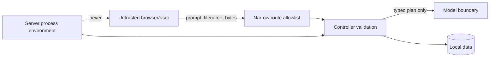

# Security and privacy

## Threat model

The main threats are malicious/oversized raster input, path traversal, prompt-controlled routing,
secret leakage, resource exhaustion, malformed model output, and misleading evidence/confidence.

## Controls

| Threat | Control |
|---|---|
| Oversized upload | Streaming byte counter and configured maximum |
| Raster decompression bomb | Pixel, band, driver, dimension, CRS, and transform limits |
| Path traversal | Random storage IDs, sanitized metadata, resolved-path containment |
| Arbitrary tool/model execution | Closed task enum and policy router |
| Prompt injection into infrastructure | Prompt cannot set URLs, paths, model IDs, or parameters outside allowlist |
| Secret leakage | Server-only environment values; browser bundle has no HF/model token |
| GPU denial of service | One model request lock, input/token bounds, controller timeout |
| Malformed model output | Specialist Pydantic schema and geometry normalization |
| False certainty | Uncalibrated label and UI policy; no correctness percentage |
| Fake spatial evidence | Invalid/unparseable boxes are omitted with a warning |

## Local binding and authentication

Development services bind to `127.0.0.1`; the frontend is available at localhost. Local mode may
leave `SATQUERY_API_KEY` empty. Before any service is exposed to another machine:

1. Set a long random controller API key.
2. Set a different model-service bearer token.
3. Restrict allowed origins exactly.
4. Put TLS/authentication/rate limiting in front of both services.
5. Define retention and access policy for imagery and reports.

Production configuration refuses the simulator and requires a controller API key.

## Secrets inventory

| Secret | Needed locally? | Location | Browser-visible? |
|---|---:|---|---:|
| Hugging Face read token | No; model is public | Only future server/notebook secret store | Never |
| Controller API key | No on loopback | `.env`/process environment | Never; proxy may send server-side |
| ngrok authtoken | Yes for the temporary tunnel | Kaggle Secret only | Never |
| Model-service token | Required over ngrok | Kaggle Secret + local `.env` | Never |

A Hugging Face token was pasted into chat earlier. Revoke it and do not reuse it. This repository
must never contain that token in source, notebook output, `.env.example`, logs, or screenshots.

## Data handling

| Data | Local GPU profile | Temporary free-GPU profile |
|---|---|---|
| Original GeoTIFF | Local filesystem only | Stored locally, then transmitted to Kaggle through the protected ngrok API |
| RGB preview | Local | Created inside the Kaggle model process |
| Question and location context | Local | Sent through ngrok to Kaggle |
| Result/trace/report | Local SQLite/files | Stored locally after remote model response |
| Retention | Until user manually removes runtime data | Same locally; remote service memory ends with session |

Do not use the temporary notebook profile for confidential, regulated, embargoed, or personally
sensitive imagery. Bearer authentication blocks unauthenticated inference but does not turn
third-party tunnel/notebook infrastructure into an approved confidential environment. Local
deletion is intentionally not automated because artifacts may be required
for SIH evidence.

## Supply chain and model integrity

- Base and adapter use immutable 40-character commit SHAs.
- Adapter weights use SafeTensors.
- `trust_remote_code=False` is used at model/processor load.
- Dependency versions for the local model path are pinned in `requirements-local-model.txt`.
- Model provenance is returned with every successful analysis.
- Changes to revisions or preprocessing require evaluation and release-gate reruns.

## Incident response

For a credential incident: revoke the credential, clear affected environment/notebook secrets,
inspect Git history and logs, issue a least-privilege replacement only if needed, and record what
could access it. For a model/input incident, retain the request ID, analysis ID, sanitized trace,
revisions, and image hash; do not attach private source imagery to a public issue.
