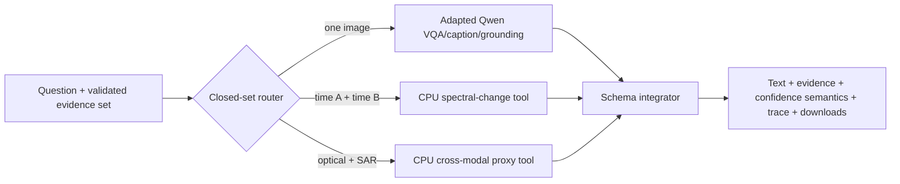

# SIH 2026 problem-statement compliance

This document traces the supplied **SatQuery AI — Interactive Vision-Language Assistant for
Multimodal Remote Sensing Image Analysis through Text Queries** problem statement to executable
repository evidence. It distinguishes feature completeness from model-quality claims.

## Verdict

The architecture is feasible and the code now covers every mandatory workflow. The released
BigEarthNet.txt-adapted Qwen specialist handles single-image work; bounded local analytical tools
make bi-temporal and optical/SAR pair workflows runnable without pretending that unreleased learned
weights exist. The remaining gates are empirical evaluation on prescribed public splits and the
undisclosed ISRO/SAC set. No team can complete the hidden-set gate before judging.

## Requirement traceability

| Problem-statement requirement | Status | Executable evidence | Qualification |
|---|---|---|---|
| Remote-sensing fine-tuning/domain adaptation | Implemented | `notebooks/SatQuery_Qwen3VL_Training_v2.ipynb`; public LoRA at immutable revision `ed12e59...` | Adapted on BigEarthNet.txt-derived image/question records |
| One optical, multispectral, **or SAR** image | Implemented | UI modality declaration; raster validator; Qwen one/two-band preview fix | SAR is rendered as a repeated grayscale visual channel; raw backscatter semantics are not invented |
| Single-image VQA | Implemented | `single_vqa` registry task and Qwen adapter | Public-split accuracy still requires the prescribed VRSBench/RSVQA evaluation run |
| Captioning or grounding | Implemented beyond minimum | `caption` and `grounding`; strict box parser | A missing/malformed generated box becomes a warning, never fake geometry |
| Bi-temporal change description/change VQA | Implemented baseline | `LocalPairSpecialistGateway`; automatic `change_vqa` route; UI time-A/time-B upload | Current CPU output is a quantified spectral-change proxy, not a learned semantic CDVQA probability |
| Spatial change evidence | Implemented baseline | Changed-pixel fraction and normalized evidence box on time B | A learned dense mask remains gated on CDVQA/SECOND evaluation |
| Co-registered optical/multispectral + SAR analysis | Implemented baseline | Local optical-context/SAR-backscatter proxy tool; automatic fusion route | Candidate water/built-up regions are uncalibrated proxies, explicitly labelled |
| Query/task classification | Implemented | Pattern classifier plus validated-input fallback in `PolicyRouter` | No arbitrary LLM-selected code, URL, path, or model |
| Check number, modality, format, metadata, compatibility | Implemented | `RasterValidator` and task validation | Pair gate checks CRS, ≥98% overlap, ≤2% resolution delta, and ≤0.25-pixel grid offset |
| Predefined model/tool registry | Implemented | `TaskType` enum, hybrid specialist gateway | Five closed tasks only |
| Configure permitted parameters only | Implemented | Router accepts bounded targets, threshold, and bbox; drops unknown fields | Threshold clamped to 0.05–0.95 |
| Select, sequence, and execute workflow automatically | Implemented | Input-aware policy plan and async job service | UI defaults to **Auto route**; explicit route remains available for judging |
| Combine textual/spatial outputs and confidence | Implemented | Structured integrator and `Confidence` contract | Open-ended/proxy outputs are evidence-quality scores, not correctness percentages |
| Auditable execution summary | Implemented | Trace includes task, tool, model version, permitted parameters, reason, status, timing | Internal chain-of-thought is neither stored nor exposed |
| GeoTIFF/TIFF support | Implemented | Magic-byte and Rasterio inspection | File extension alone is not trusted |
| PNG/JPEG only for named public benchmarks | Implemented | Allowlist: VRSBench, RSVQA, CDVQA, SECOND | Production benchmark import requires a server-controlled manifest |
| Interactive GUI/web app | Implemented | `app/page.tsx` | Local-first; no website deployment required |
| Textual and visual results | Implemented | Answer panel, CSS evidence, downloadable marked JPEG | Pair evidence is drawn over the co-registered reference image |
| Downloadable report | Implemented | Deterministic PDF report endpoint | Includes request, trace, warnings, and provenance |
| Code, models, tests, demonstration | Implemented in repository | Automated tests, notebooks, public adapter, `scripts/sih-acceptance.py` | Five-workflow real-model run still needs an active free GPU session |

## Evaluation readiness

| Evaluation source | Current readiness | Required action before final submission |
|---|---|---|
| BigEarthNet.txt | Adapter trained, hashed, uploaded, fresh-reloaded | Preserve the notebook output and exact split manifest with the submission |
| VRSBench | Loader/task path documented; no final prescribed-split score recorded | Run VQA/caption/grounding metrics on the exact organizer-prescribed test split |
| RSVQA | Same | Record normalized VQA accuracy and per-question-type results |
| CDVQA | Learned training notebook exists; CPU baseline runs now | Train/evaluate the learned change expert and record answer plus localization metrics |
| ISRO/SAC Cartosat-2S + RISAT hidden set | Interface and pair validation are compatible | Cannot pre-score undisclosed annotations; avoid any unsupported performance claim |

## Feasibility constraints

| Constraint | Feasible approach | Limitation that must be stated |
|---|---|---|
| Zero monetary cost | Local UI/controller/storage; CPU pair tools; free Kaggle/Colab GPU for Qwen | Free GPU/tunnel sessions are temporary and have quota; there is no uptime SLA |
| Low-spec laptop | No local Qwen load required; pair tools are bounded to a 512-pixel long edge | Large originals are inspected but analysis uses a bounded aligned working grid |
| Public demonstration | Start the protected Kaggle tunnel, then run the local app | The tunnel URL changes when the notebook restarts |
| Production-like behavior | Strict validation, auth boundary, immutable hashes, timeouts, trace, reports | A genuinely public multi-user production service cannot promise permanent ₹0 compute |

## Definition of done for judging

Run all static/unit gates, then execute `scripts/sih-acceptance.py` with licensed co-registered
fixtures. The generated directory must contain five JSON records, five marked images, five PDFs,
and a summary whose model provenance shows Qwen for single tasks and the two bounded pair tools for
paired tasks. Finally, attach the prescribed benchmark score files; do not replace them with manual
demo impressions.

