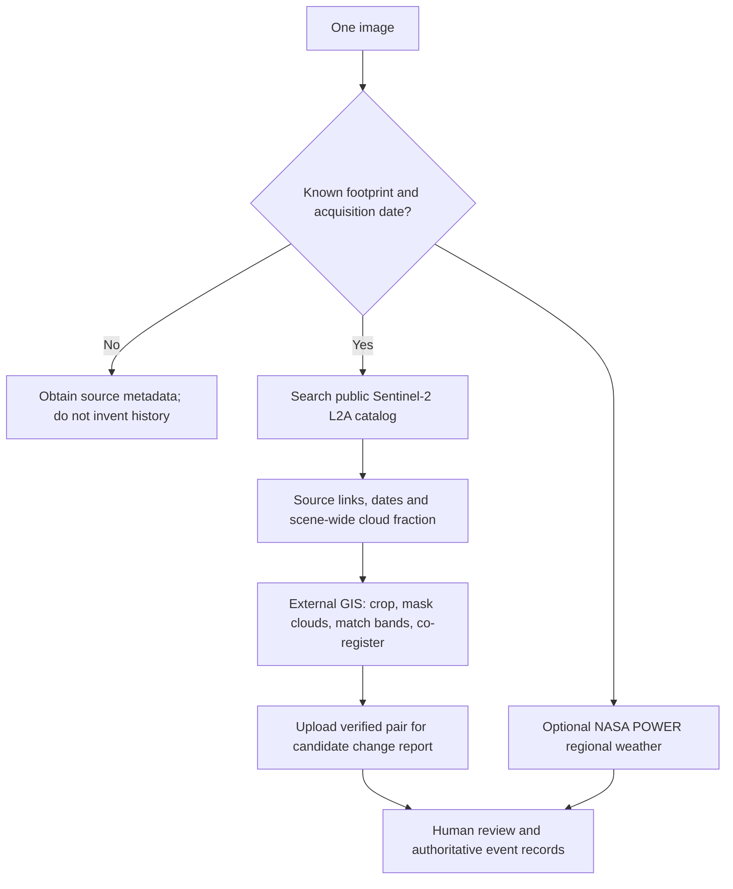

# SatQuery investigation studio

Updated 2026-09-04. Local website/controller, attended Kaggle inference. No website deployment,
paid endpoint, new paid API or local GPU training is required. Free services have quotas and
outages; this is not guaranteed 24/7 hosting.

## Start and navigate

Keep the existing Kaggle inference notebook and bounded ngrok session running. This is not
another fine-tuning run. Put the current URL in ignored root `.env` as
`SATQUERY_MODEL_SERVICE_URL`; keep the identical service secret server-side. Do not paste
secrets into the website. Full setup: [Kaggle/ngrok runbook](NGROK_KAGGLE_RUNBOOK.md).

For this existing checkout, start the backend:

```powershell
Set-Location D:\Projects\Sih-2026
.\.venv\Scripts\python.exe -m uvicorn app.main:app --app-dir backend --env-file .env --host 127.0.0.1 --port 8000
```

In another terminal:

```powershell
Set-Location D:\Projects\Sih-2026
npm run dev
```

Open `http://localhost:3000`. A new machine must first follow setup instructions. Restart the
controller after environment changes. Stop both local processes and the Kaggle session when done.

| Page | Job |
|---|---|
| `/` Investigation | Evidence selection, editable presets, source inspector, report and trace tabs |
| `/cases` Casebook | Persistent local investigations, including failures |
| `/cases/{id}` Case detail | Original previews, sourced report, JSON/PDF/marked-image downloads |
| `/archive` Historical evidence | Earlier Sentinel acquisitions and dated regional weather |
| `/method` Methods & limits | Implemented capabilities and unvalidated scientific claims |

## Formats and the three evidence sets

| Set | Exploration mode | Strict SIH mode | Current analysis |
|---|---|---|---|
| Single optical | RGB/grayscale JPG, JPEG, PNG, WebP, TIFF | Geospatial TIFF; controlled named PNG/JPEG benchmarks only | Real Qwen interpretation and candidate masks with upgraded service |
| Bi-temporal | Compatible rasters; unreferenced pair requires explicit pixel-alignment declaration | Compatible georeferenced temporal rasters | Local selected-band difference baseline |
| Optical + SAR | Real sensor TIFFs with geospatial registration | Same sensor/geospatial requirements | Local optical/backscatter proxy baseline |

Files are capped at 50 MiB; ordinary display images also at 40 million pixels. Animated, palette,
CMYK, alpha-channel and orientation-tagged display files are rejected with a reason. Export an
opaque, correctly oriented RGB image first. Declaring a JPEG as SAR/multispectral does not create
sensor data. WebP is transmitted to the remote service as PNG; original bytes/hash stay local.

No CRS means image coordinates only. A user-supplied location does not georeference a photo or
permit hectare estimates. RGB alone cannot reliably establish species, forest health, exact
weather, acquisition date, damage or cause.

## Single image

1. Select Exploration, One scene, Optical; upload a JPG/PNG or compatible TIFF.
2. Select Water, Forestry or Journalism as a starting question and edit it.
3. Run analysis. Auto-routed multi-sentence questions use one appropriate specialist call rather
   than duplicating the full report across tasks. Explicit multiple task requests remain supported.
4. Inspect original pixels with the mask toggle/opacity slider, then read the full report.
5. Open the case to export the report, trace, marked JPEG and evidence JSON. Masks are candidates.

Prefer satellite/nadir aerial scenes. A perspective phone photograph is not a mapped raster.

## Bi-temporal pair

Choose before as time A and after as time B. Use matching band meanings and review dates,
illumination, season, cloud and shadow. For unreferenced inputs, both files must have equal
dimensions/bands/dtypes and you must confirm that corresponding pixels show the same ground.
Matching dimensions alone do not prove alignment. Automatic photograph registration is absent.

The default threshold is `max(0.12, 85th percentile of normalized difference)`: it highlights
upper-tail differences, often roughly 15%, not all confirmed physical changes. Clouds/exposure
can dominate it. API `parameters.threshold` supports sensitivity testing; select thresholds on
validation data, not to manufacture a preferred result. Pair processing is bounded to 1536 pixels
on the long edge. Reports use shared valid support; repeated masks on exact matching date grids
are counted once. Shifted compatible grids use the before reference grid.

The user's Nepal pair passed the real local workflow. Its strongest differences include bright
cloud-like regions. This verifies operation, not flood extent or causal analysis.

## Optical + SAR

Use real, co-registered geospatial sensor TIFFs with explicit roles, not radar screenshots.
The CPU baseline returns candidate water/vegetation/built-up masks on the optical reference grid.
Speckle, incidence angle, layover, radar shadow, moisture and preprocessing are confounders.
Learned TerraMind fusion and CDVQA temporal specialists remain training/evaluation release gates.

## One photo and historical evidence



Archive is working discovery, **not automatic downloading/cropping/registration**. Confirm a
WGS84 bounding box and acquisition date; search up to one year before the image and at most a
2° × 2° region. Camera GPS is not the image footprint. Scene cloud fraction is not local cloud
coverage. A phone photo and satellite acquisition cannot be subtracted as matching pixels.

Weather searches cover at most 31 days and return daily temperature, precipitation, humidity
and wind with source units/missing values. NASA POWER is coarse regional reanalysis, not exact
pixel weather or proof that rainfall caused a flood. Use independent dated event records.

Only requested coordinates/dates are sent to providers, not images. Export sourced context JSON
to accompany a case; automatic attachment to reports is not implemented. No paid imagery or
requester-pays dataset is used. Sources: [Earth Search](https://element84.com/earth-search/),
[public Sentinel-2](https://registry.opendata.aws/sentinel-2-l2a-cogs/),
[NASA POWER](https://power.larc.nasa.gov/docs/services/api/temporal/daily/).

## Model update and confidence

Local reports separate model observations, file metadata, mask measurements, readiness and
verification. Filtered original text remains in unverified audit data. Coverage is not accuracy;
uncalibrated scores are not correctness percentages. The display guard is not a general verifier.

The live session was tested with `satquery-quality-v2`. Updated notebook section **6b** provides
`satquery-quality-v3`: six-part evidence-limited reporting with less short-answer anchoring.
Apply and smoke-test it using [the quality procedure](ANALYSIS_QUALITY.md); no retraining needed.
V3 has not been run on the user's active Kaggle GPU in this update.

Perfect masks, species recognition, regional benchmark accuracy and event causality are not
established. [The evaluation plan](MODEL_EVALUATION_PLAN.md) describes the remaining evidence needed.
