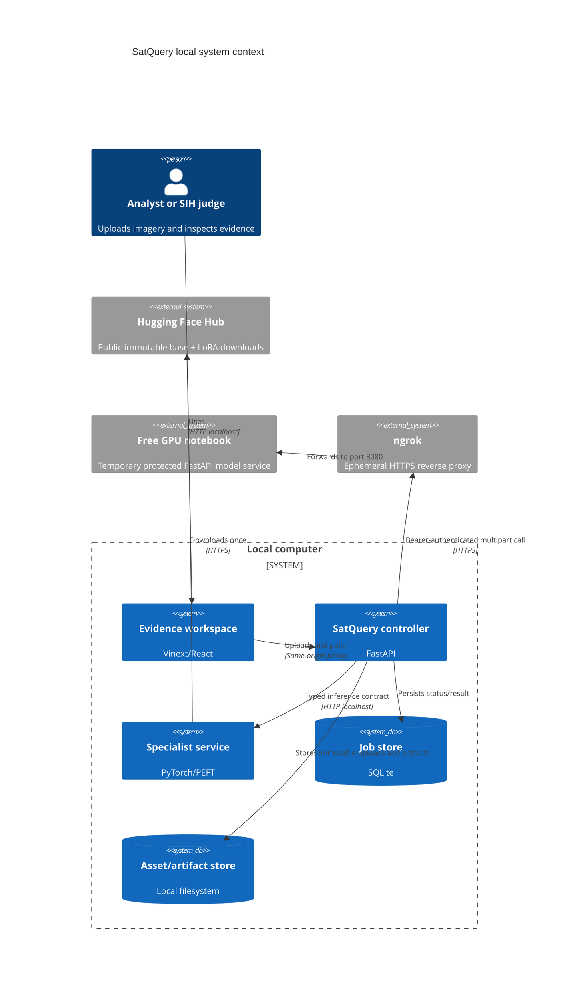
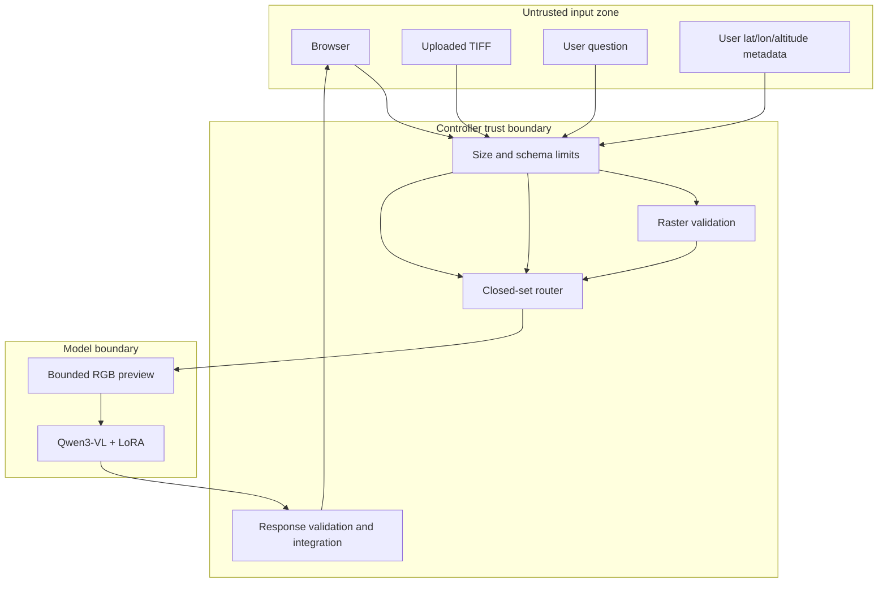
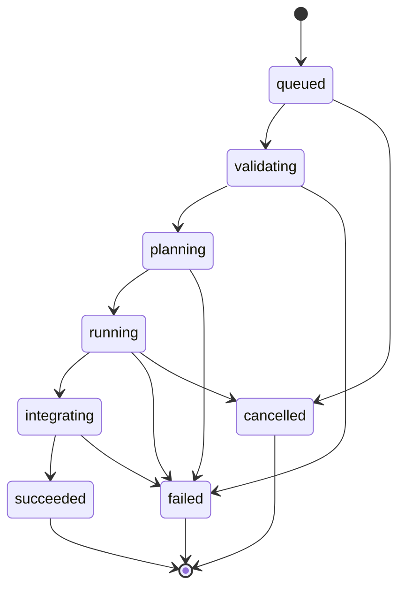
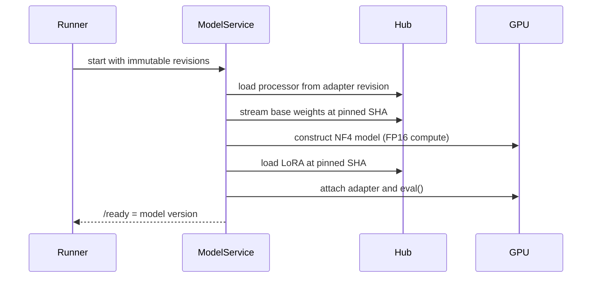

# System design

Studio additions are documented in [Architecture](ARCHITECTURE.md) and [Studio guide](STUDIO_GUIDE.md).
Cases remain local SQLite records. External context queries have fixed hosts, bounded response
sizes, timeouts, concurrency and cache limits; they neither follow arbitrary URLs nor download
imagery. Input profiles/registration provenance are stored and cannot be replaced by camera GPS.
Model-derived mask counts are recomputed against the source grid. No paid infrastructure is used.

## Design goals

| Goal | Mechanism | Failure behavior |
|---|---|---|
| Evidence-backed answers | Specialist response carries asset-linked geometry | No geometry is shown when parsing/validation fails |
| Auditable execution | Closed task plan, model revisions, durations, warnings, provenance | Observable trace remains even when a job fails |
| Local-first control plane | Loopback frontend/controller, SQLite, local artifacts | GPU tunnel outage is explicit |
| Model isolation | Controller calls a typed specialist HTTP boundary | A model crash does not expose arbitrary execution to the browser |
| Reproducibility | Base/adapter commits, SafeTensors, manifests, pinned runtime | Startup rejects mutable/malformed revisions |
| Zero billed infrastructure | Laptop GPU or temporary free notebook GPU | Quota/OOM is explicit; no paid fallback is provisioned |

## Component view

## Trust boundaries

User text never becomes a URL, file path, model identifier, shell command, or arbitrary tool name.
The router can select only `single_vqa`, `caption`, `grounding`, `change_vqa`, or
`optical_sar_fusion`, and compatibility checks reject tasks without the required assets.

## Runtime processes

| Process | Port | Startup readiness | Concurrency | Persistent state |
|---|---:|---|---:|---|
| Frontend | 3000 | Route compiles and responds | Framework-managed | None |
| Controller | 8000 | SQLite + model gateway healthy | Two jobs max by default | SQLite, uploads, reports |
| VLM service | 8080 | Base and LoRA loaded, CUDA ready | One request lock | HF cache only |
| ngrok agent | ephemeral HTTPS | Tunnel URL responds | Free-plan limits | None |

The controller uses asynchronous jobs so upload/API polling remains responsive while generation is
blocking. The model service serializes GPU work to prevent VRAM overcommit.

## State model

Each transition is persisted. On controller restart, unfinished in-process jobs are marked failed
instead of being presented as still running.

## Data model

| Entity | Key fields | Invariant |
|---|---|---|
| Asset | ID, original name, SHA-256, modality, role, raster metadata | Stored name is random; source bytes are immutable |
| Analysis | ID, request, location context, state, progress, plan, result/error | Terminal states do not resume silently |
| Plan step | Task enum, asset IDs, permitted parameters, policy reason | No arbitrary model/tool execution |
| Specialist output | Text, facts, evidence, score semantics, revision, warnings | Pydantic schema validation before integration |
| Evidence | Type, label, score, coordinate space, geometry, asset ID | Coordinates must remain within the declared space |
| Trace event | Step, tool, revision, duration, status, reason | Records observable operations, not hidden reasoning |

## Model loading design

Weights are not merged. Keeping the adapter separate preserves provenance and avoids writing a
large merged checkpoint. No token is required because both repositories are public.

## Failure policy

| Failure | Surface | System response |
|---|---|---|
| Invalid/corrupt raster | Upload | `422 validation_failed`; no model call |
| Unsupported asset/task combination | Planning | `422 routing_failed` |
| Model offline/OOM | Running | Analysis becomes `failed`; API stays alive |
| Model timeout | Running | Bounded timeout; no fabricated answer |
| Unparseable box | Integration | Text retained, warning added, evidence omitted |
| Report generation error | Artifact stage | Valid answer retained with a warning |
| Controller restart | Job store | Interrupted jobs marked failed |

## Scale and future deployment

The current local profile is intended for one analyst and one GPU. Scaling later should replace
only infrastructure adapters: SQLite → PostgreSQL, local files → object storage, in-process jobs →
durable queue, and local model URL → authenticated GPU service. Browser and specialist schemas do
not need to change. No such deployment is authorized or performed in the current phase.
