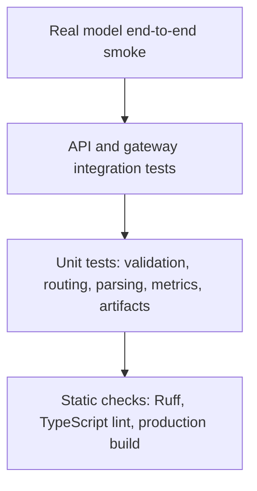

# Verification and release gates

## Test pyramid



Passing unit tests does not prove that the model loads. Local acceptance requires the real-model
smoke below.

## Automated suite

```powershell
$python = "$env:USERPROFILE\.venvs\satquery\Scripts\python.exe"
Set-Location D:\Projects\Sih-2026

& $python -m pytest backend\tests -q
& $python -m pytest ml\tests -q
& $python -m ruff check backend ml model_service scripts
npm run lint
npm run build
```

| Suite | What it proves | What it does not prove |
|---|---|---|
| Backend API | Upload, persistence, jobs, reports, overlays, errors | Real CUDA generation |
| ML utilities | Splits, preprocessing, metrics, manifests | Model quality on target domain |
| Ruff/lint/build | Source consistency and compilability | Runtime hardware fit |

## Real model startup gate

1. Run the Kaggle notebook through cell 9.
2. Require GPU, model, local HTTP, and public ngrok smoke tests to print `PASS`.
3. Configure `.env` with the printed URL and matching bearer token.
4. Start `scripts/run-local.py`.
5. Require `GET :8000/v1/health/ready` to report database and model gateway true.

If startup fails with repeatable CUDA OOM on a clean GPU, local-laptop inference does not pass; use
the free-GPU bridge and record that as the accepted execution profile.

## End-to-end acceptance scenario

Use a valid RGB/optical GeoTIFF that is permitted to be processed.

| Step | Assertion |
|---|---|
| Upload | `201`, valid asset, SHA-256 present, raster metadata present |
| Preview | `200 image/jpeg`, non-empty body |
| Analysis create | `202`, status `queued` |
| Location context | Valid lat/lon/altitude appears in request provenance and user-location fact |
| Completion | Terminal state becomes `succeeded` within five minutes |
| Text | `result.answer` is non-empty and not demo/simulator copy |
| Model provenance | Revision contains adapter SHA `ed12e59e0de...` |
| Confidence | Marked uncalibrated/evidence quality, not correctness probability |
| Report | PDF endpoint returns non-empty `application/pdf` |
| Grounding | Valid box produces an overlay; invalid/no box produces warning, not fake geometry |

Run at least three semantic probes:

1. `single_vqa`: a yes/no land-cover question whose answer is visually checkable.
2. `caption`: a concise description request.
3. `grounding`: locate one visible water, vegetation, or built-up region.

Record the image license/source, query, reference answer, model answer, latency, revision, warnings,
and manual judgement. One successful query proves integration, not model accuracy.

## Model-quality gates

| Specialist | Required evidence before release |
|---|---|
| Qwen single-image | Pinned fresh reload; task-specific validation and held-out test report |
| Grounding | Box parse rate plus localization IoU on labeled samples |
| Change-VQA | Answer accuracy/F1 plus mask IoU/Dice on disjoint SECOND test identities |
| Optical/SAR | Macro-F1/AP plus S2-only/S1-only ablations and dense-evidence metric |

## Regression policy

- A changed model revision requires rerunning real-model and quality gates.
- A changed preprocessing rule requires a new runtime manifest and evaluation.
- A changed API schema requires backend integration tests and frontend build.
- A visual-only change still requires the build and one upload/result interaction.
- Failed or skipped gates must remain explicit in `PROGRESS.md`; never relabel them complete.
