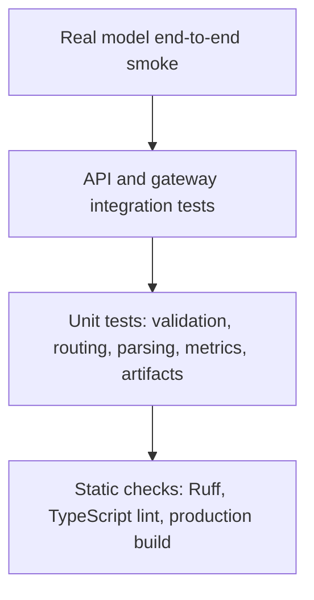

# Verification and release gates

## Report/mask quality gates

`backend/tests/test_masks_and_reports.py` covers binary-mask holes, background preservation,
band-gated NDWI, area units, report structure, numeric-claim filtering and API ownership.
`backend/tests/test_quality_notebook.py` checks the paired notebook and CPU-only quality-cell
contracts; it deliberately does not download GPU models. `tests/proxy.test.mjs` covers mask-route
and query allowlisting. Run `scripts/evaluate-water-mask.py` against independently labelled,
same-grid binary masks for pixel metrics. SAM GPU execution and real-scene quality remain separate
acceptance gates; no synthetic test result is model accuracy. See [quality guide](ANALYSIS_QUALITY.md).

## Test pyramid



Passing unit tests, notebook compilation or a frontend build does not prove that a live model
loads or answers correctly. Local acceptance requires the actual GPU and real-image checks below.
Static checks and local simulator-enabled integration must not be described as live Kaggle/ngrok
or real-Qwen verification.

## Automated suite

```powershell
$satqueryPython = "$env:USERPROFILE\.venvs\satquery-cloud\Scripts\python.exe"
Set-Location D:\Projects\Sih-2026

& $satqueryPython -m pytest backend\tests -q
& $satqueryPython -m pytest ml\tests -q
& $satqueryPython -m ruff check backend ml model_service scripts
node --test tests/proxy.test.mjs
npm run lint
npm run build
```

| Suite | What it proves | What it does not prove |
|---|---|---|
| Backend API | Upload, persistence, jobs, reports, overlays, errors | Real CUDA generation |
| Pair specialists | Synthetic co-registered change and one-band SAR inputs | Semantic accuracy on CDVQA or ISRO/SAC |
| ML utilities | Splits, preprocessing, metrics, manifests | Model quality on target domain |
| Node HTTP proxy tests | Actual frontend route forwarding and streamed request handling over Node HTTP | Live GPU or ngrok availability |
| Ruff/lint/build | Source consistency and compilability | Runtime hardware fit |

The recorded local smoke on 2026-09-03 exercised all five automatic routes through
`http://localhost:3000/api/satquery`, with explicit `--allow-simulated`: single-image VLM output
was simulated and paired-image tools executed on the CPU. Its artifacts are under
`outputs/smoke-20260903/acceptance-production-build` for the final built-frontend run. This verifies local application plumbing, **not** neural
inference or semantic accuracy. Reproduce that scope using `scripts/make-smoke-fixtures.py` and
the dedicated plumbing command in [SIH_DEMO_RUNBOOK.md](SIH_DEMO_RUNBOOK.md).

## Real model startup gate

1. Use the inference notebook in [NGROK_KAGGLE_RUNBOOK.md](NGROK_KAGGLE_RUNBOOK.md), separate from
   training. Run the install cell and sections 1–9 in a fresh Kaggle GPU session.
2. Require GPU, model, local HTTP, and public ngrok smoke tests to print `PASS`.
3. Keep section 10 running during attended testing. Its demo window ends after at most 60 minutes.
   The synthetic fixture verifies generation and transport, not satellite accuracy.
4. Configure repository-root `.env` with the printed URL and matching bearer token; keep
   `.env.local` pointed at the local controller. Start `scripts/run-local.py --mode remote`.
5. Require `GET :8000/v1/health/ready` to report database and model gateway true.

Use Kaggle only where its current account rules allow the active demo; do not use this proxy
workflow on managed Colab. Stop the Kaggle session to release GPU quota after testing. If section
10 was interrupted but model variables remain, restart sections **6–10**, not just the tunnel.

The optional local-GPU equivalent uses `--mode local` after `setup-local.ps1 -WithLocalModel`.
Repeated CUDA OOM on a clean laptop means that profile has not passed; do not label it accepted.

## Five mandatory end-to-end acceptance scenarios

Use licensed single, temporal-pair, and optical/SAR fixtures. Run
`scripts/sih-acceptance.py` as documented in [SIH_DEMO_RUNBOOK.md](SIH_DEMO_RUNBOOK.md). The default
rejects simulator responses. Run with `--auto-route` to test query-driven selection; omit that
flag for a separate explicit-task check. `--allow-simulated` belongs only to tests of
`scripts/run-local.py --mode demo` and must never count as real-model acceptance.

| Step | Assertion |
|---|---|
| Single VQA | One valid raster; non-empty adapted-Qwen answer and pinned provenance |
| Additional single task | Caption and grounding both run; invalid box becomes a warning |
| Temporal change | Time A/B validation; quantified change facts and candidate evidence on the time-A reference grid |
| Optical/SAR | Declared modalities; pair compatibility; complementary proxy facts/evidence |
| Automatic orchestration | `requested_tasks=null` selects by query and evidence configuration |
| Upload | Every asset returns `201`, SHA-256, and raster metadata |
| Preview | `200 image/jpeg`, non-empty body |
| Analysis create | `202`, status `queued` |
| Location context | Valid lat/lon/altitude appears in request provenance and user-location fact |
| Completion | Terminal state becomes `succeeded` within the configured timeout (CLI default: 600 seconds) |
| Text | `result.answer` is non-empty and not demo/simulator copy |
| Model provenance | Revision contains adapter SHA `ed12e59e0de...` |
| Confidence | Marked uncalibrated/evidence quality, not correctness probability |
| Report | PDF endpoint returns non-empty `application/pdf` |
| Grounding | Valid box produces an overlay; invalid/no box produces warning, not fake geometry |

The automated run executes these five registered tasks:

1. `single_vqa`: a land-cover question whose answer is visually checkable.
2. `caption`: the representative land-cover/major-objects description.
3. `grounding`: highlight one water region.
4. `change_vqa`: describe what changed and where.
5. `optical_sar_fusion`: identify candidate built-up and water-covered regions jointly.

Record the image license/source, query, reference answer, model answer, latency, revision, warnings,
and manual judgement. The CLI verifies task completion, nonempty text, task provenance, trace,
and artifact downloads; also manually check image preview, user-supplied location context,
grounding geometry and the exact pinned adapter revision. One successful query proves integration,
not model accuracy. The CPU pair tools are real pixel-analysis baselines, not learned semantic models.

## Model-quality gates

| Specialist | Required evidence before release |
|---|---|
| Qwen single-image | Pinned fresh reload; task-specific validation and held-out test report |
| Grounding | Box parse rate plus localization IoU on labeled samples |
| Change-VQA | Answer accuracy/F1 plus mask IoU/Dice on disjoint SECOND test identities |
| Optical/SAR | Macro-F1/AP plus S2-only/S1-only ablations and dense-evidence metric |

CPU pair baselines pass a **functional demonstration gate**, not the learned model-quality gate.
Final submission evidence must include scores on the exact organizer-prescribed public splits.

## Regression policy

- `npm run test:proxy` runs 17 Node tests for proxy transport, browser-facing API errors and
  the real Vinext multipart preflight. A 6 MiB streamed upload must survive that preflight;
  an oversized request must still fail. Directly invoking a route handler is insufficient to
  catch framework-level body limits. After changing upload config, restart the frontend and
  test a >1 MiB valid GeoTIFF through both development and production-build servers.
- `backend/tests/test_notebook_runtime.py` exercises the Kaggle/Colab detection regression,
  missing-session recovery, HTTPS-only tunnel, bounded timer, stale-URL cleanup, HTTP-vs-JSON
  diagnostics, warning-free synthetic GeoTIFF round trip, greedy-generation parameters and
  paired notebook/copyable-cell synchronization. Tests use network/model doubles; they do not
  establish that a live public tunnel or satellite inference is working.
- A changed model revision requires rerunning real-model and quality gates.
- A changed preprocessing rule requires a new runtime manifest and evaluation.
- A changed API schema requires backend integration tests and frontend build.
- A visual-only change still requires the build and one upload/result interaction.
- Failed or skipped gates must remain explicit in `PROGRESS.md`; never relabel them complete.
